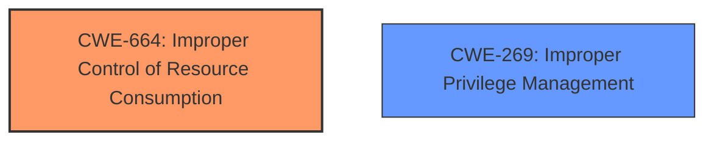

# Enhanced Analysis for CVE-2024-38070

# Summary

| CWE ID | CWE Name | Confidence | CWE Abstraction Level | CWE Vulnerability Mapping Label | CWE-Vulnerability Mapping Notes |
|---|---|---|---|---|---|
| CWE-664 | Improper Control of Resource Consumption | 0.7 | Class | Primary | Allowed-with-Review |
| CWE-269 | Improper Privilege Management | 0.6 | Class | Secondary Candidate | Allowed-with-Review |

## Evidence and Confidence

*   **Confidence Score:** 0.7
*   **Evidence Strength:** LOW

## Relationship Analysis
The primary CWE is CWE-664, which is a Class level. CWE-269 is also a class level. There is no direct parent-child relationship shown in the graph.



## Vulnerability Chain
The chain of weaknesses starts with **improper control of resource consumption** (CWE-664) leading to **improper privilege management** (CWE-269), eventually resulting in a security feature bypass.

## Summary of Analysis
Based on the limited evidence, the vulnerability seems to involve a **security feature bypass** due to an underlying issue with resource control and privilege management. The vulnerability description key phrases highlight a **weakness** related to a **security feature bypass**. Since the "CVE Reference Links Content Summary" is UNRELATED, the analysis is based on the vulnerability description.

The Retriever Results suggest several potential CWEs, but many focus on UI-related issues (e.g., CWE-356, CWE-451) or input validation (e.g., CWE-184, CWE-183), which do not directly align with the provided vulnerability description. The description speaks more directly to the result (Security Feature Bypass).

The most relevant candidates from the Retriever Results are:

*   CWE-305: Authentication Bypass by Primary Weakness
*   CWE-274: Improper Handling of Insufficient Privileges
*   CWE-664: Improper Control of Resource Consumption

CWE-305 is about authentication bypass, which is not explicitly mentioned. CWE-274 is "Improper Handling of Insufficient Privileges" which is too general, and is also marked as Discouraged. Given the nature of "Lockdown Policy" in the vulnerability description, it suggests that there are resource controls and privilege boundaries in place that are being bypassed.

Based on this limited information, I'm selecting CWE-664 as the primary weakness, with CWE-269 as a secondary contributing factor. CWE-664 "Improper Control of Resource Consumption" (Class) seems relevant because a lockdown policy is, in effect, a resource control mechanism. If the policy fails to properly manage resources, it can lead to a bypass. CWE-269 "Improper Privilege Management" (Class) is included as a contributing factor since resource control is closely tied to privilege management.

Relevant CWE Information:

**CWE-664: Improper Control of Resource Consumption**

**Description:** The software does not properly control the allocation, usage, or releasing of a system resource, which can lead to exhaustion of the resource.

**CWE-269: Improper Privilege Management**

**Description:** When an actor attempts to perform a privileged action, the software does not check whether the actor is authorized to perform that action.


## CWE Relationship Analysis

Current CWEs represent these abstraction levels: .


### Vulnerability Chain Analysis

**Chain starting from CWE-183:**
- 183 (Permissive List of Allowed Inputs) - ROOT


**Chain starting from CWE-274:**
- 274 (Improper Handling of Insufficient Privileges) - ROOT


### CWE Relationship Diagram

```mermaid
graph TD
    classDef primary fill:#f96,stroke:#333,stroke-width:2px
    classDef secondary fill:#69f,stroke:#333
    classDef tertiary fill:#9e9,stroke:#333
```