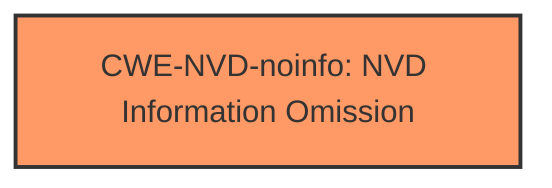

# Analysis Report for CVE-2024-38104

# Vulnerability Analysis Report: CVE-2024-38104

## Description

Windows Fax Service Remote Code Execution Vulnerability

## Vulnerability Description Key Phrases

- **Impact:** Remote Code Execution
- **Product:** Windows
- **Component:** Fax Service

## Analysis (with Relationship Data)

# Summary
| CWE ID | CWE Name | Confidence | CWE Abstraction Level | CWE Vulnerability Mapping Label | CWE-Vulnerability Mapping Notes |
|---|---|---|---|---|---|
| CWE-NVD-noinfo | NVD Information Omission | 0.7 | N/A | Primary CWE | N/A |

## Evidence and Confidence

*   **Confidence Score:** 0.7
*   **Evidence Strength:** LOW

## Relationship Analysis
N/A as CWE-NVD-noinfo has no relationships.



## Vulnerability Chain
The provided data does not provide any details on the **root cause** of the vulnerability. The description only mentions the **impact** (Remote Code Execution) and the affected component (Windows Fax Service). Thus, we cannot establish a vulnerability chain.

## Summary of Analysis
The primary challenge in this analysis is the lack of specific root cause information within the provided vulnerability description and CVE reference links.

The vulnerability description mentions a "Windows Fax Service Remote Code Execution Vulnerability". The key phrases include "Remote Code Execution," "Windows," and "Fax Service." The CVE Reference Links Content Summary section is marked as "UNRELATED," offering no helpful details.

The "CWE for similar CVE Descriptions" lists CWE-NVD-noinfo as the primary match and most frequent top CWE. Given the absence of root cause details, mapping to CWE-NVD-noinfo is the most appropriate choice.

The Retriever Results list several CWEs, but they are based on sparse data and do not align well with the limited information available. These include CWE-269, CWE-732, CWE-1386, CWE-138, CWE-276, CWE-250, CWE-119, CWE-427, CWE-94 and CWE-79. Without more information about the **root cause**, selecting any of these would be speculative.

Therefore, the final decision is to assign CWE-NVD-noinfo due to the lack of root cause information. This decision is made with a confidence level of 0.7 due to the limited evidence.

Relevant CWE Information:
N/A


## CWE Relationship Analysis

Current CWEs represent these abstraction levels: .


### Vulnerability Chain Analysis

**Chain starting from CWE-427:**
- 427 (Uncontrolled Search Path Element) - ROOT


**Chain starting from CWE-94:**
- 94 (Improper Control of Generation of Code ('Code Injection')) - ROOT


### CWE Relationship Diagram

```mermaid
graph TD
    classDef primary fill:#f96,stroke:#333,stroke-width:2px
    classDef secondary fill:#69f,stroke:#333
    classDef tertiary fill:#9e9,stroke:#333
```


*Report generated on 2025-07-13 10:08:07*
