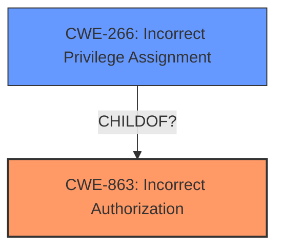

# Raw Analyzer Response for CVE-2024-38202

# Summary
| CWE ID | CWE Name | Confidence | CWE Abstraction Level | CWE Vulnerability Mapping Label | CWE-Vulnerability Mapping Notes |
|---|---|---|---|---|---|
| CWE-863 | Incorrect Authorization | 0.75 | Class | Allowed-with-Review | The product performs an authorization check when an actor attempts to access a resource or perform an action, but it does not correctly perform the check. |
| CWE-266 | Incorrect Privilege Assignment | 0.5 | Base | Allowed | A product incorrectly assigns a privilege to a particular actor, creating an unintended sphere of control for that actor. |

## Evidence and Confidence

*   **Confidence Score:** 0.7
*   **Evidence Strength:** MEDIUM

## Relationship Analysis
The primary relationship influencing the decision is the hierarchical relationship between CWE-863 (Incorrect Authorization) and its potential base-level children, as well as the guidance to consider privilege vs. permission issues. The weakness involves an attacker with low privileges being able to reintroduce vulnerabilities if they can convince a privileged user to perform a system restore. This hints at a problem with the authorization check that is performed during system restore, potentially due to incorrect privilege assignment somewhere in the process.

## Vulnerability Chain
The vulnerability chain starts with an attacker having basic user privileges, then tricking a privileged user into performing a system restore, which then leads to the reintroduction of previously mitigated vulnerabilities or circumvention of VBS. The root cause is the **incorrect authorization** or **incorrect privilege assignment** during the system restore process.

## Summary of Analysis
The initial analysis focused on identifying the root cause of the vulnerability. The description mentions "elevation of privilege" and "reintroduce previously mitigated vulnerabilities or circumvent some features of Virtualization Based Security (VBS)," suggesting an issue related to authorization or privilege management. However, the vulnerability requires additional interaction by a privileged user to be successful, which means that the attacker is not directly escalating privileges but exploiting a flaw in how the system restore process handles authorization.

The retriever results suggested several CWEs, including CWE-59, CWE-732, CWE-23, CWE-367, CWE-20, CWE-863, CWE-287, CWE-269, CWE-1386, and CWE-363. Of these, CWE-863 (Incorrect Authorization) seemed the most relevant, as it directly addresses the issue of an authorization check being performed incorrectly. CWE-266 (Incorrect Privilege Assignment) was also considered as a possible contributing factor.

The decision to select CWE-863 is based on the fact that the vulnerability description explicitly states that the attacker requires interaction from a privileged user to trigger the vulnerability. This suggests that the authorization check performed during the system restore process is **incorrect**, allowing the attacker to reintroduce vulnerabilities.

CWE-266 is included as a secondary candidate because the **incorrect authorization** could stem from an **incorrect privilege assignment** somewhere in the system restore process.

The evidence supporting this decision is primarily derived from the "Vulnerability Description" section, which states that "an attacker attempting to exploit this vulnerability requires additional interaction by a privileged user to be successful." This statement suggests that the vulnerability is not a direct privilege escalation but rather an exploitation of a flawed authorization check that is triggered by a privileged user's action.

The selected CWEs are at the optimal level of specificity, as CWE-863 directly addresses the **incorrect authorization** issue, and CWE-266 acknowledges the possibility of an **incorrect privilege assignment** contributing to the vulnerability. While it is possible that a more specific child CWE of CWE-863 exists, the available information does not provide enough detail to make that determination.

Relevant CWE Information:

# Enhanced Context (25 CWEs)
The following CWEs were identified as potentially relevant to this vulnerability:

## CWE-863: Incorrect Authorization
**Abstraction Level**: Class
**Similarity Score**: 1594.03
**Source**: sparse

**Description**:
The product performs an authorization check when an actor attempts to access a resource or perform an action, but it does not correctly perform the check.

**Mapping Guidance**:
- Usage: Allowed-with-Review
- Rationale: This CWE entry is a Class and might have Base-level children that would be more appropriate

## CWE-266: Incorrect Privilege Assignment
**Abstraction Level**: Base
**Similarity Score**: 0.79
**Source**: dense

**Description**:
A product incorrectly assigns a privilege to a particular actor, creating an unintended sphere of control for that actor.

**Mapping Guidance**:
- Usage: Allowed
- Rationale: This CWE entry is at the Base level of abstraction, which is a preferred level of abstraction for mapping to the root causes of vulnerabilities.