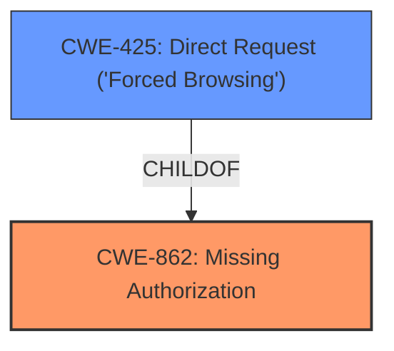

# Analysis for CVE-2024-3821

# Summary
| CWE ID | CWE Name | Confidence | CWE Abstraction Level | CWE Vulnerability Mapping Label | CWE-Vulnerability Mapping Notes |
|---|---|---|---|---|---|
| CWE-862 | Missing Authorization | 1.0 | Class | Primary | Allowed-with-Review |
| CWE-425 | Direct Request ('Forced Browsing') | 0.7 | Base | Secondary | Allowed |

## Evidence and Confidence

*   **Confidence Score:** 0.85
*   **Evidence Strength:** HIGH

## Relationship Analysis
The primary relationship that influenced the decision was the parent-child relationship between CWE-862 (Missing Authorization) and some of its children, including CWE-425 (Direct Request). CWE-862 is a Class-level CWE, while CWE-425 is a Base-level CWE. The vulnerability description indicates a **missing capability check**, which directly relates to authorization. Since no authentication is required, an attacker can directly request and manipulate data.

## Vulnerability Chain
The vulnerability chain starts with the **missing capability check**, leading to unauthorized access and ultimately data manipulation.

Missing Capability Check (CWE-862) -> Direct Request (CWE-425) -> Data Manipulation

## Summary of Analysis
The initial analysis focused on identifying the root cause of the vulnerability, which is a **missing capability check** in the `wdt_ajax_actions.php` file. The CVE description and key phrases strongly support this. The Retriever results also highlighted CWE-862 (Missing Authorization) as a potential candidate. After reviewing the CWE specifications and relationships, CWE-862 was chosen as the primary CWE due to its direct relevance to the **missing authorization**.

The secondary CWE, CWE-425 (Direct Request), was considered because the **missing authorization** allows unauthenticated users to directly access and manipulate data. This highlights the direct request aspect of the vulnerability.

The evidence from the CVE Reference Links Content Summary states:
"**Root Cause of Vulnerability:**
The root cause is a missing authorization check in the `wdt_ajax_actions.php` file within the wpDataTables plugin. Specifically, several functions within this file lack proper capability checks, allowing unauthorized users to access and manipulate data tables."

"**Weaknesses/Vulnerabilities Present:**
- **Missing Authorization:** The primary vulnerability is the absence of proper authorization checks before allowing access to data table manipulation functions. This allows unauthenticated users to call these functions directly."

These statements provide strong evidence for the selection of CWE-862 and CWE-425.

The selected CWEs are at the optimal level of specificity. CWE-862 is a Class, but the description aligns closely with the vulnerability. CWE-425 is a Base CWE, providing a more specific view of the direct request aspect of the vulnerability.

Relevant CWE Information:

# Enhanced Context (25 CWEs)
The following CWEs were identified as potentially relevant to this vulnerability:

## CWE-352: Cross-Site Request Forgery (CSRF)
**Abstraction Level**: Compound
**Similarity Score**: 0.73
**Source**: dense

**Description**:
The web application does not, or can not, sufficiently verify whether a well-formed, valid, consistent request was intentionally provided by the user who submitted the request.

**Mapping Guidance**:
- Usage: Allowed
- Rationale: This is a well-known Composite of multiple weaknesses that must all occur simultaneously, although it is attack-oriented in nature.

*   **Why Not Used:** While CSRF could be a potential attack vector, the root cause is the **missing authorization** check, which is better captured by CWE-862.

## CWE-472: External Control of Assumed-Immutable Web Parameter
**Abstraction Level**: Base
**Similarity Score**: 0.72
**Source**: dense

**Description**:
The web application does not sufficiently verify inputs that are assumed to be immutable but are actually externally controllable, such as hidden form fields.

**Mapping Guidance**:
- Usage: Allowed
- Rationale: This CWE entry is at the Base level of abstraction, which is a preferred level of abstraction for mapping to the root causes of vulnerabilities.

*   **Why Not Used:** This CWE focuses on the manipulation of parameters, whereas the primary issue is the **missing authorization** to even access the functions.

## CWE-425: Direct Request ('Forced Browsing')
**Abstraction Level**: Base
**Similarity Score**: 0.71
**Source**: dense

**Description**:
The web application does not adequately enforce appropriate authorization on all restricted URLs, scripts, or files.

**Mapping Guidance**:
- Usage: Allowed
- Rationale: This CWE entry is at the Base level of abstraction, which is a preferred level of abstraction for mapping to the root causes of vulnerabilities.

*   **Why Used:** The description directly matches the vulnerability where unauthenticated users can access restricted URLs due to the **missing authorization**.

## CWE-639: Authorization Bypass Through User-Controlled Key
**Abstraction Level**: Base
**Similarity Score**: 0.70
**Source**: dense

**Description**:
The system's authorization functionality does not prevent one user from gaining access to another user's data or record by modifying the key value identifying the data.

**Mapping Guidance**:
- Usage: Allowed
- Rationale: This CWE entry is at the Base level of abstraction, which is a preferred level of abstraction for mapping to the root causes of vulnerabilities.

*   **Why Not Used:** This CWE is more specific to user-controlled keys, which is not the primary issue in this vulnerability. The main problem is the **missing authorization** itself.

## CWE-862: Missing Authorization
**Abstraction Level**: Class
**Similarity Score**: 0.69
**Source**: dense

**Description**:
The product does not perform an authorization check when an actor attempts to access a resource or perform an action.

**Mapping Guidance**:
- Usage: Allowed-with-Review
- Rationale: This CWE entry is a Class and might have Base-level children that would be more appropriate

*   **Why Used:** The description perfectly aligns with the vulnerability, where the plugin does not perform authorization checks.

## CWE-502: Deserialization of Untrusted Data
**Abstraction Level**: Base
**Similarity Score**: 0.69
**Source**: dense

**Description**:
The product deserializes untrusted data without sufficiently ensuring that the resulting data will be valid.

**Mapping Guidance**:
- Usage: Allowed
- Rationale: This CWE entry is at the Base level of abstraction, which is a preferred level of abstraction for mapping to the root causes of vulnerabilities.

*   **Why Not Used:** Deserialization is not mentioned or implied in the vulnerability description.

## CWE-434: Unrestricted Upload of File with Dangerous Type
**Abstraction Level**: Base
**Similarity Score**: 0.68
**Source**: dense

**Description**:
The product allows the upload or transfer of dangerous file types that are automatically processed within its environment.

**Mapping Guidance**:
- Usage: Allowed
- Rationale: This CWE entry is at the Base level of abstraction, which is a preferred level of abstraction for mapping to the root causes of vulnerabilities.

*   **Why Not Used:** File uploads are not mentioned or implied in the vulnerability description.

## CWE-116: Improper Encoding or Escaping of Output
**Abstraction Level**: Class
**Similarity Score**: 0.68
**Source**: dense

**Description**:
The product prepares a structured message for communication with another component, but encoding or escaping of the data is either missing or done incorrectly. As a result, the intended structure of the message is not preserved.

**Mapping Guidance**:
- Usage: Allowed-with-Review
- Rationale: This CWE entry is a Class and might have Base-level children that would be more appropriate

*   **Why Not Used:** Encoding or escaping is not mentioned or implied in the vulnerability description.

## CWE-79: Improper Neutralization of Input During Web Page Generation ('Cross-site Scripting')
**Abstraction Level**: Base
**Similarity Score**: 0.68
**Source**: dense

**Description**:
The product does not neutralize or incorrectly neutralizes user-controllable input before it is placed in output that is used as a web page that is served to other users.

**Mapping Guidance**:
- Usage: Allowed
- Rationale: This CWE entry is at the Base level of abstraction, which is a preferred level of abstraction for mapping to the root causes of vulnerabilities.

*   **Why Not Used:** XSS is not mentioned or implied in the vulnerability description.

## CWE-201: Insertion of Sensitive Information Into Sent Data
**Abstraction Level**: Base
**Similarity Score**: 0.67
**Source**: dense

**Description**:
The code transmits data to another actor