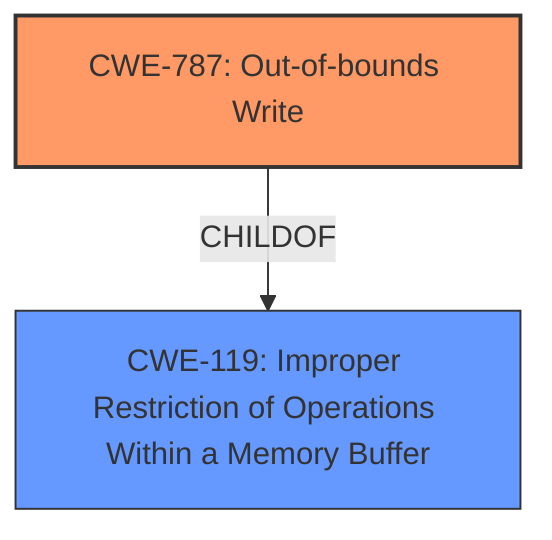

# Enhanced Analysis for CVE-2024-38218

# Summary
| CWE ID | CWE Name | Confidence | CWE Abstraction Level | CWE Vulnerability Mapping Label | CWE-Vulnerability Mapping Notes |
|---|---|---|---|---|---|
| CWE-787 | Out-of-bounds Write | 0.8 | Base | Primary CWE | Allowed |

## Evidence and Confidence

*   **Confidence Score:** 0.8
*   **Evidence Strength:** LOW

## Relationship Analysis
The primary focus is on CWE-787 as the root cause, with potential relationships to memory corruption issues. The graph relationships highlight potential chains involving buffer overflows and other memory-related errors.



## Vulnerability Chain
The chain of root cause and weaknesses for the Vulnerability Description is:
1.  **ROOT CAUSE:** CWE-787 (Out-of-bounds Write)

## Summary of Analysis
The analysis is based on the limited evidence provided, primarily the "memory corruption" **weakness** and the primary CWE match of CWE-787 from similar CVE descriptions. The selection of CWE-787 is at the optimal level of specificity, given the available information. Since the "CVE Reference Links Content Summary" is unhelpful, there is less confidence in the final assessment.

Relevant CWE Information:

# Enhanced Context (25 CWEs)
The following CWEs were identified as potentially relevant to this vulnerability:

## CWE-843: Access of Resource Using Incompatible Type ('Type Confusion')
**Abstraction Level**: Base
**Similarity Score**: 0.71
**Source**: dense

**Description**:
The product allocates or initializes a resource such as a pointer, object, or variable using one type, but it later accesses that resource using a type that is incompatible with the original type.

**Mapping Guidance**:
- Usage: Allowed
- Rationale: This CWE entry is at the Base level of abstraction, which is a preferred level of abstraction for mapping to the root causes of vulnerabilities.

## CWE-787: Out-of-bounds Write
**Abstraction Level**: Base
**Similarity Score**: 0.70
**Source**: dense

**Description**:
The product writes data past the end, or before the beginning, of the intended buffer.

**Mapping Guidance**:
- Usage: Allowed
- Rationale: This CWE entry is at the Base level of abstraction, which is a preferred level of abstraction for mapping to the root causes of vulnerabilities.

## CWE-416: Use After Free
**Abstraction Level**: Variant
**Similarity Score**: 2.61
**Source**: graph

**Description**:
The product reuses or references memory after it has been freed. At some point afterward, the memory may be allocated again and saved in another pointer, while the original pointer references a location somewhere within the new allocation. Any operations using the original pointer are no longer valid because the memory "belongs" to the code that operates on the new pointer.

**Mapping Guidance**:
- Usage: Allowed
- Rationale: This CWE entry is at the Variant level of abstraction, which is a preferred level of abstraction for mapping to the root causes of vulnerabilities.

### CWE Selection Details:

*   **CWE-787: Out-of-bounds Write**
    *   **Technical Explanation:** The vulnerability description mentions "**memory corruption**," and CWE-787 directly addresses writing data outside the intended buffer boundaries, which is a common cause of memory corruption.
    *   **Security Implications:** This can lead to arbitrary code execution, denial of service, or information disclosure.
    *   **Relationship Analysis:** CWE-787 is a child of CWE-119 (Improper Restriction of Operations Within a Memory Buffer).
    *   **Mapping Guidance:** The usage is "ALLOWED," and it's at the Base level of abstraction.
    *   **Evidence:** The "Vulnerability Description Key Phrases" section mentions "**memory corruption**," and the "CWE for similar CVE Descriptions" lists CWE-787 as the primary match and the top CWE.
*   **CWE-843: Access of Resource Using Incompatible Type ('Type Confusion')**
    *   The product accesses a resource using an incompatible type.
    *   This can lead to code execution or data corruption.
    *   The usage is "ALLOWED," and it's at the Base level of abstraction.
    *   **Justification for not using:** While type confusion can lead to memory corruption, the description doesn't provide enough evidence to support this specific cause.
*   **CWE-416: Use After Free**
    *   The product reuses or references memory after it has been freed.
    *   This can lead to code execution or data corruption.
    *   The usage is "ALLOWED," and it's at the Variant level of abstraction.
    *   **Justification for not using:** The description doesn't provide enough evidence to support this specific cause.


## CWE Relationship Analysis

Current CWEs represent these abstraction levels: .


### Vulnerability Chain Analysis

**Chain starting from CWE-416:**
- 416 (Use After Free) - ROOT


**Chain starting from CWE-119:**
- 119 (Improper Restriction of Operations within the Bounds of a Memory Buffer) - ROOT


### CWE Relationship Diagram

```mermaid
graph TD
    classDef primary fill:#f96,stroke:#333,stroke-width:2px
    classDef secondary fill:#69f,stroke:#333
    classDef tertiary fill:#9e9,stroke:#333
```