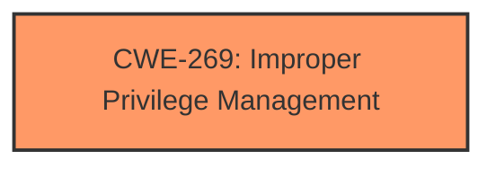

# Enhanced Analysis for CVE-2024-38220

# Summary
| CWE ID    | CWE Name                                                    | Confidence | CWE Abstraction Level | CWE Vulnerability Mapping Label | CWE-Vulnerability Mapping Notes |
| :-------- | :---------------------------------------------------------- | :--------- | :-------------------- | :------------------------------ | :------------------------------ |
| CWE-269 | Improper Privilege Management | 0.6      | Class | Primary | Discouraged |

## Evidence and Confidence

*   **Confidence Score:** 0.6
*   **Evidence Strength:** LOW

## Relationship Analysis
The primary candidate CWE-269 (Improper Privilege Management) is a Class-level CWE, which is generally discouraged unless a more specific Base or Variant is not available. The retriever results offer several potential Base-level CWEs related to privilege and permission issues, such as CWE-266 (Incorrect Privilege Assignment), CWE-250 (Execution with Unnecessary Privileges), CWE-280 (Improper Handling of Insufficient Permissions or Privileges), and CWE-863 (Incorrect Authorization). These were considered, but lacked sufficient context to determine if they were a better fit.



## Vulnerability Chain
The description indicates an elevation of privilege vulnerability. The chain is:
1.  **Root Cause:** Unknown, but assumed to be a flaw in privilege management (CWE-269)
2.  **Impact:** Elevation of Privilege

The missing piece of the chain is the specific **root cause** that allows the elevation of privilege.

## Summary of Analysis
The vulnerability description is very high level, stating only "Azure Stack Hub Elevation of Privilege Vulnerability". The **Vulnerability Description Key Phrases** include "**impact:** Elevation of Privilege" and "**product:** Azure Stack Hub". The **CWE for similar CVE Descriptions** lists CWE-NVD-noinfo as the primary match, followed by CWE-269 and CWE-59. The **CVE Reference Links Content Summary** is "UNRELATED," providing no further information.

Given the limited information, CWE-269 (Improper Privilege Management) is chosen as the primary CWE. This choice is based on the vulnerability description indicating an "Elevation of Privilege," which suggests a problem in how privileges are managed. However, without more specifics, it's impossible to pinpoint the exact **root cause**.

The weakness is classified at the Class level due to the lack of specifics. While retriever results suggest other CWEs, there is no information in the description to support them.
CWE-NVD-noinfo is not used since a CWE was provided in the top CWEs list.

Relevant CWE Information:
# Enhanced Context (25 CWEs)
The following CWEs were identified as potentially relevant to this vulnerability:

## CWE-266: Incorrect Privilege Assignment
**Abstraction Level**: Base
**Similarity Score**: 0.78
**Source**: dense

**Description**:
A product incorrectly assigns a privilege to a particular actor, creating an unintended sphere of control for that actor.

**Mapping Guidance**:
- Usage: Allowed
- Rationale: This CWE entry is at the Base level of abstraction, which is a preferred level of abstraction for mapping to the root causes of vulnerabilities.

## CWE-250: Execution with Unnecessary Privileges
**Abstraction Level**: base
**Similarity Score**: 2.47
**Source**: graph

**Description**:
CWE-250: Execution with Unnecessary Privileges

**Mapping Guidance**:
- Usage: Allowed
- Rationale: This CWE entry is at the Base level of abstraction, which is a preferred level of abstraction for mapping to the root causes of vulnerabilities.

## CWE-284: Improper Access Control (Parent/Generic)

## CWE-285: Improper Authorization


## CWE Relationship Analysis

Current CWEs represent these abstraction levels: .


### Vulnerability Chain Analysis

**Chain starting from CWE-863:**
- 863 (Incorrect Authorization) - ROOT


**Chain starting from CWE-280:**
- 280 (Improper Handling of Insufficient Permissions or Privileges ) - ROOT


### CWE Relationship Diagram

```mermaid
graph TD
    classDef primary fill:#f96,stroke:#333,stroke-width:2px
    classDef secondary fill:#69f,stroke:#333
    classDef tertiary fill:#9e9,stroke:#333
```