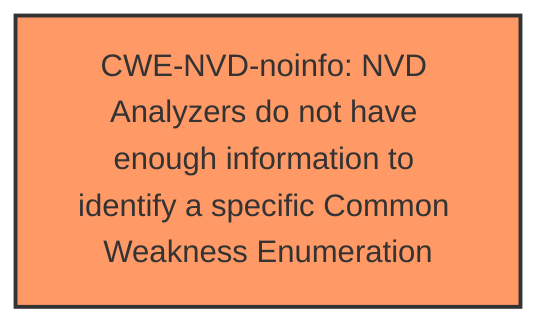

# Analysis Report for CVE-2024-38230

# Vulnerability Analysis Report: CVE-2024-38230

## Description

Windows Standards-Based Storage Management Service Denial of Service Vulnerability

## Vulnerability Description Key Phrases

- **Impact:** Denial of Service
- **Product:** Windows Standards-Based Storage Management Service

## Analysis (with Relationship Data)

# Summary
| CWE ID          | CWE Name                                                                 | Confidence | CWE Abstraction Level | CWE Vulnerability Mapping Label | CWE-Vulnerability Mapping Notes |
|-----------------|--------------------------------------------------------------------------|------------|-----------------------|---------------------------------|-----------------------------------|
| CWE-NVD-noinfo  | NVD Analyzers do not have enough information to identify a specific Common Weakness Enumeration | 1.0        | N/A                   | Primary                           | N/A                               |

## Evidence and Confidence

*   **Confidence Score:** 1.0
*   **Evidence Strength:** LOW

## Relationship Analysis
There are no relationships to analyze because CWE-NVD-noinfo is used when there isn't enough information.

## Vulnerability Chain
There is no vulnerability chain due to the lack of information. The vulnerability description only mentions a Denial of Service **impact** and the affected product.

## Summary of Analysis
The primary and only identified CWE is CWE-NVD-noinfo, as there isn't sufficient information available to determine the root cause of this vulnerability. The vulnerability description key phrases only identify the impact and the product, but no rootcause or weakness. The CVE Reference Links Content Summary is unrelated. Therefore, I'm relying only on the vulnerability description to make a classification.

The Retriever Results list many possible CWEs, but without further evidence, it is impossible to determine which, if any, are accurate.
I am selecting CWE-NVD-noinfo because it correctly represents the state of lacking enough information to assign a specific CWE.

Relevant CWE Information:
N/A

*Report generated on 2025-07-13 10:18:37*
