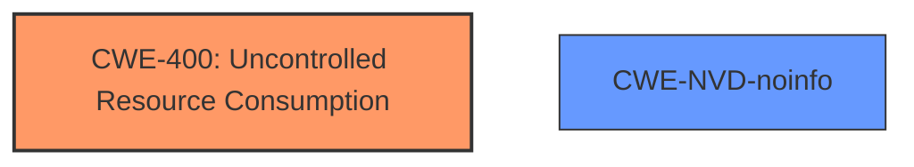

# Raw Analyzer Response for CVE-2024-38231

# Summary

| CWE ID    | CWE Name                                                                           | Confidence | CWE Abstraction Level | CWE Vulnerability Mapping Label | CWE-Vulnerability Mapping Notes |
| --------- | ---------------------------------------------------------------------------------- | ---------- | --------------------- | ------------------------------- | ------------------------------- |
| CWE-400   | Uncontrolled Resource Consumption                                                  | 0.75       | Class                 | Allowed                         | Primary CWE                     |
| CWE-NVD-noinfo | NVD Analyst triaged, no CWE mapped    | 0.25       |   |   | Secondary Candidate                      |

## Evidence and Confidence

*   **Confidence Score:** 0.75
*   **Evidence Strength:** LOW

## Relationship Analysis

The primary relationship considered is that CWE-400 [CWE-400: Uncontrolled Resource Consumption] is a class-level CWE, representing a broad category of resource exhaustion vulnerabilities. While more specific CWEs might exist, the provided information is insufficient to narrow down the classification further. CWE-400 is selected because the vulnerability description explicitly mentions "Denial of Service," a direct consequence of uncontrolled resource consumption.

## Vulnerability Chain

The vulnerability chain is relatively simple:

1.  **Root Cause:** Unspecified flaw in the Remote Desktop Licensing Service leading to resource consumption.
2.  **Impact:** Denial of Service.

Due to limited information, the exact mechanism triggering the resource consumption remains unclear.

## Summary of Analysis

The initial assessment focused on identifying the root cause and impact of the described vulnerability. The primary indicator is the "Denial of Service" impact, which strongly suggests resource exhaustion.

Given the limited details in the "CVE Reference Links Content Summary" (which is "UNRELATED") and the "Vulnerability Description Key Phrases" (which only highlights the impact), the selection of CWE-400 [CWE-400: Uncontrolled Resource Consumption] is primarily based on the vulnerability's stated impact.

The retriever results list several potential CWEs, but none are definitively supported by the provided evidence. CWE-400 [CWE-400: Uncontrolled Resource Consumption] has a relatively high score (0.505) and directly aligns with the "Denial of Service" impact, making it the most reasonable choice.

CWE-NVD-noinfo is included as a secondary candidate due to the lack of specific root cause information in the vulnerability description.

The selection of CWE-400 [CWE-400: Uncontrolled Resource Consumption] as the primary CWE is at a class level, which is less specific than preferred. However, the lack of detailed information prevents a more precise classification.

Relevant CWE Information:

# Enhanced Context (25 CWEs)
The following CWEs were identified as potentially relevant to this vulnerability:

## CWE-755: Improper Handling of Exceptional Conditions
**Abstraction Level**: Class
**Similarity Score**: 0.71
**Source**: dense

**Description**:
The product does not handle or incorrectly handles an exceptional condition.

**Mapping Guidance**:
- Usage: Discouraged
- Rationale: This CWE entry is a level-1 Class (i.e., a child of a Pillar). It might have lower-level children that would be more appropriate

*Not Used:* This is a class level CWE and there is nothing in the description to indicate that exception handling is the rootcause.

## CWE-67: Improper Handling of Windows Device Names
**Abstraction Level**: Variant
**Similarity Score**: 0.71
**Source**: dense

**Description**:
The product constructs pathnames from user input, but it does not handle or incorrectly handles a pathname containing a Windows device name such as AUX or CON. This typically leads to denial of service or an information exposure when the application attempts to process the pathname as a regular file.

**Mapping Guidance**:
- Usage: Allowed
- Rationale: This CWE entry is at the Variant level of abstraction, which is a preferred level of abstraction for mapping to the root causes of vulnerabilities.

*Not Used:* This does not align with the vulnerability description, which is about a Denial of Service in the Remote Desktop Licensing Service. There is nothing about Windows Device Names or pathnames in the description.

## CWE-280: Improper Handling of Insufficient Permissions or Privileges
**Abstraction Level**: Base
**Similarity Score**: 0.70
**Source**: dense

**Description**:
The product does not handle or incorrectly handles when it has insufficient privileges to access resources or functionality as specified by their permissions. This may cause it to follow unexpected code paths that may leave the product in an invalid state.

**Mapping Guidance**:
- Usage: Allowed
- Rationale: This CWE entry is at the Base level of abstraction, which is a preferred level of abstraction for mapping to the root causes of vulnerabilities.

*Not Used:* There is no evidence to indicate this vulnerability is due to incorrect permissions or privileges.

## CWE-59: Improper Link Resolution Before File Access ('Link Following')
**Abstraction Level**: Base
**Similarity Score**: 0.70
**Source**: dense

**Description**:
The product attempts to access a file based on the filename, but it does not properly prevent that filename from identifying a link or shortcut that resolves to an unintended resource.

**Mapping Guidance**:
- Usage: Allowed
- Rationale: This CWE entry is at the Base level of abstraction, which is a preferred level of abstraction for mapping to the root causes of vulnerabilities.

*Not Used:* There is no evidence to indicate this vulnerability involves link following.

## CWE-497: Exposure of Sensitive System Information to an Unauthorized Control Sphere
**Abstraction Level**: Base
**Similarity Score**: 0.70
**Source**: dense

**Description**:
The product does not properly prevent sensitive system-level information from being accessed by unauthorized actors who do not have the same level of access to the underlying system as the product does.

**Mapping Guidance**:
- Usage: Allowed
- Rationale: This CWE entry is at the Base level of abstraction, which is a preferred level of abstraction for mapping to the root causes of vulnerabilities.

*Not Used:* The vulnerability description indicates a denial-of-service, not information exposure.

## CWE-782: Exposed IOCTL with Insufficient Access Control
**Abstraction Level**: Variant
**Similarity Score**: 0.70
**Source**: dense

**Description**:
The product implements an IOCTL with functionality that should be restricted, but it does not properly enforce access control for the IOCTL.

**Mapping Guidance**:
- Usage: Allowed
- Rationale: This CWE entry is at the Variant level of abstraction, which is a preferred level of abstraction for mapping to the root causes of vulnerabilities.

*Not Used:* There is no evidence to indicate this vulnerability involves IOCTL.

## CWE-427: Uncontrolled Search Path Element
**Abstraction Level**: Base
**Similarity Score**: 0.69
**Source**: dense

**Description**:
The product uses a fixed or controlled search path to find resources, but one or more locations in that path can be under the control of unintended actors.

**Mapping Guidance**:
- Usage: Allowed
- Rationale: This CWE entry is at the Base level of abstraction, which is a preferred level of abstraction for mapping to the root causes of vulnerabilities.

*Not Used:* There is no evidence to indicate this vulnerability is related to search path elements.

## CWE-274: Improper Handling of Insufficient Privileges
**Abstraction Level**: Base
**Similarity Score**: 0.69
**Source**: dense

**Description**:
The product does not handle or incorrectly handles when it has insufficient privileges to perform an operation, leading to resultant weaknesses.

**Mapping Guidance**:
- Usage: Discouraged
- Rationale: This CWE entry could be deprecated in a future version of CWE.

*Not Used:* There is no evidence to indicate this vulnerability is due to incorrect privileges.

## CWE-288: Authentication Bypass Using an Alternate Path or Channel
**Abstraction Level**: Base
**Similarity Score**: 0.69
**Source**: dense

**Description**:
The product requires authentication, but the product has an alternate path or channel that does not require authentication.

**Mapping Guidance**:
- Usage: Allowed
- Rationale: This CWE entry is at the Base level of abstraction, which is a preferred level of abstraction for mapping to the root causes of vulnerabilities.

*Not Used:* There is no evidence to indicate this vulnerability is due to Authentication Bypass.

## CWE-119: Improper Restriction of Operations within the Bounds of a Memory Buffer
**Abstraction Level**: Class
**Similarity Score**: 0.69
**Source**: dense

**Description**:
The product performs operations on a memory buffer, but it reads from or writes to a memory location outside the buffer's intended boundary. This may result in read or write operations on unexpected memory locations that could be linked to other variables, data structures, or internal program data.

**Mapping Guidance**:
- Usage: Discouraged
- Rationale: CWE-11