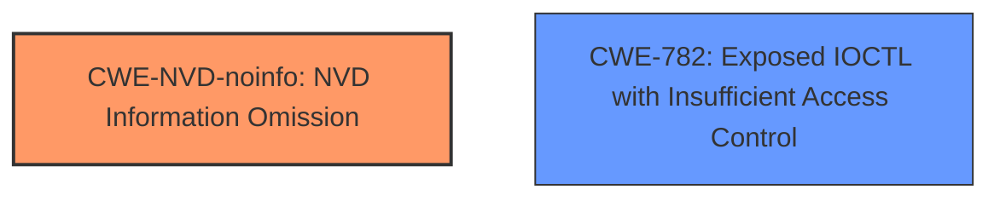

# Analysis for CVE-2024-38243

# Summary
| CWE ID | CWE Name | Confidence | CWE Abstraction Level | CWE Vulnerability Mapping Label | CWE-Vulnerability Mapping Notes |
|---|---|---|---|---|---|
| CWE-NVD-noinfo | NVD Information Omission | 0.7 | N/A | Primary CWE | Allowed |
| CWE-782 | Exposed IOCTL with Insufficient Access Control | 0.3 | Variant | Secondary Candidate | Allowed |

## Evidence and Confidence

*   **Confidence Score:** 0.7
*   **Evidence Strength:** LOW

## Relationship Analysis
The primary identified CWE is CWE-NVD-noinfo, which indicates a lack of specific information about the vulnerability. The secondary candidate is CWE-782, which is related to IOCTL exposure without sufficient access control.

## Vulnerability Chain
Due to the limited information provided, a complete vulnerability chain cannot be established. The available information suggests a potential elevation of privilege within the Kernel Streaming Service Driver, but the root cause remains unclear.

## Summary of Analysis
The primary classification, CWE-NVD-noinfo, reflects the absence of detailed information regarding the vulnerability's root cause. The description indicates an "Elevation of Privilege" within the "Kernel Streaming Service Driver," but lacks specific details about the flaw.

Given the sparse information, selecting a more specific CWE is challenging. While CWE-782 is listed as a possibility based on retriever results, there isn't sufficient evidence in the provided description to confirm this. The decision is primarily based on the "CWE for similar CVE Descriptions" which points to CWE-NVD-noinfo. My confidence is moderate due to the lack of conclusive evidence.

Relevant CWE Information:

# Enhanced Context (25 CWEs)
## CWE-NVD-noinfo
This is not a real CWE. It is assigned when there is not enough information to map to a true CWE.

## CWE-782: Exposed IOCTL with Insufficient Access Control
**Technical Explanation:** The vulnerability involves an exposed IOCTL (Input/Output Control) interface without sufficient access control. This means that an attacker could potentially send commands to the kernel driver, bypassing security checks and potentially leading to privilege escalation.

**Security Implications:** Exploiting this vulnerability could allow an attacker to execute arbitrary code with elevated privileges, potentially compromising the entire system.

**Relationship Analysis:** CWE-782 is a variant of CWE-749 (Exposed Direct Memory Operation). It can be preceded by CWE-781 (Improper Address Validation in IOCTL with METHOD_NEITHER I/O Control Code).

**Mapping Guidance Analysis:** The retriever results suggest CWE-782 as a possible candidate, but the evidence is too weak to confirm it definitively.