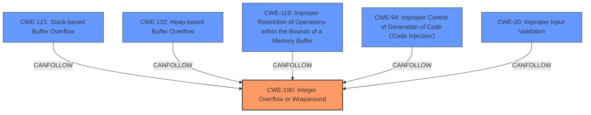

# Analysis Report for CVE-2024-38265

# Vulnerability Analysis Report: CVE-2024-38265

## Description

Windows Routing and Remote Access Service (RRAS) Remote Code Execution Vulnerability

## Vulnerability Description Key Phrases

- **Rootcause:** A vulnerability exists in the Windows Routing and Remote Access Service (RRAS) that allows remote code execution.
- **Weakness:** ['The specific weakness is not provided in the description. A deeper analysis is needed to identify the type of vulnerability (e.g.', 'buffer overflow', 'integer overflow', 'etc.)']
- **Impact:** ['Remote Code Execution', 'Successful exploitation could allow an attacker to execute arbitrary code on the target system.']
- **Vector:** The vulnerability is remotely exploitable.
- **Attacker:** The attacker would be remote and unauthenticated.
- **Product:** Windows Routing and Remote Access Service (RRAS)
- **Version:** The specific affected versions are not provided in the description. Further analysis is required to determine the affected versions.
- **Component:** Routing and Remote Access Service

## Analysis (with Relationship Data)

# Summary
| CWE ID    | CWE Name                                                                                                        | Confidence | CWE Abstraction Level | CWE Vulnerability Mapping Label | CWE-Vulnerability Mapping Notes |
| :---------- | :---------------------------------------------------------------------------------------------------------------- | :--------- | :---------------------- | :------------------------------ | :------------------------------ |
| CWE-190     | Integer Overflow or Wraparound                                                                                   | 0.8        | Base                    | Primary CWE                     | Allowed                         |
| CWE-121     | Stack-based Buffer Overflow                                                                                     | 0.7        | Base                    | Secondary Candidate             | Allowed                         |
| CWE-122     | Heap-based Buffer Overflow                                                                                      | 0.7        | Base                    | Secondary Candidate             | Allowed                         |
| CWE-119     | Improper Restriction of Operations within the Bounds of a Memory Buffer                                           | 0.6        | Base                    | Secondary Candidate             | Allowed                         |
| CWE-94      | Improper Control of Generation of Code ('Code Injection')                                                        | 0.5        | Base                    | Secondary Candidate             | Allowed-with-Review             |
| CWE-20      | Improper Input Validation                                                                                         | 0.4        | Base                    | Secondary Candidate             | Allowed                         |

## Evidence and Confidence

*   **Confidence Score:** 0.7
*   **Evidence Strength:** MEDIUM

## Relationship Analysis

The primary CWE is CWE-190 **Integer Overflow or Wraparound**, which can lead to other weaknesses like buffer overflows (CWE-121 **Stack-based Buffer Overflow**, CWE-122 **Heap-based Buffer Overflow**, and CWE-119 **Improper Restriction of Operations within the Bounds of a Memory Buffer**). The **integer overflow** can result in a smaller-than-expected buffer being allocated, which then leads to a buffer overflow when data larger than the allocated buffer is written to it. CWE-94 **Improper Control of Generation of Code ('Code Injection')** and CWE-20 **Improper Input Validation** were also considered but are less directly supported by the provided information.



## Vulnerability Chain

The vulnerability chain starts with an **integer overflow** (CWE-190) leading to a buffer overflow (CWE-121, CWE-122, CWE-119), which allows for remote code execution. The absence of proper input validation (CWE-20) could contribute to the **integer overflow** and subsequent buffer overflow.  CWE-94 might be a consequence of successful exploitation of the buffer overflow.

## Summary of Analysis

The primary weakness is identified as CWE-190 **Integer Overflow or Wraparound**, as the vulnerability description mentions "integer overflow" explicitly. The subsequent **buffer overflow** is a direct consequence of this **integer overflow**. The retriever results support this, with CWE-190 having a high relevance score for the "integer overflow" weakness. The chain of events begins with a faulty integer calculation (CWE-190), followed by memory corruption due to the **buffer overflow** (CWE-121, CWE-122, CWE-119), and the potential for code execution (CWE-94) because of the corrupted memory.

The choice of CWE-190 as the primary weakness is based on the direct mention of "integer overflow" in the vulnerability description and its role as the root cause of the subsequent **buffer overflow**. The other CWEs represent potential consequences or contributing factors.

Relevant CWE Information:
*   **CWE-190 Integer Overflow or Wraparound**: The product performs a calculation that can produce an **integer overflow** or wraparound when the logic assumes that the resulting value will always be larger than the original value.
*   **CWE-121 Stack-based Buffer Overflow**: A stack-based **buffer overflow** condition is a condition where the buffer being overwritten is allocated on the stack (i.e., is a local variable or, rarely, a parameter to a function).
*   **CWE-122 Heap-based Buffer Overflow**: A heap **overflow** condition is a **buffer overflow**, where the buffer that can be overwritten is allocated in the heap portion of memory, generally meaning that the buffer was allocated using a routine such as malloc().
*   **CWE-119 Improper Restriction of Operations within the Bounds of a Memory Buffer**: The product performs operations on a memory buffer, but it reads from or writes to a memory location outside the buffer's intended boundary.
*   **CWE-94 Improper Control of Generation of Code ('Code Injection')**: The product constructs all or part of a code segment using externally-influenced input from an upstream component, but it does not neutralize or incorrectly neutralizes special elements that could modify the syntax or behavior of the intended code segment.
*   **CWE-20 Improper Input Validation**: The product receives input or data, but it does not validate or incorrectly validates that the input has the properties that are required to process the data safely and correctly.


## CWE Relationship Analysis

Current CWEs represent these abstraction levels: .


### Vulnerability Chain Analysis

**Chain starting from CWE-121:**
- 121 (Stack-based Buffer Overflow) - ROOT


**Chain starting from CWE-94:**
- 94 (Improper Control of Generation of Code ('Code Injection')) - ROOT


### CWE Relationship Diagram

```mermaid
graph TD
    classDef primary fill:#f96,stroke:#333,stroke-width:2px
    classDef secondary fill:#69f,stroke:#333
    classDef tertiary fill:#9e9,stroke:#333
```


*Report generated on 2025-07-13 10:21:46*
