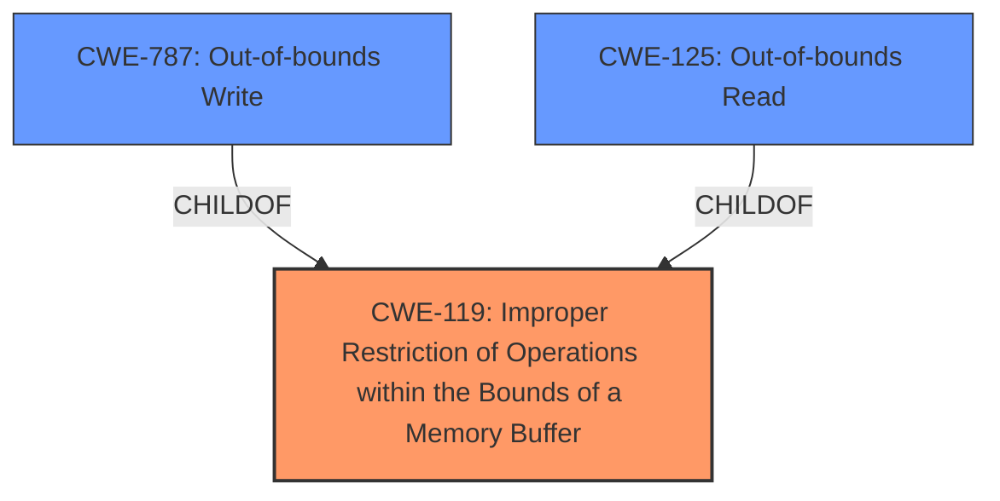

# Enhanced Analysis for CVE-2024-38269

# Summary

| CWE ID  | CWE Name                                                                           | Confidence | CWE Abstraction Level | CWE Vulnerability Mapping Label | CWE-Vulnerability Mapping Notes |
| :-------- | :--------------------------------------------------------------------------------- | :--------- | :-------------------- | :------------------------------ | :------------------------------ |
| CWE-119   | Improper Restriction of Operations within the Bounds of a Memory Buffer             | 0.9        | Class                 | Primary CWE                   | Allowed-with-Review           |
| CWE-787   | Out-of-bounds Write                                                                | 0.7        | Base                  | Secondary Candidate             | Allowed                       |
| CWE-125   | Out-of-bounds Read                                                                 | 0.6        | Base                  | Secondary Candidate             | Allowed                       |

## Evidence and Confidence

*   **Confidence Score:** 0.8
*   **Evidence Strength:** HIGH

## Relationship Analysis

The primary CWE selected is CWE-119, which is a Class-level CWE. CWE-787 and CWE-125 are child CWEs and are more specific, operating at the Base level. Although more specific, the description indicates that the **improper restriction** is the root cause, which could lead to either an out-of-bounds read or write. The hierarchical relationship influenced the decision to start with CWE-119 as the primary weakness, since the description indicated an **improper restriction of operations within the bounds of a memory buffer**.



## Vulnerability Chain

The vulnerability chain starts with the **improper restriction of operations within the bounds of a memory buffer** (CWE-119), which can lead to memory corruption. The memory corruption could manifest as an out-of-bounds write (CWE-787) or read (CWE-125), leading to a thread crash.

## Summary of Analysis

The initial analysis identified CWE-119 as a potential primary CWE, supported by the vulnerability description's emphasis on **improper restriction of operations within the bounds of a memory buffer**. The CVE Reference Links Content Summary reinforces this by stating "An **improper restriction of operations within the bounds of a memory buffer**." The retriever results also listed CWE-119 as the top candidate.

The hierarchical relationship between CWE-119 and its child CWEs (CWE-787 and CWE-125) was crucial in deciding the primary CWE. While the vulnerability could result in either an out-of-bounds read or write, the root cause is the **improper restriction**, making CWE-119 the more appropriate primary classification.

The selected CWEs are at the optimal level of specificity. CWE-119 captures the root cause, while CWE-787 and CWE-125 represent potential consequences.

Relevant CWE Information:

# Enhanced Context (25 CWEs)

## CWE-280: Improper Handling of Insufficient Permissions or Privileges
**Abstraction Level**: Base
**Similarity Score**: 0.79
**Source**: dense

**Description**:
The product does not handle or incorrectly handles when it has insufficient privileges to access resources or functionality as specified by their permissions. This may cause it to follow unexpected code paths that may leave the product in an invalid state.

**Mapping Guidance**:
- Usage: Allowed
- Rationale: This CWE entry is at the Base level of abstraction, which is a preferred level of abstraction for mapping to the root causes of vulnerabilities.

*Not Selected*: This CWE is not relevant because the vulnerability does not involve insufficient permissions or privileges. The vulnerability stems from **improper memory buffer handling**, not privilege-related issues.

## CWE-131: Incorrect Calculation of Buffer Size
**Abstraction Level**: Base
**Similarity Score**: 0.78
**Source**: dense

**Description**:
The product does not correctly calculate the size to be used when allocating a buffer, which could lead to a buffer overflow.

**Mapping Guidance**:
- Usage: Allowed
- Rationale: This CWE entry is at the Base level of abstraction, which is a preferred level of abstraction for mapping to the root causes of vulnerabilities.

*Not Selected*: This CWE is not the most appropriate because the root cause is **improper restriction of operations** rather than incorrect buffer size calculation. While incorrect buffer size calculation could lead to similar outcomes, the vulnerability description emphasizes the restriction aspect.

## CWE-274: Improper Handling of Insufficient Privileges
**Abstraction Level**: Base
**Similarity Score**: 0.78
**Source**: dense

**Description**:
The product does not handle or incorrectly handles when it has insufficient privileges to perform an operation, leading to resultant weaknesses.

**Mapping Guidance**:
- Usage: Discouraged
- Rationale: This CWE entry could be deprecated in a future version of CWE.

*Not Selected*: This CWE is not relevant because the vulnerability does not involve insufficient privileges. The vulnerability stems from **improper memory buffer handling**, not privilege-related issues.

## CWE-703: Improper Check or Handling of Exceptional Conditions
**Abstraction Level**: Pillar
**Similarity Score**: 0.78
**Source**: dense

**Description**:
The product does not properly anticipate or handle exceptional conditions that rarely occur during normal operation of the product.

**Mapping Guidance**:
- Usage: Discouraged
- Rationale: This CWE entry is extremely high-level, a Pillar.

*Not Selected*: This CWE is too generic and does not accurately reflect the specific vulnerability, which is related to **improper memory buffer handling**.

## CWE-754: Improper Check for Unusual or Exceptional Conditions
**Abstraction Level**: Class
**Similarity Score**: 0.78
**Source**: dense

**Description**:
The product does not check or incorrectly checks for unusual or exceptional conditions that are not expected to occur frequently during day to day operation of the product.

**Mapping Guidance**:
- Usage: Allowed-with-Review
- Rationale: This CWE entry is a Class and might have Base-level children that would be more appropriate

*Not Selected*: Similar to CWE-703, this CWE is too generic. The specific issue is **improper memory buffer handling**.

## CWE-191: Integer Underflow (Wrap or Wraparound)
**Abstraction Level**: Base
**Similarity Score**: 0.77
**Source**: dense

**Description**:
The product subtracts one value from another, such that the result is less than the minimum allowable integer value, which produces a value that is not equal to the correct result.

**Mapping Guidance**:
- Usage: Allowed
- Rationale: This CWE entry is at the Base level of abstraction, which is a preferred level of abstraction for mapping to the root causes of vulnerabilities.

*Not Selected*: This CWE is not relevant as the vulnerability does not involve integer underflow.

## CWE-667: Improper Locking
**Abstraction Level**: Class
**Similarity Score**: 0.77
**Source**: dense

**Description**:
The product does not properly acquire or release a lock on a resource, leading to unexpected resource state changes and behaviors.

**Mapping Guidance**:
- Usage: Allowed-with-Review
- Rationale: This CWE entry is a Class and might have Base-level children that would be more appropriate

*Not Selected*: This CWE is not relevant as the vulnerability does not involve improper locking mechanisms.

## CWE-266: Incorrect Privilege Assignment
**Abstraction Level**: Base
**Similarity Score**: 0.77
**Source**: dense

**Description**:
A product incorrectly assigns a privilege to a particular actor, creating an unintended sphere of control for that actor.

**Mapping Guidance**:
- Usage: Allowed
- Rationale: This CWE entry is at the Base level of abstraction, which is a preferred level of abstraction for mapping to the root causes of vulnerabilities.

*Not Selected*: This CWE is not relevant because the vulnerability is not related to incorrect privilege assignment. Although the attacker needs administrator privileges, the root cause is still **improper memory buffer handling**.

## CWE-267: Privilege Defined With Unsafe Actions
**Abstraction Level**: Base
**Similarity Score**: 0.77
**Source**: dense

**Description**:
A particular privilege, role, capability, or right can be used to perform unsafe actions that were not intended, even when it is assigned to the correct entity.

**Mapping Guidance**:
- Usage: Allowed
- Rationale: This CWE entry is at the Base level of abstraction, which is a preferred level of abstraction for mapping to the root causes of vulnerabilities.

*Not Selected*: This CWE is not relevant as the vulnerability does not involve a privilege defined with unsafe actions


## CWE Relationship Analysis

Current CWEs represent these abstraction levels: .


### Vulnerability Chain Analysis

**Chain starting from CWE-274:**
- 274 (Improper Handling of Insufficient Privileges) - ROOT


**Chain starting from CWE-280:**
- 280 (Improper Handling of Insufficient Permissions or Privileges ) - ROOT


### CWE Relationship Diagram

```mermaid
graph TD
    classDef primary fill:#f96,stroke:#333,stroke-width:2px
    classDef secondary fill:#69f,stroke:#333
    classDef tertiary fill:#9e9,stroke:#333
```