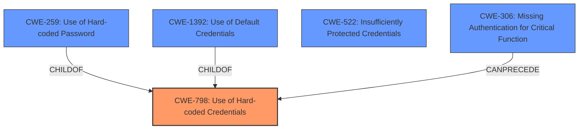

# Raw Analyzer Response for CVE-2024-38282

# Summary

| CWE ID    | CWE Name                                                                 | Confidence | CWE Abstraction Level | CWE Vulnerability Mapping Label | CWE-Vulnerability Mapping Notes |
| :-------- | :----------------------------------------------------------------------- | :--------- | :-------------------- | :------------------------------ | :------------------------------ |
| CWE-798   | Use of Hard-coded Credentials                                            | 1.0        | Base                  | Primary                         | Allowed                         |
| CWE-1392  | Use of Default Credentials                                               | 0.9        | Base                  | Secondary                       | Allowed                         |
| CWE-259   | Use of Hard-coded Password                                               | 0.8        | Variant               | Secondary                       | Allowed                         |
| CWE-522   | Insufficiently Protected Credentials                                     | 0.7        | Base                  | Secondary                       | N/A                             |
| CWE-306   | Missing Authentication for Critical Function                             | 0.6        | Base                  | Secondary                       | Allowed                         |

## Evidence and Confidence

*   **Confidence Score:** 0.9
*   **Evidence Strength:** HIGH

## Relationship Analysis

The primary weakness is the **use of hard-coded credentials (CWE-798)**, which can be further specified as the **use of default credentials (CWE-1392)** or a **hard-coded password (CWE-259)**. These CWEs are related hierarchically, with CWE-798 being the parent of both CWE-259 and CWE-1392. The vulnerability also highlights the lack of proper protection for these credentials, pointing to **CWE-522 (Insufficiently Protected Credentials)**. Furthermore, the ability to log in and make changes suggests a potential **CWE-306 (Missing Authentication for Critical Function)**, as critical functions are accessible without proper authentication.

## Vulnerability Chain

The vulnerability chain starts with the **use of hard-coded/default credentials (CWE-798)**. Because the credentials are not unique, this leads to **insufficient protection of credentials (CWE-522)**. This in turn allows an attacker to bypass authentication, effectively resulting in **missing authentication for critical functions (CWE-306)**, ultimately enabling unauthorized access and control over the camera's operating system.

## Summary of Analysis

The initial analysis correctly identifies the **use of default credentials** as a primary issue. The **CVE Reference Links Content Summary** section clearly states that the "**vulnerability stems from the use of hardcoded default credentials**" and that the device uses "**default credentials that are not unique to each device (CWE-522)**". This supports the selection of **CWE-798 (Use of Hard-coded Credentials)** as the primary CWE, further specified by **CWE-1392 (Use of Default Credentials)** and **CWE-259 (Use of Hard-coded Password)**. The ability to log in and make changes suggests a lack of proper authentication, leading to the inclusion of **CWE-306 (Missing Authentication for Critical Function)** as a secondary weakness.

The graph relationships highlight the hierarchical nature of these CWEs. **CWE-798** is a broader category that encompasses both **CWE-259** and **CWE-1392**. Including **CWE-522** and **CWE-306** helps to paint a more complete picture of the vulnerability by illustrating the lack of proper protection and authentication mechanisms.

The selected CWEs are at the optimal level of specificity because they accurately reflect the root cause and contributing factors of the vulnerability. **CWE-798** captures the general issue of using hard-coded credentials, while **CWE-1392** and **CWE-259** provide more specific details about the type of credentials used. **CWE-522** highlights the insufficient protection of these credentials, and **CWE-306** illustrates the consequences of this weakness by showing that critical functions are accessible without proper authentication.

**CWEs considered but not used:**

*   **CWE-923 (Improper Restriction of Communication Channel to Intended Endpoints):** This CWE is related to communication channel restrictions and is not directly applicable to the core issue of using hard-coded credentials.
*   **CWE-256 (Plaintext Storage of a Password):** While the vulnerability involves credentials, there's no explicit mention of passwords being stored in plaintext.
*   **CWE-532 (Insertion of Sensitive Information into Log File):** This CWE is not relevant as there is no mention of sensitive information being logged.
*   **CWE-1299 (Missing Protection Mechanism for Alternate Hardware Interface):** This CWE is specific to hardware interfaces and is not applicable to the described vulnerability.
*   **CWE-322 (Key Exchange without Entity Authentication):** This CWE relates to key exchange protocols and is not relevant to the described vulnerability.