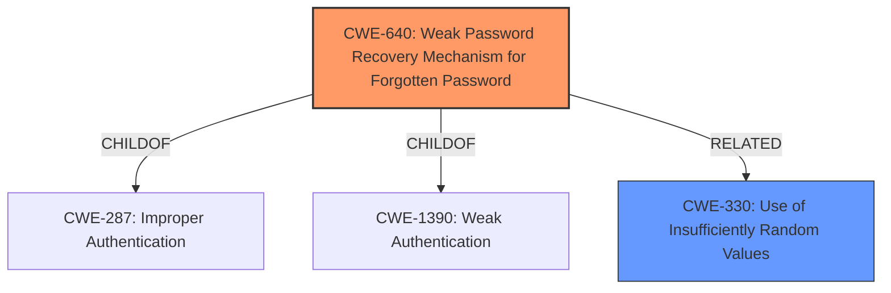

# Analysis Report for CVE-2024-38287

# Vulnerability Analysis Report: CVE-2024-38287

## Description

The password-reset mechanism in the Forgot Password functionality in R-HUB TurboMeeting through 8.x allows unauthenticated remote attackers to force the application into resetting the administrators password to a random insecure 8-digit value.

## Vulnerability Description Key Phrases

- **Impact:** reset administrators password to a random insecure 8-digit value
- **Attacker:** unauthenticated remote attackers
- **Product:** R-HUB TurboMeeting
- **Version:** through 8.x
- **Component:** Forgot Password functionality

## Analysis (with Relationship Data)

# Summary
| CWE ID | CWE Name | Confidence | CWE Abstraction Level | CWE Vulnerability Mapping Label | CWE-Vulnerability Mapping Notes |
|---|---|---|---|---|---|
| CWE-640 | Weak Password Recovery Mechanism for Forgotten Password | 1.0 | Base | Allowed-with-Review | Primary CWE |
| CWE-330 | Use of Insufficiently Random Values | 0.7 | Class | Discouraged | Secondary Candidate |

## Evidence and Confidence

*   **Confidence Score:** 0.9
*   **Evidence Strength:** HIGH

## Relationship Analysis
The primary CWE selected is CWE-640, which is at the Base level, making it a good fit. CWE-640 is a child of CWE-287 (Improper Authentication) and CWE-1390 (Weak Authentication). CWE-330 (Use of Insufficiently Random Values) is considered as a secondary issue because the generated password is an insecure 8-digit value and is a Class.



## Vulnerability Chain
The vulnerability chain starts with a **weak password recovery mechanism** (CWE-640), which generates a predictable 8-digit password. This can be viewed as a result of using **insufficiently random values** (CWE-330). An attacker exploits a separate SQL injection (CVE-2024-38286) to retrieve the hashed password, then cracks it easily, leading to account takeover and full system control.

## Summary of Analysis
The primary weakness is the **weak password recovery mechanism** (CWE-640) where the system generates a predictable password instead of letting the user set a new password. The "CVE Reference Links Content Summary" states, "The system does not allow users to set a new password of their choice during a password reset, instead generating a weak, predictable password." This aligns with the description of CWE-640. The fact that the password is a predictable 8-digit value can be viewed as a result of using **insufficiently random values** (CWE-330). The provided evidence and the relationships between the CWEs support this selection.

# Enhanced Context (25 CWEs)
The following CWEs were identified as potentially relevant to this vulnerability:

## CWE-916: Use of Password Hash With Insufficient Computational Effort
**Abstraction Level**: Base
**Similarity Score**: 0.70
**Source**: dense

**Description**:
The product generates a hash for a password, but it uses a scheme that does not provide a sufficient level of computational effort that would make password cracking attacks infeasible or expensive.

**Mapping Guidance**:
- Usage: Allowed
- Rationale: This CWE entry is at the Base level of abstraction, which is a preferred level of abstraction for mapping to the root causes of vulnerabilities.

*This CWE was not selected because the issue is with the password recovery mechanism itself, not the hashing algorithm.*

## CWE-620: Unverified Password Change
**Abstraction Level**: Base
**Similarity Score**: 0.69
**Source**: dense

**Description**:
When setting a new password for a user, the product does not require knowledge of the original password, or using another form of authentication.

**Mapping Guidance**:
- Usage: Allowed
- Rationale: This CWE entry is at the Base level of abstraction, which is a preferred level of abstraction for mapping to the root causes of vulnerabilities.

*This CWE was not selected because the main issue is not the lack of verification of the old password, but the weak password generation.*

## CWE-1391: Use of Weak Credentials
**Abstraction Level**: Class
**Similarity Score**: 0.68
**Source**: dense

**Description**:
The product uses weak credentials (such as a default key or hard-coded password) that can be calculated, derived, reused, or guessed by an attacker.

**Mapping Guidance**:
- Usage: Allowed-with-Review
- Rationale: This CWE entry is a Class and might have Base-level children that would be more appropriate

*This CWE was not selected because the weak credential isn't a default or hardcoded password, but a generated password during the reset.*

## CWE-257: Storing Passwords in a Recoverable Format
**Abstraction Level**: Base
**Similarity Score**: 0.66
**Source**: dense

**Description**:
The storage of passwords in a recoverable format makes them subject to password reuse attacks by malicious users. In fact, it should be noted that recoverable encrypted passwords provide no significant benefit over plaintext passwords since they are subject not only to reuse by malicious attackers but also by malicious insiders. If a system administrator can recover a password directly, or use a brute force search on the available information, the administrator can use the password on other accounts.

**Mapping Guidance**:
- Usage: Allowed
- Rationale: This CWE entry is at the Base level of abstraction, which is a preferred level of abstraction for mapping to the root causes of vulnerabilities.

*This CWE was not selected because the passwords are not stored in a recoverable format.*

## CWE-640: Weak Password Recovery Mechanism for Forgotten Password
**Abstraction Level**: Base
**Similarity Score**: 0.66
**Source**: dense

**Description**:
The product contains a mechanism for users to recover or change their passwords without knowing the original password, but the mechanism is weak.

**Mapping Guidance**:
- Usage: Allowed-with-Review
- Rationale: This entry appears to be frequently misused for any weakness related to password changes, even though the name focuses on "Password Recovery" for a "forgotten" password.

*This CWE was selected as the primary weakness because it accurately describes the vulnerability where the password recovery mechanism generates a weak, predictable password.*

## CWE-472: External Control of Assumed-Immutable Web Parameter
**Abstraction Level**: Base
**Similarity Score**: 0.66
**Source**: dense

**Description**:
The web application does not sufficiently verify inputs that are assumed to be immutable but are actually externally controllable, such as hidden form fields.

**Mapping Guidance**:
- Usage: Allowed
- Rationale: This CWE entry is at the Base level of abstraction, which is a preferred level of abstraction for mapping to the root causes of vulnerabilities.

*This CWE was not selected because it is not related to externally controllable parameters.*

## CWE-836: Use of Password Hash Instead of Password for Authentication
**Abstraction Level**: Base
**Similarity Score**: 0.66
**Source**: dense

**Description**:
The product records password hashes in a data store, receives a hash of a password from a client, and compares the supplied hash to the hash obtained from the data store.

**Mapping Guidance**:
- Usage: Allowed
- Rationale: This CWE entry is at the Base level of abstraction, which is a preferred level of abstraction for mapping to the root causes of vulnerabilities.

*This CWE was not selected because the issue isn't how the authentication is done.*

## CWE-259: Use of Hard-coded Password
**Abstraction Level**: Variant
**Similarity Score**: 0.66
**Source**: dense

**Description**:
The product contains a hard-coded password, which it uses for its own inbound authentication or for outbound communication to external components.

**Mapping Guidance**:
- Usage: Allowed
- Rationale: This CWE entry is at the Variant level of abstraction, which is a preferred level of abstraction for mapping to the root causes of vulnerabilities.

*This CWE was not selected because the issue is with the password recovery mechanism, not a hardcoded password.*

## CWE-328: Use of Weak Hash
**Abstraction Level**: Base
**Similarity Score**: 0.66
**Source**: dense

**Description**:
The product uses an algorithm that produces a digest (output value) that does not meet security expectations for a hash function that allows an adversary to reasonably determine the original input (preimage attack), find another input that can produce the same hash (2nd preimage attack), or find multiple inputs that evaluate to the same hash (birthday attack).

**Mapping Guidance**:
- Usage: Allowed
- Rationale: This CWE entry is at the Base level of abstraction, which is a preferred level of abstraction for mapping to the root causes of vulnerabilities.

*This CWE was not selected because the weakness is not related to a weak hashing algorithm, but with the generated password's weakness.*

## CWE-330: Use of Insufficiently Random Values
**Abstraction Level**: Class
**Similarity Score**: 0.66
**Source**: dense

**Description


## CWE Relationship Analysis

Current CWEs represent these abstraction levels: .


### Vulnerability Chain Analysis

**Chain starting from CWE-1390:**
- 1390 (Weak Authentication) - ROOT


**Chain starting from CWE-640:**
- 640 (Weak Password Recovery Mechanism for Forgotten Password) - ROOT


### CWE Relationship Diagram

```mermaid
graph TD
    classDef primary fill:#f96,stroke:#333,stroke-width:2px
    classDef secondary fill:#69f,stroke:#333
    classDef tertiary fill:#9e9,stroke:#333
```


*Report generated on 2025-07-13 10:24:57*
