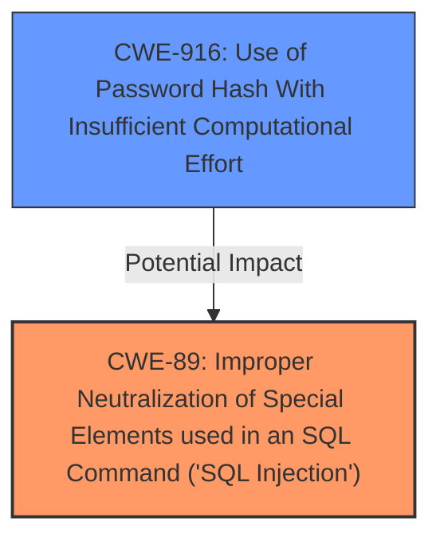

# Raw Analyzer Response for CVE-2024-38289

# Summary
| CWE ID | CWE Name | Confidence | CWE Abstraction Level | CWE Vulnerability Mapping Label | CWE-Vulnerability Mapping Notes |
|---|---|---|---|---|---|
| CWE-89 | Improper Neutralization of Special Elements used in an SQL Command ('SQL Injection') | 1.0 | Base | Allowed | Primary CWE: The root cause is the failure to properly neutralize special elements in SQL commands. |
| CWE-916 | Use of Password Hash With Insufficient Computational Effort | 0.6 | Base | Allowed | Secondary CWE: This is a potential contributing factor given the vulnerability allows extraction of hashed passwords. |

## Evidence and Confidence

*   **Confidence Score:** 0.9
*   **Evidence Strength:** HIGH

## Relationship Analysis
The primary relationship is the direct identification of **SQL injection** as the root cause, making CWE-89 the central weakness. CWE-916 is considered because the **impact** includes extracting password hashes, suggesting a potential weakness in the hashing algorithm itself, however, the primary issue is the ability to extract the hashes due to the SQL injection.

## Vulnerability Chain
The vulnerability chain starts with **improper input sanitization** leading to **SQL injection**, which allows an attacker to **extract hashed passwords**.

1.  **Root Cause:** CWE-89 (**Improper Neutralization of Special Elements used in an SQL Command ('SQL Injection')**) - The application fails to properly sanitize input, leading to SQL injection.
2.  **Impact:** Extraction of password hashes. - The attacker is able to extract the hashed passwords because of the **SQL injection**. This may potentially be related to CWE-916 (**Use of Password Hash With Insufficient Computational Effort**), if the hashes are easily crackable.

## Summary of Analysis
The analysis identifies the root cause as CWE-89 (**Improper Neutralization of Special Elements used in an SQL Command ('SQL Injection')**), based on the **Vulnerability Description Key Phrases** and **CVE Reference Links Content Summary**. The vulnerability description explicitly mentions **SQL injection**, and the summary details the insufficient input sanitization.

The decision to include CWE-916 (**Use of Password Hash With Insufficient Computational Effort**) is based on the fact that the vulnerability leads to extraction of password hashes. This is secondary to the primary **SQL injection** issue (CWE-89).

The selected CWEs are at the optimal level of specificity because CWE-89 is a Base level CWE which accurately represents the root cause, and CWE-916 is Base level, representing a potential contributing factor.
Relevant CWE Information:

# Enhanced Context (25 CWEs)
The following CWEs were identified as potentially relevant to this vulnerability:

## CWE-916: Use of Password Hash With Insufficient Computational Effort
**Abstraction Level**: Base
**Similarity Score**: 0.71
**Source**: dense

**Description**:
The product generates a hash for a password, but it uses a scheme that does not provide a sufficient level of computational effort that would make password cracking attacks infeasible or expensive.

**Mapping Guidance**:
- Usage: Allowed
- Rationale: This CWE entry is at the Base level of abstraction, which is a preferred level of abstraction for mapping to the root causes of vulnerabilities.

## CWE-89: Improper Neutralization of Special Elements used in an SQL Command ('SQL Injection')
**Abstraction Level**: Base
**Similarity Score**: 0.71
**Source**: dense

**Description**:
The product constructs all or part of an SQL command using externally-influenced input from an upstream component, but it does not neutralize or incorrectly neutralizes special elements that could modify the intended SQL command when it is sent to a downstream component. Without sufficient removal or quoting of SQL syntax in user-controllable inputs, the generated SQL query can cause those inputs to be interpreted as SQL instead of ordinary user data.

**Mapping Guidance**:
- Usage: Allowed
- Rationale: This CWE entry is at the Base level of abstraction, which is a preferred level of abstraction for mapping to the root causes of vulnerabilities.