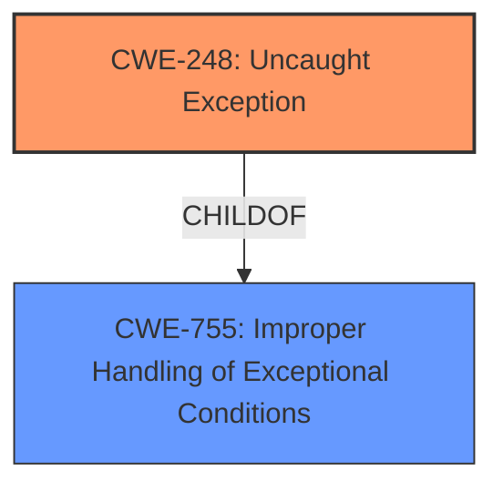

# Raw Analyzer Response for CVE-2024-38355

# Summary

| CWE ID | CWE Name | Confidence | CWE Abstraction Level | CWE Vulnerability Mapping Label | CWE-Vulnerability Mapping Notes |
|---|---|---|---|---|---|
| CWE-248 | Uncaught Exception | 0.9 | Base | Primary | Allowed |
| CWE-755 | Improper Handling of Exceptional Conditions | 0.7 | Class | Secondary | Discouraged |

## Evidence and Confidence

*   **Confidence Score:** 0.8
*   **Evidence Strength:** HIGH

## Relationship Analysis
The primary relationship considered was the parent-child relationship between CWE-755 and CWE-248. While CWE-755 is a broader class, CWE-248 directly represents the specific issue of an uncaught exception. The other relationships provided did not appear to apply to this vulnerability description.

## Vulnerability Chain
The vulnerability chain starts with the receipt of a specially crafted Socket.IO packet, leading to an **uncaught exception** (CWE-248) which then results in the Node.js process being killed, leading to a denial of service.

## Summary of Analysis
The initial analysis focused on identifying the **root cause** of the vulnerability, which the description clearly states is an **uncaught exception**. The CVE Reference Links Content Summary confirms this, emphasizing the absence of a default error handler for the "error" event. This directly aligns with CWE-248. The retriever results also listed CWE-248 as the top candidate.

The relationship analysis highlighted the parent-child relationship between CWE-755 and CWE-248. However, since CWE-248 provides a more specific and accurate representation of the **root cause**, it was chosen as the primary CWE.

The final decision is strongly based on the provided evidence, particularly the vulnerability description and the CVE Reference Links Content Summary. CWE-248 is at the optimal level of specificity as it directly addresses the **uncaught exception**, which is the **root cause** of the vulnerability.

Relevant CWE Information:

# Enhanced Context (25 CWEs)

## CWE-248: Uncaught Exception
**Abstraction Level**: Base
**Similarity Score**: 0.77
**Source**: dense

**Description**:
An exception is thrown from a function, but it is not caught.

**Mapping Guidance**:
- Usage: Allowed
- Rationale: This CWE entry is at the Base level of abstraction, which is a preferred level of abstraction for mapping to the **root causes** of vulnerabilities.

**Rationale for inclusion**: The vulnerability description explicitly states the **root cause** is an **uncaught exception**. This aligns perfectly with the description of CWE-248.

## CWE-755: Improper Handling of Exceptional Conditions
**Abstraction Level**: Class
**Similarity Score**: 0.75
**Source**: dense

**Description**:
The product does not handle or incorrectly handles an exceptional condition.

**Mapping Guidance**:
- Usage: Discouraged
- Rationale: This CWE entry is a level-1 Class (i.e., a child of a Pillar). It might have lower-level children that would be more appropriate

**Rationale for inclusion**: This CWE is a broader classification that encompasses the **improper handling of exceptional conditions**. While relevant, it is less specific than CWE-248, which directly addresses the **uncaught exception**.

## CWE-346: Origin Validation Error
**Abstraction Level**: Class
**Similarity Score**: 0.75
**Source**: dense

**Description**:
The product does not properly verify that the source of data or communication is valid.

**Mapping Guidance**:
- Usage: Allowed-with-Review
- Rationale: This CWE entry is a Class and might have Base-level children that would be more appropriate

**Rationale for exclusion**: This CWE relates to origin validation, which is not the primary issue in this vulnerability.

## CWE-617: Reachable Assertion
**Abstraction Level**: Base
**Similarity Score**: 0.75
**Source**: dense

**Description**:
The product contains an assert() or similar statement that can be triggered by an attacker, which leads to an application exit or other behavior that is more severe than necessary.

**Mapping Guidance**:
- Usage: Allowed
- Rationale: This CWE entry is at the Base level of abstraction, which is a preferred level of abstraction for mapping to the **root causes** of vulnerabilities.

**Rationale for exclusion**: This CWE involves assertions, which are not mentioned or implied in the vulnerability description.

## CWE-703: Improper Check or Handling of Exceptional Conditions
**Abstraction Level**: Pillar
**Similarity Score**: 0.74
**Source**: dense

**Description**:
The product does not properly anticipate or handle exceptional conditions that rarely occur during normal operation of the product.

**Mapping Guidance**:
- Usage: Discouraged
- Rationale: This CWE entry is extremely high-level, a Pillar.

**Rationale for exclusion**: This CWE is a very high-level categorization and does not provide sufficient specificity for the vulnerability.

## CWE-918: Server-Side Request Forgery (SSRF)
**Abstraction Level**: Base
**Similarity Score**: 0.74
**Source**: dense

**Description**:
The web server receives a URL or similar request from an upstream component and retrieves the contents of this URL, but it does not sufficiently ensure that the request is being sent to the expected destination.

**Mapping Guidance**:
- Usage: Allowed
- Rationale: This CWE entry is at the Base level of abstraction, which is a preferred level of abstraction for mapping to the **root causes** of vulnerabilities.

**Rationale for exclusion**: This CWE relates to server-side request forgery, which is not relevant to the vulnerability description.

## CWE-1286: Improper Validation of Syntactic Correctness of Input
**Abstraction Level**: Base
**Similarity Score**: 0.74
**Source**: dense

**Description**:
The product receives input that is expected to be well-formed - i.e., to comply with a certain syntax - but it does not validate or incorrectly validates that the input complies with the syntax.

**Mapping Guidance**:
- Usage: Allowed
- Rationale: This CWE entry is at the Base level of abstraction, which is a preferred level of abstraction for mapping to the **root causes** of vulnerabilities.

**Rationale for exclusion**: While the vulnerability is triggered by a crafted packet, the core issue isn't about syntactic validation but the handling of the resulting exception.

## CWE-824: Access of Uninitialized Pointer
**Abstraction Level**: Base
**Similarity Score**: 0.73
**Source**: dense

**Description**:
The product accesses or uses a pointer that has not been initialized.

**Mapping Guidance**:
- Usage: Allowed
- Rationale: This CWE entry is at the Base level of abstraction, which is a preferred level of abstraction for mapping to the **root causes** of vulnerabilities.

**Rationale for exclusion**: This CWE relates to uninitialized pointers, which is not mentioned or implied in the vulnerability description.

## CWE-134: Use of Externally-Controlled Format String
**Abstraction Level**: Base
**Similarity Score**: 0.73
**Source**: dense

**Description**:
The product uses a function that accepts a format string as an argument, but the format string originates from an external source.

**Mapping Guidance**:
- Usage: Allowed
- Rationale: This CWE entry is at the Base level of abstraction, which is a preferred level of abstraction for mapping to the **root causes** of vulnerabilities.

**Rationale for exclusion**: This CWE relates to format string vulnerabilities, which is not relevant to the vulnerability description.

## CWE-212: Improper Removal of Sensitive Information Before Storage or Transfer
**Abstraction Level**: Base
**Similarity Score**: 0.73
**Source**: dense

**Description**:
The product stores, transfers, or shares a resource that contains sensitive information, but it does not properly remove that information before the product makes the resource available to unauthorized actors.

**Mapping Guidance**:
- Usage: Allowed
- Rationale: This CWE entry is at the Base level of abstraction, which is a preferred level of abstraction for mapping to the **root causes** of vulnerabilities.

**Rationale for exclusion**: This CWE relates to sensitive information handling, which is not relevant to the vulnerability description.

## CWE-1284: Improper Validation of Specified Quantity in Input
**Abstraction Level**: base
**Similarity Score**: 2.47
**Source**: graph

**Description**:
CWE-1284: Improper Validation of Specified Quantity in Input

**Mapping Guidance**:
- Usage: Allowed
- Rationale: This CWE entry is at the Base level of abstraction, which is a preferred level of abstraction for mapping to the **root causes** of vulnerabilities.

**Relationships**:
- PARENTOF -> CWE-606
- CANPRECEDE -> CWE-789
- CH