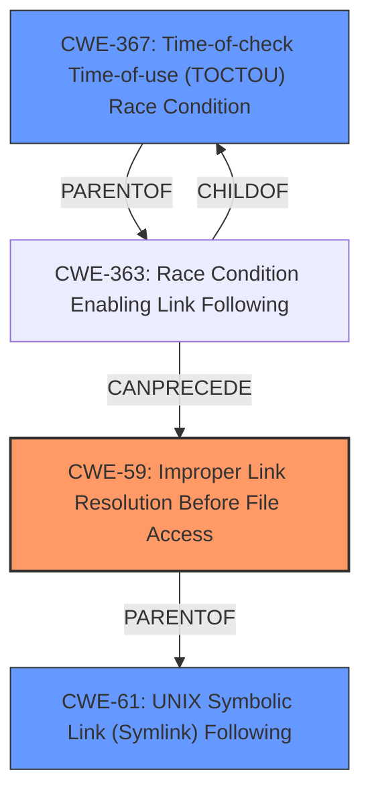

# Analysis Report for CVE-2024-38358

# Vulnerability Analysis Report: CVE-2024-38358

## Description

Wasmer is a web assembly (wasm) Runtime supporting WASIX, WASI and Emscripten. If the preopened directory has a symlink pointing outside, WASI programs can traverse the symlink and access host filesystem if the caller sets both `oflagscreat` and `rightsfd_write`. Programs can also crash the runtime by creating a symlink pointing outside with `path_symlink` and `path_open`ing the link. This issue has been addressed in commit `b9483d022` which has been included in release version 4.3.2. Users are advised to upgrade. There are no known workarounds for this vulnerability.

## Vulnerability Description Key Phrases

- **Impact:** access host filesystem
- **Vector:** symlink pointing outside
- **Attacker:** WASI programs
- **Product:** Wasmer
- **Version:** before 4.3.2

## Analysis (with Relationship Data)

# Summary
| CWE ID  | CWE Name                                                                        | Confidence | CWE Abstraction Level | CWE Vulnerability Mapping Label | CWE-Vulnerability Mapping Notes |
| :-------- | :------------------------------------------------------------------------------ | :--------- | :---------------------- | :------------------------------ | :------------------------------ |
| CWE-59    | Improper Link Resolution Before File Access ('Link Following')                 | 0.9        | Base                    | Primary                         | Allowed                         |
| CWE-367   | Time-of-check Time-of-use (TOCTOU) Race Condition                               | 0.7        | Base                    | Secondary                       | Allowed                         |
| CWE-61    | UNIX Symbolic Link (Symlink) Following                                        | 0.6        | Compound                | Secondary                       | Allowed                         |

## Evidence and Confidence

*   **Confidence Score:** 0.8
*   **Evidence Strength:** HIGH

## Relationship Analysis
The primary weakness is CWE-59, which describes the **improper link resolution** that allows access to unintended resources. This is a Base-level CWE, providing a specific and actionable description of the vulnerability. CWE-367 (TOCTOU) is considered as a secondary factor because a race condition could potentially exacerbate the symlink issue, but the core problem is still the **improper link resolution**. CWE-61 is a compound of multiple weaknesses that must occur simultaneously and it is attack-oriented.



## Vulnerability Chain
The vulnerability chain starts with **insufficient checks** on symlinks, leading to **improper link resolution**, which allows attackers to **access the host filesystem**. The root cause is the **improper handling of symlinks**, which can be represented as CWE-59. A potential race condition (CWE-367) could be present, but the primary issue is the symlink traversal.

## Summary of Analysis
The analysis is primarily based on the provided evidence, which indicates that the Wasmer runtime **does not properly handle symlinks** in preopened directories. This allows WASI programs to traverse these symlinks and access the host filesystem, representing a **clear case of improper link resolution**.

The selection of CWE-59 is based on its direct relevance to the vulnerability description, which mentions that "WASI programs can traverse the symlink and access host filesystem." This aligns with the CWE's description of **improper prevention of filenames identifying links that resolve to unintended resources**.

CWE-367 (TOCTOU) is considered due to the potential for a race condition to exacerbate the symlink issue. However, the core problem remains the **improper link resolution**, making CWE-59 the primary CWE. CWE-61 is a compound of multiple weaknesses and it is attack-oriented.

The selected CWEs are at the optimal level of specificity, with CWE-59 being a Base-level CWE that directly addresses the **improper link resolution** vulnerability.

Relevant CWE Information:

# Enhanced Context (25 CWEs)
The following CWEs were identified as potentially relevant to this vulnerability:

## CWE-59: Improper Link Resolution Before File Access ('Link Following')
**Abstraction Level**: Base
**Similarity Score**: 0.75
**Source**: dense

**Description**:
The product attempts to access a file based on the filename, but it **does not properly prevent** that filename from identifying a link or shortcut that resolves to an unintended resource.

**Mapping Guidance**:
- Usage: Allowed
- Rationale: This CWE entry is at the Base level of abstraction, which is a preferred level of abstraction for mapping to the root causes of vulnerabilities.

## CWE-61: UNIX Symbolic Link (Symlink) Following
**Abstraction Level**: Compound
**Similarity Score**: 0.75
**Source**: dense

**Description**:
The product, when opening a file or directory, **does not sufficiently account** for when the file is a symbolic link that resolves to a target outside of the intended control sphere. This could allow an attacker to cause the product to operate on unauthorized files.

**Mapping Guidance**:
- Usage: Allowed
- Rationale: This is a well-known Composite of multiple weaknesses that must all occur simultaneously, although it is attack-oriented in nature.

## CWE-367: Time-of-check Time-of-use (TOCTOU) Race Condition
**Abstraction Level**: Base
**Similarity Score**: 0.72
**Source**: dense

**Description**:
The product checks the state of a resource before using that resource, but the resource's state can change between the check and the use in a way that invalidates the results of the check. This can cause the product to perform invalid actions when the resource is in an unexpected state.

**Mapping Guidance**:
- Usage: Allowed
- Rationale: This CWE entry is at the Base level of abstraction, which is a preferred level of abstraction for mapping to the root causes of vulnerabilities.

## CWE-22: Improper Limitation of a Pathname to a Restricted Directory ('Path Traversal')
**Abstraction Level**: Base
**Similarity Score**: 1081.62
**Source**: sparse

**Description**:
The product uses external input to construct a pathname that is intended to identify a file or directory that is located underneath a restricted parent directory, but the product **does not properly neutralize** special elements within the pathname that can cause the pathname to resolve to a location that is outside of the restricted directory.

**Mapping Guidance**:
- Usage: Allowed
- Rationale: This CWE entry is at the Base level of abstraction, which is a preferred level of abstraction for mapping to the root causes of vulnerabilities.

CWE-22 (Improper Limitation of a Pathname to a Restricted Directory 'Path Traversal') was considered but not selected as the primary CWE because, although path traversal is involved, the root cause is the **improper handling of symlinks**, which allows the traversal to occur in the first place.

CWE-386 (Symbolic Name not Mapping to Correct Object) was considered but not selected because it is too abstract and doesn't capture the specific issue of **improper link resolution** leading to filesystem access.

CWE-476 (NULL Pointer Dereference) was considered but not selected as it doesn't appear to be relevant to the vulnerability description.


## CWE Relationship Analysis

Current CWEs represent these abstraction levels: .


### Vulnerability Chain Analysis

**Chain starting from CWE-476:**
- 476 (NULL Pointer Dereference) - ROOT


**Chain starting from CWE-22:**
- 22 (Improper Limitation of a Pathname to a Restricted Directory ('Path Traversal')) - ROOT


### CWE Relationship Diagram

```mermaid
graph TD
    classDef primary fill:#f96,stroke:#333,stroke-width:2px
    classDef secondary fill:#69f,stroke:#333
    classDef tertiary fill:#9e9,stroke:#333
```


*Report generated on 2025-07-13 10:30:16*
