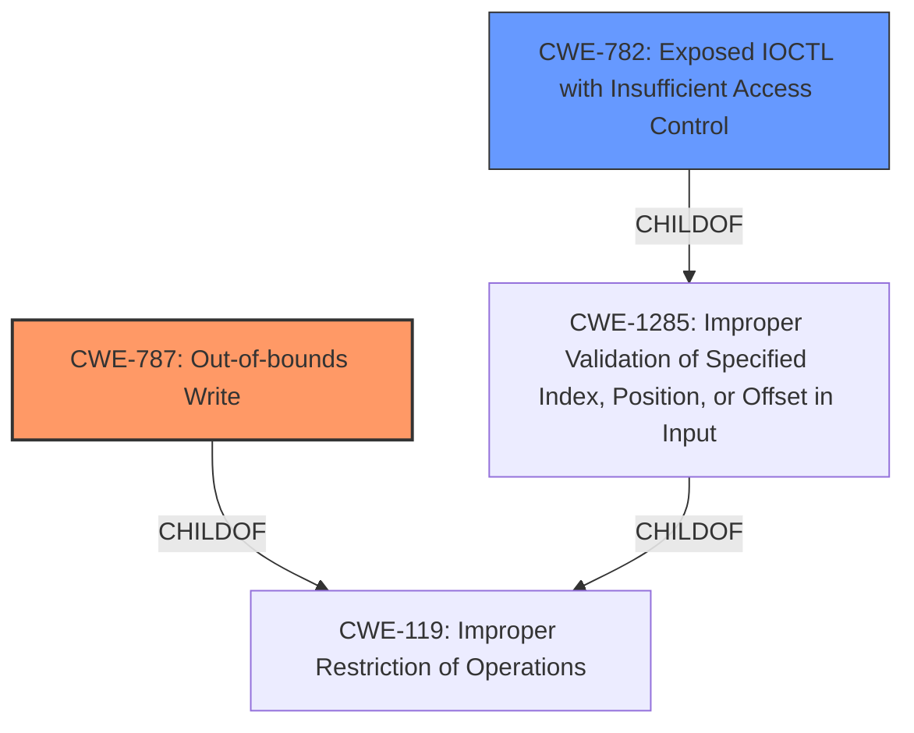

# Analysis for CVE-2024-38406

# Summary

| CWE ID  | CWE Name                         | Confidence | CWE Abstraction Level | CWE Vulnerability Mapping Label | CWE-Vulnerability Mapping Notes |
| ------- | -------------------------------- | ---------- | --------------------- | ------------------------------- | ----------------------------- |
| CWE-787 | Out-of-bounds Write              | 0.9        | Base                  | Primary                         | Allowed                       |
| CWE-782 | Exposed IOCTL with Insufficient Access Control | 0.6       | Variant                  | Secondary                         | Allowed                       |

## Evidence and Confidence

*   **Confidence Score:** 0.75
*   **Evidence Strength:** MEDIUM

## Relationship Analysis

The primary relationship is that CWE-787 (Out-of-bounds Write) is a type of memory corruption, which aligns with the vulnerability description. The secondary relationship stems from the **vector** of IOCTL calls, suggesting that **insufficient access control** on these IOCTLs might be a contributing factor, linking it to CWE-782. CWE-787 is a base CWE, while CWE-782 is a variant, offering more specific details.

## Vulnerability Chain

The vulnerability chain starts with potentially **insufficient access control** on IOCTL calls (CWE-782), which could allow unauthorized access. This could lead to **improper handling** of data within the JPEG Encoder driver, culminating in a **memory corruption**, specifically an **out-of-bounds write** (CWE-787).

## Summary of Analysis

The initial analysis focused on the **memory corruption** aspect, pointing towards CWE-787 as the primary weakness. The involvement of IOCTL calls led to the consideration of CWE-782, suggesting a potential access control issue contributing to the vulnerability.

The evidence suggests that the **root cause** is related to **memory corruption** when handling IOCTL calls in the JPEG Encoder driver, specifically, "**Memory corruption** while handling IOCTL calls in JPEG Encoder driver".

CWE-787 (Out-of-bounds Write) is a base CWE that accurately describes the **memory corruption**, while CWE-782 (Exposed IOCTL with Insufficient Access Control) captures the potential access control issue related to the IOCTL calls. Given the limited information, both CWEs appear relevant in characterizing the vulnerability.

Relevant CWE Information:

*   **CWE-787: Out-of-bounds Write:** Matches the **memory corruption** aspect of the vulnerability description.
*   **CWE-782: Exposed IOCTL with Insufficient Access Control:** Aligns with the **vector** of IOCTL calls and suggests a potential access control issue.

CWEs considered but not used:

*   CWE-788, CWE-823, CWE-415, CWE-131, CWE-781, and CWE-123: These were considered but deemed less directly relevant than CWE-787 and CWE-782 based on the vulnerability description's focus on memory corruption and IOCTL calls. While these other CWEs could potentially be related in a more complex vulnerability chain, the provided information does not strongly support their inclusion.