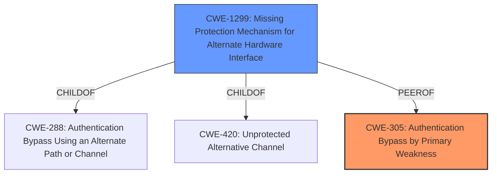

# Raw Analyzer Response for CVE-2024-38433

# Summary

| CWE ID  | CWE Name                                                   | Confidence | CWE Abstraction Level | CWE Vulnerability Mapping Label | CWE-Vulnerability Mapping Notes |
| ------- | ---------------------------------------------------------- | ---------- | --------------------- | ------------------------------- | ------------------------------- |
| CWE-305 | Authentication Bypass by Primary Weakness                  | 0.9        | Base                  | Primary                         | Allowed                         |
| CWE-1299 | Missing Protection Mechanism for Alternate Hardware Interface| 0.7        | Base                  | Secondary                         | Allowed                         |

## Evidence and Confidence

*   **Confidence Score:** 0.8
*   **Evidence Strength:** MEDIUM

## Relationship Analysis

The primary CWE is CWE-305, which is a base-level CWE, meaning it is at a preferred level of abstraction. CWE-305 is related to authentication bypass due to a primary weakness. The vulnerability description states that an attacker can modify the u-boot image header on flash, which leads to arbitrary code execution. This indicates that the **authentication** mechanism relies on the integrity of the u-boot image header, and modifying it allows bypassing authentication checks.

## Vulnerability Chain

The vulnerability chain starts with an attacker gaining write access to the SPI-Flash. This leads to the modification of the u-boot image header. The **weakness** lies in the **authentication bypass** caused by this modification, ultimately resulting in arbitrary code execution.

Attacker Write Access --> Modify u-boot image header --> Authentication Bypass (CWE-305) --> Arbitrary Code Execution

## Summary of Analysis

The initial assessment identified CWE-305 as the most relevant CWE, as it directly addresses the **authentication bypass** due to a primary weakness. The vulnerability description indicates that the **authentication** mechanism is bypassed by modifying the u-boot image header. This aligns with the definition of CWE-305, which focuses on authentication bypasses caused by separate weaknesses.

The selection is based on the provided evidence, which explicitly mentions an **authentication bypass** resulting from modifying the u-boot image header. This aligns perfectly with the description of CWE-305.

CWE-305 is at the optimal level of specificity because it directly addresses the root cause of the **authentication bypass** in this scenario.

Relevant CWE Information:

# Enhanced Context (25 CWEs)
The following CWEs were identified as potentially relevant to this vulnerability:

## CWE-345: Insufficient Verification of Data Authenticity
**Abstraction Level**: Class
**Similarity Score**: 0.75
**Source**: dense

**Description**:
The product does not sufficiently verify the origin or authenticity of data, in a way that causes it to accept invalid data.

**Mapping Guidance**:
- Usage: Discouraged
- Rationale: This CWE entry is a level-1 Class (i.e., a child of a Pillar). It might have lower-level children that would be more appropriate

*Reasoning:* While data authenticity is involved, the core issue is the authentication bypass rather than generic data verification.

## CWE-1391: Use of Weak Credentials
**Abstraction Level**: Class
**Similarity Score**: 0.74
**Source**: dense

**Description**:
The product uses weak credentials (such as a default key or hard-coded password) that can be calculated, derived, reused, or guessed by an attacker.

**Mapping Guidance**:
- Usage: Allowed-with-Review
- Rationale: This CWE entry is a Class and might have Base-level children that would be more appropriate

*Reasoning:* This CWE is not applicable since the vulnerability is not due to weak credentials but rather due to modifying the u-boot image header.

## CWE-305: Authentication Bypass by Primary Weakness
**Abstraction Level**: Base
**Similarity Score**: 0.74
**Source**: dense

**Description**:
The authentication algorithm is sound, but the implemented mechanism can be bypassed as the result of a separate weakness that is primary to the authentication error.

**Mapping Guidance**:
- Usage: Allowed
- Rationale: This CWE entry is at the Base level of abstraction, which is a preferred level of abstraction for mapping to the root causes of vulnerabilities.

*Reasoning:* This is the primary CWE. The vulnerability description highlights an **authentication bypass** due to the ability to modify the u-boot image header on flash.

## CWE-288: Authentication Bypass Using an Alternate Path or Channel
**Abstraction Level**: Base
**Similarity Score**: 0.74
**Source**: dense

**Description**:
The product requires authentication, but the product has an alternate path or channel that does not require authentication.

**Mapping Guidance**:
- Usage: Allowed
- Rationale: This CWE entry is at the Base level of abstraction, which is a preferred level of abstraction for mapping to the root causes of vulnerabilities.

*Reasoning:* While there's a bypass, the root cause isn't explicitly an alternate path. It is a primary weakness, as noted in CWE-305.

## CWE-703: Improper Check or Handling of Exceptional Conditions
**Abstraction Level**: Pillar
**Similarity Score**: 0.74
**Source**: dense

**Description**:
The product does not properly anticipate or handle exceptional conditions that rarely occur during normal operation of the product.

**Mapping Guidance**:
- Usage: Discouraged
- Rationale: This CWE entry is extremely high-level, a Pillar.

*Reasoning:* This is too general.

## CWE-303: Incorrect Implementation of Authentication Algorithm
**Abstraction Level**: Base
**Similarity Score**: 0.74
**Source**: dense

**Description**:
The requirements for the product dictate the use of an established authentication algorithm, but the implementation of the algorithm is incorrect.

**Mapping Guidance**:
- Usage: Allowed
- Rationale: This CWE entry is at the Base level of abstraction, which is a preferred level of abstraction for mapping to the root causes of vulnerabilities.

*Reasoning:* The vulnerability is not due to an incorrect implementation of the algorithm but rather the ability to bypass it completely by modifying the image header.

## CWE-807: Reliance on Untrusted Inputs in a Security Decision
**Abstraction Level**: Base
**Similarity Score**: 0.74
**Source**: dense

**Description**:
The product uses a protection mechanism that relies on the existence or values of an input, but the input can be modified by an untrusted actor in a way that bypasses the protection mechanism.

**Mapping Guidance**:
- Usage: Allowed
- Rationale: This CWE entry is at the Base level of abstraction, which is a preferred level of abstraction for mapping to the root causes of vulnerabilities.

*Reasoning:* This is related, but the primary issue is the authentication bypass, making CWE-305 more suitable.

## CWE-41: Improper Resolution of Path Equivalence
**Abstraction Level**: Base
**Similarity Score**: 0.74
**Source**: dense

**Description**:
The product is vulnerable to file system contents disclosure through path equivalence. Path equivalence involves the use of special characters in file and directory names. The associated manipulations are intended to generate multiple names for the same object.

**Mapping Guidance**:
- Usage: Allowed
- Rationale: This CWE entry is at the Base level of abstraction, which is a preferred level of abstraction for mapping to the root causes of vulnerabilities.

*Reasoning:* Not applicable, as this is not a path traversal issue.

## CWE-280: Improper Handling of Insufficient Permissions or Privileges
**Abstraction Level**: Base
**Similarity Score**: 0.73
**Source**: dense

**Description**:
The product does not handle or incorrectly handles when it has insufficient privileges to access resources or functionality as specified by their permissions. This may cause it to follow unexpected code paths that may leave the product in an invalid state.

**Mapping Guidance**:
- Usage: Allowed
- Rationale: This CWE entry is at the Base level of abstraction, which is a preferred level of abstraction for mapping to the root causes of vulnerabilities.

*Reasoning:* Not the primary issue, although related to the impact.

## CWE-294: Authentication Bypass by Capture-replay
**Abstraction Level**: Base
**Similarity Score**: 0.73
**Source**: dense

**Description**:
A capture-replay flaw exists when the design of the product makes it possible for a malicious user to sniff network traffic and bypass authentication by replaying it to the server in question to the same effect as the original message