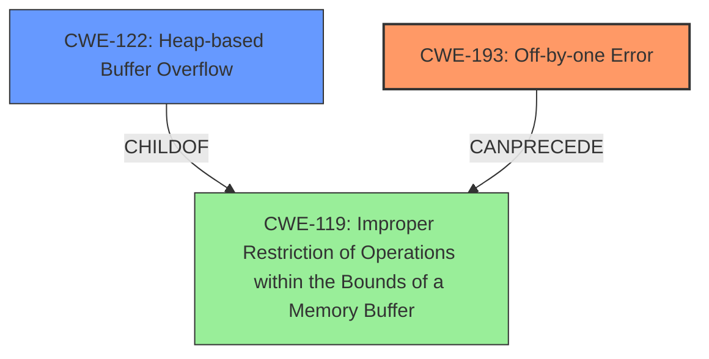

# Enhanced Analysis for CVE-2024-38441

# Summary

| CWE ID  | CWE Name                                                               | Confidence | CWE Abstraction Level | CWE Vulnerability Mapping Label | CWE-Vulnerability Mapping Notes |
| ------- | ---------------------------------------------------------------------- | ---------- | ----------------------- | ------------------------------- | ------------------------------- |
| CWE-193 | Off-by-one Error                                                       | 0.9        | Base                    | Primary CWE                     | Allowed                        |
| CWE-122 | Heap-based Buffer Overflow                                             | 0.8        | Variant                 | Secondary CWE                   | Allowed                        |

## Evidence and Confidence

*   **Confidence Score:** 0.85
*   **Evidence Strength:** HIGH

## Relationship Analysis

The primary relationship influencing the CWE selection is the hierarchical relationship between CWE-119 (Improper Restriction of Operations within the Bounds of a Memory Buffer) and its children, including CWE-122 (Heap-based Buffer Overflow). CWE-193 (Off-by-one Error) can precede CWE-119 which can lead to a buffer overflow. The chosen CWEs are at the Base and Variant levels of abstraction, representing the specific nature of the vulnerability more accurately than a higher-level Class CWE.



## Vulnerability Chain

The vulnerability chain starts with **CWE-193 Off-by-one error**, which leads to **CWE-122 Heap-based Buffer Overflow**.

*   **Root Cause:** **CWE-193 Off-by-one Error**: The **incorrect calculation** in `FPMapName` leads to writing one byte beyond the allocated buffer.
*   **Weakness/Impact:** **CWE-122 Heap-based Buffer Overflow**: The **off-by-one error** results in a **heap-based buffer overflow** allowing an attacker to potentially overwrite heap metadata and gain remote code execution.

## Summary of Analysis

The initial assessment, based on the vulnerability description and the CVE reference links, indicates an **off-by-one error** leading to a **heap-based buffer overflow**. The evidence supports this.

"Netatalk before 3.2.1 has an **off-by-one error** and resultant **heap-based buffer overflow** because of setting ibuf[len] to \0 in FPMapName in afp_mapname in etc/afpd/directory.c."

The retriever results and graph relationships reinforce this conclusion, suggesting that CWE-193 and CWE-122 are the most relevant. The selection of these CWEs is at the optimal level of specificity, as they directly describe the root cause and the resulting vulnerability. Other CWEs, like CWE-119, are too general, while others like CWE-125 (Out-of-bounds Read) are not applicable as the vulnerability involves writing beyond the buffer.

**CWE Considerations:**

*   **CWE-193 Off-by-one Error:** This is the primary root cause. The vulnerability description explicitly states an **off-by-one error**. The CVE reference details confirm that the error is in calculating the buffer size, leading to a write beyond the boundary.
*   **CWE-122 Heap-based Buffer Overflow:** This is the direct result of the **off-by-one error**. The CVE reference confirms the vulnerability is a heap out-of-bounds write, which aligns perfectly with CWE-122.
*   **CWE-119 Improper Restriction of Operations within the Bounds of a Memory Buffer:** While this is a parent of CWE-122, it's too general. The vulnerability is specifically a heap-based overflow, so CWE-122 is more appropriate. The usage is Discouraged because it is too high level.
*   **CWE-190 Integer Overflow or Wraparound:** While integer overflows can lead to buffer overflows, there's no direct evidence in the description that an integer overflow is the root cause here. The vulnerability is explicitly described as an **off-by-one error**.
*   **CWE-125 Out-of-bounds Read:** This is not relevant because the vulnerability involves writing past the end of the buffer, not reading.
*   **CWE-131 Incorrect Calculation of Buffer Size:** This is closely related but less specific than CWE-193. The description points to the **off-by-one error** rather than a completely incorrect calculation.
*    **CWE-1284 Improper Validation of Specified Quantity in Input:** While there is insufficient input validation, the root cause is the **off-by-one error**.
*   **CWE-170 Improper Null Termination:** The vulnerability does involve null termination, but the root cause isn't improper termination itself, but rather the off-by-one leading to writing the null terminator out of bounds.

Therefore, CWE-193 and CWE-122 are the most appropriate choices, accurately representing the root cause and the resulting heap-based buffer overflow, respectively.


## CWE Relationship Analysis

Current CWEs represent these abstraction levels: .


### Vulnerability Chain Analysis

**Chain starting from CWE-1284:**
- 1284 (Improper Validation of Specified Quantity in Input) - ROOT


**Chain starting from CWE-125:**
- 125 (Out-of-bounds Read) - ROOT


### CWE Relationship Diagram

```mermaid
graph TD
    classDef primary fill:#f96,stroke:#333,stroke-width:2px
    classDef secondary fill:#69f,stroke:#333
    classDef tertiary fill:#9e9,stroke:#333
```