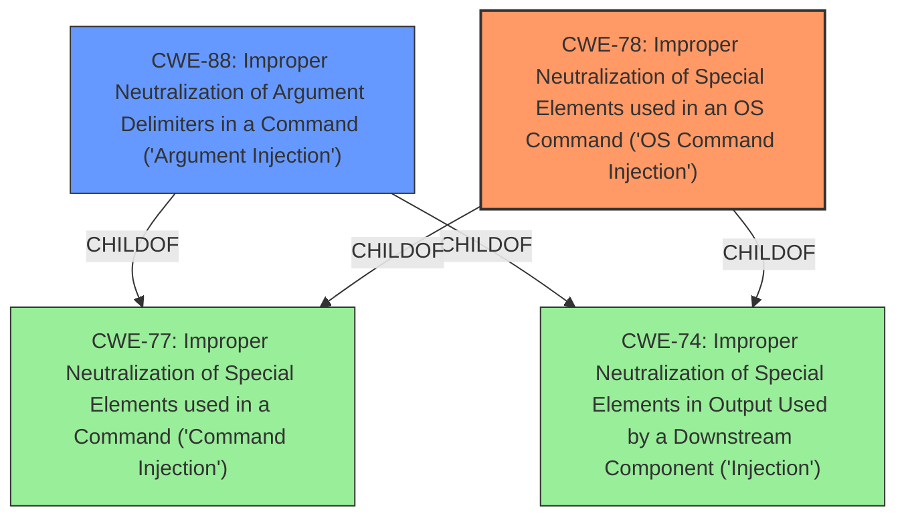

# Enhanced Analysis for CVE-2024-38448

# Summary
| CWE ID | CWE Name | Confidence | CWE Abstraction Level | CWE Vulnerability Mapping Label | CWE-Vulnerability Mapping Notes |
|---|---|---|---|---|---|
| CWE-78 | Improper Neutralization of Special Elements used in an OS Command ('OS Command Injection') | 1.0 | Base | Allowed | Primary CWE. The tool constructs an OS command using externally-influenced input without proper neutralization.|
| CWE-88 | Improper Neutralization of Argument Delimiters in a Command ('Argument Injection') | 0.7 | Base | Allowed | Secondary CWE. The input is used as an argument to a command, and delimiters are not properly handled.|

## Evidence and Confidence

*   **Confidence Score:** 0.9
*   **Evidence Strength:** HIGH

## Relationship Analysis
The primary CWE is CWE-78, which represents **Improper Neutralization of Special Elements used in an OS Command ('OS Command Injection')**. CWE-78 is a base-level CWE, providing a good level of specificity.

CWE-88, **Improper Neutralization of Argument Delimiters in a Command ('Argument Injection')**, is a related CWE that could also apply. It is a child of CWE-77 (Improper Neutralization of Special Elements used in a Command) and CWE-74 (Improper Neutralization of Special Elements in Output Used by a Downstream Component). CWE-88 represents a more specific case of command injection where the issue is with argument delimiters.



## Vulnerability Chain
The vulnerability chain starts with the **improper handling of user input** used to construct a command string. This leads to the **injection of malicious commands**, which are then executed by the system, resulting in **arbitrary code execution**.

The chain is: **Improper Input Handling** -> **CWE-78: OS Command Injection** -> **Arbitrary Code Execution**.

## Summary of Analysis
The primary vulnerability is **CWE-78: Improper Neutralization of Special Elements used in an OS Command ('OS Command Injection')**. The `htags` tool **fails to properly neutralize** shell metacharacters in the `dbpath` argument, allowing an attacker to inject arbitrary commands. This is a clear case of command injection, as the untrusted input directly influences the construction of an OS command executed by `system()`. The evidence from the CVE Reference Links Content Summary explicitly states this.

CWE-88 is a closely related vulnerability, as the injected commands are passed as arguments, but the primary issue is the lack of neutralization of shell metacharacters within the entire command string.

The retriever results strongly support CWE-78 as the primary CWE.

I considered CWE-95 (**Improper Neutralization of Directives in Dynamically Evaluated Code ('Eval Injection')**), but it is not applicable because the code is not being dynamically evaluated using `eval()`.

The selected CWEs are at the optimal level of specificity, as they accurately represent the root cause of the vulnerability.


## CWE Relationship Analysis

Current CWEs represent these abstraction levels: .


### Vulnerability Chain Analysis

**Chain starting from CWE-88:**
- 88 (Improper Neutralization of Argument Delimiters in a Command ('Argument Injection')) - ROOT


**Chain starting from CWE-77:**
- 77 (Improper Neutralization of Special Elements used in a Command ('Command Injection')) - ROOT


### CWE Relationship Diagram

```mermaid
graph TD
    classDef primary fill:#f96,stroke:#333,stroke-width:2px
    classDef secondary fill:#69f,stroke:#333
    classDef tertiary fill:#9e9,stroke:#333
```