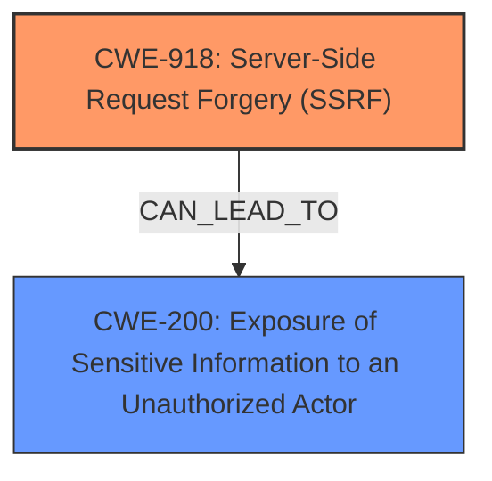

# Raw Analyzer Response for CVE-2024-38472

# Summary
| CWE ID | CWE Name | Confidence | CWE Abstraction Level | CWE Vulnerability Mapping Label | CWE-Vulnerability Mapping Notes |
|---|---|---|---|---|---|
| CWE-918 | Server-Side Request Forgery (SSRF) | 1.0 | Base | Primary | Allowed |
| CWE-200 | Exposure of Sensitive Information to an Unauthorized Actor | 0.7 | Class | Secondary | Allowed-with-Review |

## Evidence and Confidence

*   **Confidence Score:** 0.9
*   **Evidence Strength:** HIGH

## Relationship Analysis
The primary weakness is CWE-918 [Server-Side Request Forgery (SSRF)]. This is a base-level CWE, providing a good description of the root cause. The secondary weakness could be CWE-200 [Exposure of Sensitive Information to an Unauthorized Actor], due to the potential leak of NTLM hashes.

## Vulnerability Chain
The vulnerability chain starts with **SSRF** (CWE-918) which leads to the leakage of NTLM hashes, which is a form of sensitive information exposure.

## Summary of Analysis
The analysis is based on the vulnerability description and the provided CVE reference, which clearly identify the **SSRF** (**Server-Side Request Forgery**) as the main **weakness**. The description explicitly mentions that the **SSRF** allows to potentially leak NTLM hashes.

The retriever results also point to CWE-918 as the most relevant CWE.

CWE-918 [Server-Side Request Forgery (SSRF)] is the optimal choice as it directly addresses the root cause of the vulnerability which is the server being tricked into making requests to arbitrary locations. The evidence "The vulnerability is a Server-Side Request Forgery (SSRF) in the Apache HTTP Server on Windows. It allows an attacker to potentially leak NTLM hashes to a malicious server via SSRF using malicious requests or content." supports this.

CWE-200 [Exposure of Sensitive Information to an Unauthorized Actor] is a secondary consideration because the impact of the SSRF is the leakage of NTLM hashes. This is a class-level CWE.

Relevant CWE Information:

# Enhanced Context (25 CWEs)
The following CWEs were identified as potentially relevant to this vulnerability:

## CWE-918: Server-Side Request Forgery (SSRF)
**Abstraction Level**: Base
**Similarity Score**: 0.80
**Source**: dense

**Description**:
The web server receives a URL or similar request from an upstream component and retrieves the contents of this URL, but it does not sufficiently ensure that the request is being sent to the expected destination.

**Mapping Guidance**:
- Usage: Allowed
- Rationale: This CWE entry is at the Base level of abstraction, which is a preferred level of abstraction for mapping to the root causes of vulnerabilities.

## CWE-200: Exposure of Sensitive Information to an Unauthorized Actor
**Abstraction Level**: Class
**Similarity Score**: N/A
**Source**: N/A

**Description**:
The product exposes sensitive information to an unauthorized actor.

**Mapping Guidance**:
- Usage: Allowed-with-Review
- Rationale: This CWE entry is a Class and might have Base-level children that would be more appropriate. However, if no more specific CWE is available, this can be used.

### Detailed Analysis for each CWE:

**CWE-918: Server-Side Request Forgery (SSRF)**
*   **How the vulnerability's details match the CWE's characteristics:** The description states that the vulnerability is an **SSRF**, which allows the server to be tricked into making requests to arbitrary locations. This matches the definition of CWE-918.
*   **The security implications and potential impact:** An attacker can potentially leak NTLM hashes to a malicious server.
*   **Any parent-child relationships or chain patterns that influenced your mapping:** None.
*   **Whether the weakness is primary or secondary in the vulnerability:** Primary.
*   **How the official MITRE mapping guidance influenced your decision:** The mapping guidance allows for this CWE and is at the Base level of abstraction.
*   **Supporting Evidence:** "The vulnerability is a Server-Side Request Forgery (SSRF) in the Apache HTTP Server on Windows...allows an attacker to potentially leak NTLM hashes to a malicious server via SSRF using malicious requests or content."

**CWE-200: Exposure of Sensitive Information to an Unauthorized Actor**
*   **How the vulnerability's details match the CWE's characteristics:** The **SSRF** results in the leakage of NTLM hashes, which is sensitive information.
*   **The security implications and potential impact:** An attacker can use the leaked NTLM hashes to gain further access to the system.
*   **Any parent-child relationships or chain patterns that influenced your mapping:** None.
*   **Whether the weakness is primary or secondary in the vulnerability:** Secondary.
*   **How the official MITRE mapping guidance influenced your decision:** The mapping guidance allows for this CWE.
*   **Supporting Evidence:** "SSRF in Apache HTTP Server on Windows allows to potentially leak NTML hashes to a malicious server"

**CWEs Considered but Not Used:**

*   CWE-611: Improper Restriction of XML External Entity Reference: While also present in the retriever results, this is less relevant as the vulnerability is not directly related to XML processing.
*   CWE-113: Improper Neutralization of CRLF Sequences in HTTP Headers ('HTTP Request/Response Splitting'): This is not directly applicable because the vulnerability does not involve CRLF injection.
*   CWE-306: Missing Authentication for Critical Function: Not applicable as the issue is not related to missing authentication, but rather the server being tricked into making requests to attacker-controlled locations.