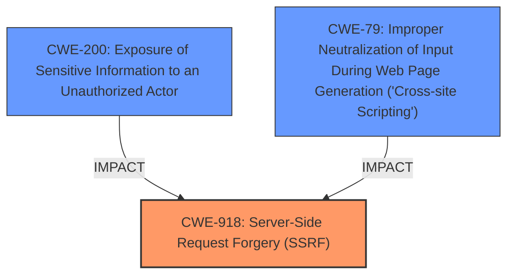

# Enhanced Analysis for CVE-2024-38476

# Summary
| CWE ID  | CWE Name                                                                                                        | Confidence | CWE Abstraction Level | CWE Vulnerability Mapping Label | CWE-Vulnerability Mapping Notes |
| :-------- | :---------------------------------------------------------------------------------------------------------------- | :--------- | :---------------------- | :------------------------------ | :------------------------------ |
| CWE-918 | Server-Side Request Forgery (SSRF)                                                                                | 0.90       | Base                    | Primary CWE                     | Allowed                         |
| CWE-200 | Exposure of Sensitive Information to an Unauthorized Actor                                                        | 0.70       | Class                   | Secondary Candidate             | Discouraged                    |
| CWE-79  | Improper Neutralization of Input During Web Page Generation ('Cross-site Scripting')                              | 0.60       | Base                    | Secondary Candidate             | Allowed                         |

## Evidence and Confidence

*   **Confidence Score:** 0.80
*   **Evidence Strength:** MEDIUM

## Relationship Analysis
The primary relationship is based on the root cause analysis, indicating that the **improper handling of backend application output** can lead to SSRF.
CWE-918 (Server-Side Request Forgery) is a Base level CWE, providing a specific description of the vulnerability.
CWE-200 (Exposure of Sensitive Information to an Unauthorized Actor) is a Class level CWE, representing a broader category of information exposure. It is a potential impact of the vulnerability, but less specific than CWE-918.
CWE-79 (Improper Neutralization of Input During Web Page Generation ('Cross-site Scripting')) is also an impact when backend applications send script related HTML tags without neutralization.



## Vulnerability Chain
The vulnerability chain starts with the **improper handling of backend application output** i.e. response headers. This leads to the possibility of:
1.  Server-Side Request Forgery (CWE-918)
2.  Information Disclosure (CWE-200)
3.  Local Script Execution, which can be viewed as Cross-Site Scripting (CWE-79)

## Summary of Analysis
Based on the vulnerability description and the provided evidence, the primary root cause is the improper handling of backend application output, leading to Server-Side Request Forgery (SSRF). The vulnerability allows a malicious backend to craft responses that cause the Apache server to perform unintended actions, such as making requests to internal or external resources.

The evidence from the CVE Reference Links Content Summary clearly states: "The core weakness is that the server **does not properly sanitize or validate response headers** from backend applications before using them for internal redirects and handler selection. This allows a malicious backend to craft responses that cause the Apache server to perform unintended actions."

CWE-918 is the most appropriate primary CWE because it directly reflects the SSRF vulnerability described in the CVE. The description of CWE-918 aligns with the ability of a malicious backend to force the server to make requests to unintended destinations.

CWE-200 is a secondary candidate because the vulnerability can also lead to information disclosure, which is a broader category.
CWE-79 is a secondary candidate because the vulnerability can also lead to local script execution, which can be viewed as cross-site scripting.

The selection of CWE-918 is at the optimal level of specificity because it directly addresses the root cause and the resulting SSRF vulnerability. While other CWEs like CWE-200 and CWE-79 may be relevant as potential impacts, CWE-918 accurately represents the core weakness exploited in this vulnerability.

CWE-113, CWE-93, CWE-212, CWE-201, CWE-22, CWE-41, CWE-425 and others are less relevant because they either represent different types of vulnerabilities (e.g., CRLF injection, path traversal) or address related but distinct aspects of the issue (e.g., sensitive information handling).


## CWE Relationship Analysis

Current CWEs represent these abstraction levels: .


### Vulnerability Chain Analysis

**Chain starting from CWE-93:**
- 93 (Improper Neutralization of CRLF Sequences ('CRLF Injection')) - ROOT


**Chain starting from CWE-22:**
- 22 (Improper Limitation of a Pathname to a Restricted Directory ('Path Traversal')) - ROOT


### CWE Relationship Diagram

```mermaid
graph TD
    classDef primary fill:#f96,stroke:#333,stroke-width:2px
    classDef secondary fill:#69f,stroke:#333
    classDef tertiary fill:#9e9,stroke:#333
```