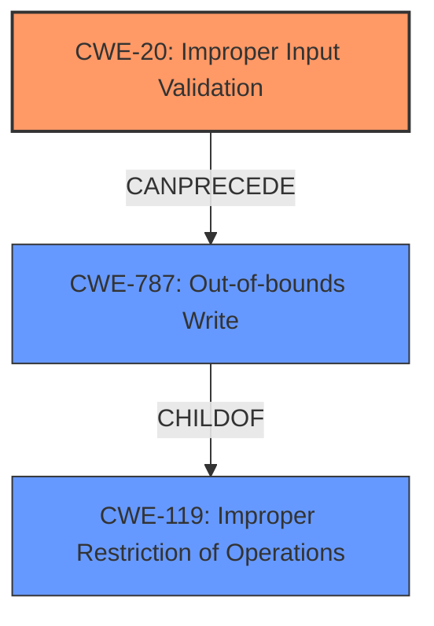

# Raw Analyzer Response for CVE-2024-38483

# Summary

| CWE ID    | CWE Name                                                      | Confidence | CWE Abstraction Level | CWE Vulnerability Mapping Label | CWE-Vulnerability Mapping Notes |
| :-------- | :------------------------------------------------------------ | :--------- | :-------------------- | :------------------------------ | :------------------------------ |
| CWE-20    | Improper Input Validation                                     | 0.9        | Class                 | Primary                         | Discouraged                   |
| CWE-787   | Out-of-bounds Write                                           | 0.6        | Base                  | Secondary                       | Allowed                       |
| CWE-119   | Improper Restriction of Operations within the Bounds of a Memory Buffer | 0.5        | Class                 | Secondary                       | Discouraged                   |

## Evidence and Confidence

*   **Confidence Score:** 0.8
*   **Evidence Strength:** MEDIUM

## Relationship Analysis

The primary CWE is CWE-20, which is a class-level CWE. It's a parent of more specific input validation CWEs. CWE-787 and CWE-119 are related to memory operations, and while the description mentions code execution, there's no explicit buffer overflow or out-of-bounds write. CWE-119 is a parent of CWE-787. The relationship is that **improper input validation** (CWE-20) can **precede** out-of-bounds write (CWE-787), which can lead to code execution.

## Vulnerability Chain

The vulnerability chain starts with **improper input validation** (CWE-20). If the input is not properly validated, it can lead to an out-of-bounds write (CWE-787), and ultimately, code execution. The description mentions **"Improper Input Validation"** leading to "Code execution", suggesting this chain.

## Summary of Analysis

The primary weakness is **Improper Input Validation** (CWE-20). This is based on the explicit statement in the vulnerability description. While code execution is the impact, the root cause is the **lack of validation** on the input.

The other candidates such as CWE-787 (Out-of-bounds Write) and CWE-119 (Improper Restriction of Operations within the Bounds of a Memory Buffer) are possibilities given the "code execution" impact, but there is no explicit buffer overflow or memory corruption mentioned. Thus, they are less strongly supported by the evidence.

The choice of CWE-20 is at the Class level. While more specific CWEs exist for input validation, the description does not provide enough detail to pinpoint the exact type of input that is **not being properly validated**.

Relevant CWE Information:

# Enhanced Context (25 CWEs)
The following CWEs were identified as potentially relevant to this vulnerability:

## CWE-20: Improper Input Validation
**Abstraction Level**: class
**Similarity Score**: 2.92
**Source**: graph

**Description**:
CWE-20: Improper Input Validation

**Mapping Guidance**:
- Usage: Discouraged
- Rationale: CWE-20 is commonly misused in low-information vulnerability reports when lower-level CWEs could be used instead, or when more details about the vulnerability are available [REF-1287]. It is not useful for trend analysis. It is also a level-1 Class (i.e., a child of a Pillar).

**Relationships**:
- CHILDOF -> CWE-707
- PEEROF -> CWE-345
- CANPRECEDE -> CWE-22
- CANPRECEDE -> CWE-41
- CANPRECEDE -> CWE-74