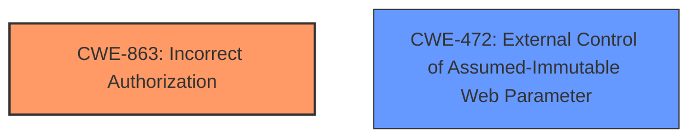

# Analysis for CVE-2024-38518

# Summary
| CWE ID | CWE Name | Confidence | CWE Abstraction Level | CWE Vulnerability Mapping Label | CWE-Vulnerability Mapping Notes |
|---|---|---|---|---|---|
| CWE-863 | Incorrect Authorization | 1.0 | Class | Primary CWE | Allowed-with-Review |
| CWE-472 | External Control of Assumed-Immutable Web Parameter | 0.7 | Base | Secondary Candidate | Allowed |

## Evidence and Confidence

*   **Confidence Score:** 0.9
*   **Evidence Strength:** HIGH

## Relationship Analysis
The primary CWE is CWE-863, "Incorrect Authorization," a Class-level CWE. While it's generally preferable to choose a Base or Variant level CWE, the provided information doesn't give enough details to pinpoint the exact authorization mechanism that failed. CWE-863 serves as a suitable high-level classification, indicating that authorization checks were present but flawed.

CWE-472, "External Control of Assumed-Immutable Web Parameter," is a Base-level CWE. It describes a scenario where the application does not sufficiently verify inputs that are assumed to be immutable but are actually externally controllable. This is relevant to the vulnerability description, as the attacker is manipulating the `role` parameter in the join link.

## Vulnerability Chain
The vulnerability chain begins with the **improper handling of parameters** within the BigBlueButton API, specifically the `join` API endpoint. This leads to the ability to inject arbitrary parameters, such as `role=moderator`. The final impact is privilege escalation, allowing an attacker to join a meeting as a moderator with unauthorized access.

## Summary of Analysis
The initial assessment identified CWE-863, Incorrect Authorization, as the primary weakness due to the **improper access control** allowing an attacker to join a meeting as a moderator. The evidence supporting this includes the vulnerability description key phrases and the CVE reference links content summary stating that an attacker can manipulate parameters to gain elevated privileges.

The retriever results listed several candidate CWEs, including CWE-863, CWE-73, CWE-284, CWE-285, CWE-22, CWE-201, CWE-20, CWE-940, CWE-472, and CWE-59. Of these, CWE-863 and CWE-472 were the most relevant.

CWE-863 directly addresses the authorization issue, while CWE-472 highlights the **external control** aspect. The decision to include both CWEs provides a more complete picture of the vulnerability. The selection of CWE-863 as the primary CWE is based on the root cause being a flaw in the authorization mechanism.

The chosen CWEs are at the optimal level of specificity given the available information. While a more specific child of CWE-863 might exist, the current description doesn't provide sufficient details to pinpoint the exact authorization failure. Similarly, CWE-472 is a good base level description for the external control of web parameters.

Relevant CWE Information:

* **CWE-863: Incorrect Authorization:** The product performs an authorization check when an actor attempts to access a resource or perform an action, but it does not correctly perform the check. The vulnerability description clearly indicates that an attacker can bypass the intended authorization by manipulating the `role` parameter.
* **CWE-472: External Control of Assumed-Immutable Web Parameter:** The web application does not sufficiently verify inputs that are assumed to be immutable but are actually externally controllable, such as hidden form fields. In this case, the `role` parameter, likely assumed to be controlled server-side, is being manipulated by the attacker.

CWEs Considered but Not Used:

* **CWE-73: External Control of File Name or Path:** This CWE is not applicable because the vulnerability does not involve file names or paths.
* **CWE-284: Improper Access Control:** While this is a general access control issue, CWE-863 is more specific to the authorization aspect, making it a better fit.
* **CWE-285: Improper Authorization:** This is similar to CWE-863, but CWE-863 is a better fit because it more directly captures the "incorrect" aspect of the authorization, rather than just a general "improper" authorization.
* **CWE-22: Improper Limitation of a Pathname to a Restricted Directory ('Path Traversal'):** This CWE is not relevant as the vulnerability is not related to path traversal.
* **CWE-201: Insertion of Sensitive Information Into Sent Data:** Not relevant as it doesn't involve sensitive information being inserted into data.
* **CWE-20: Improper Input Validation:** While input validation is related, CWE-472 specifically covers the external control of parameters, making it a better fit for the secondary weakness.
* **CWE-940: Improper Verification of Source of a Communication Channel:** This CWE is not applicable as the vulnerability is not about verifying the source of a communication channel.
* **CWE-59: Improper Link Resolution Before File Access ('Link Following'):** Not relevant as it is about file access using links.