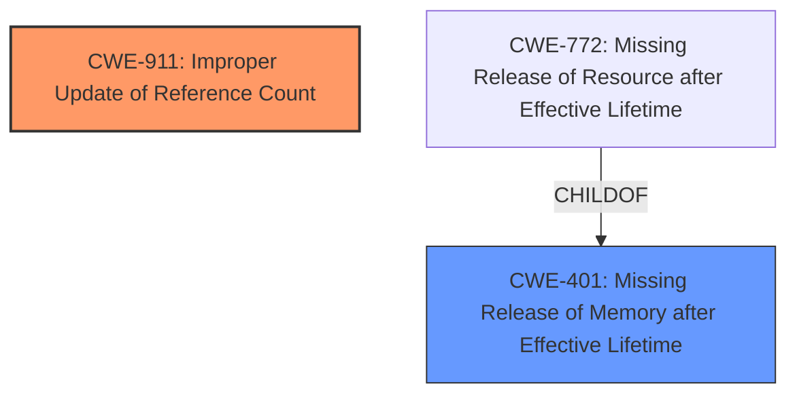

# Raw Analyzer Response for CVE-2024-38554

# Summary

| CWE ID | CWE Name | Confidence | CWE Abstraction Level | CWE Vulnerability Mapping Label | CWE-Vulnerability Mapping Notes |
|---|---|---|---|---|---|
| CWE-911 | Improper Update of Reference Count | 1.0 | Base | Primary | Allowed |
| CWE-401 | Missing Release of Memory after Effective Lifetime | 0.7 | Class | Secondary | Allowed-with-Review |

## Evidence and Confidence

*   **Confidence Score:** 0.9
*   **Evidence Strength:** HIGH

## Relationship Analysis

The primary CWE is CWE-911, which is a Base level CWE. CWE-401 is a Class-level CWE and a parent of CWE-772, Missing Release of Resource after Effective Lifetime, but since the description specifies **reference count**, CWE-911 is a better fit.

## Vulnerability Chain

The vulnerability chain starts with an **improper update of the reference count** (CWE-911), which leads to a **memory leak**, because the memory is not released after its effective lifetime (CWE-401).

## Summary of Analysis

The vulnerability description clearly states a **reference count leak** issue in the Linux kernel. The `ax25_dev_device_down()` function **drops the reference count** of `net_device` one or zero times, depending on the execution path. This leads to a **memory leak**.

CWE-911 (Improper Update of Reference Count) is the most appropriate primary CWE, as it directly addresses the **root cause** of the vulnerability. The description explicitly mentions the **improper update of the reference count**, making CWE-911 a precise match. The evidence for this is the vulnerability description and the Keyphrase-Specific CWE Analysis, specifically the WEAKNESS: `reference count leak`.

CWE-401 (Missing Release of Memory after Effective Lifetime) can be considered a secondary CWE. While the vulnerability ultimately results in a memory leak, the **root cause** is the **improper handling of the reference count**. The description clearly states, "When the ax25 device is shutting down, the ax25_dev_device_down() drops the reference count of net_device one or zero times depending on if we goto unlock_put or not, which will cause **memory leak**". The evidence for this is the vulnerability description and the Keyphrase-Specific CWE Analysis, specifically the WEAKNESS: `memory leak`.

I am overriding the general mapping guidance to map both the root cause and resulting impact as the relationship is clear in the description.

Relevant CWE Information:

# Enhanced Context (25 CWEs)
The following CWEs were identified as potentially relevant to this vulnerability:

## CWE-911: Improper Update of Reference Count
**Abstraction Level**: Base
**Similarity Score**: 0.76
**Source**: dense

**Description**:
The product uses a reference count to manage a resource, but it does not update or incorrectly updates the reference count.

**Mapping Guidance**:
- Usage: Allowed
- Rationale: This CWE entry is at the Base level of abstraction, which is a preferred level of abstraction for mapping to the root causes of vulnerabilities.

## CWE-401: Missing Release of Memory after Effective Lifetime
**Abstraction Level**: Class
**Similarity Score**: 0.72
**Source**: dense

**Description**:
The product does not sufficiently track and release allocated memory after it has been used, which slowly consumes remaining memory....

**Mapping Guidance**:
- Usage: Allowed-with-Review
- Rationale: This CWE entry is a Class and might have Base-level children that would be more appropriate

## CWE-190: Integer Overflow or Wraparound
**Abstraction Level**: Base
**Similarity Score**: 0.72
**Source**: dense

**Description**:
The product performs a calculation that can
         produce an integer overflow or wraparound when the logic
         assumes that the resulting value will always be larger than
         the original value. This occurs when an integer value is
         incremented to a value that is too large to store in the
         associated representation. When this occurs, the value may
         become a very small or negative number.

**Mapping Guidance**:
- Usage: Allowed
- Rationale: This CWE entry is at the Base level of abstraction, which is a preferred level of abstraction for mapping to the root causes of vulnerabilities.

## CWE-362: Concurrent Execution using Shared Resource with Improper Synchronization ('Race Condition')
**Abstraction Level**: Class
**Similarity Score**: 0.73
**Source**: dense

**Description**:
The product contains a concurrent code sequence that requires temporary, exclusive access to a shared resource, but a timing window exists in which the shared resource can be modified by another code sequence operating concurrently.

**Mapping Guidance**:
- Usage: Allowed-with-Review
- Rationale: This CWE entry is a Class and might have Base-level children that would be more appropriate

## CWE-775: Missing Release of File Descriptor or Handle after Effective Lifetime
**Abstraction Level**: Base
**Similarity Score**: 0.73
**Source**: dense

**Description**:
The product does not release a file descriptor or handle after its effective lifetime has ended, i.e., after the file descriptor/handle is no longer needed.

**Mapping Guidance**:
- Usage: Allowed
- Rationale: This CWE entry is at the Base level of abstraction, which is a preferred level of abstraction for mapping to the root causes of vulnerabilities.

## CWE-909: Missing Initialization of Resource
**Abstraction Level**: Class
**Similarity Score**: 0.73
**Source**: dense

**Description**:
The product does not initialize a critical resource.

**Mapping Guidance**:
- Usage: Allowed-with-Review
- Rationale: This CWE entry is a Class and might have Base-level children that would be more appropriate

## CWE-824: Access of Uninitialized Pointer
**Abstraction Level**: Base
**Similarity Score**: 0.74
**Source**: dense

**Description**:
The product accesses or uses a pointer that has not been initialized.

**Mapping Guidance**:
- Usage: Allowed
- Rationale: This CWE entry is at the Base level of abstraction, which is a preferred level of abstraction for mapping to the root causes of vulnerabilities.