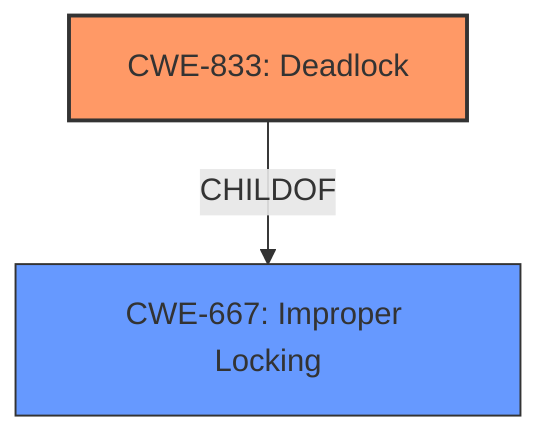

# Analysis Report for CVE-2024-38557

# Vulnerability Analysis Report: CVE-2024-38557

## Description

In the Linux kernel, the following vulnerability has been resolved net/mlx5 Reload only IB representors upon lag disable/enable On lag disable, the bond IB device along with all of its representors are destroyed, and then the slaves representors get reloaded. In case the slave IB representor load fails, the eswitch error flow unloads all representors, including ethernet representors, where the netdevs get detached and removed from lag bond. Such flow is inaccurate as the lag driver is not responsible for loading/unloading ethernet representors. Furthermore, the flow described above begins by holding lag lock to prevent bond changes during disable flow. However, when reaching the ethernet representors detachment from lag, the lag lock is required again, triggering the following **deadlock** Call trace __switch_to+0xf4/0x148 __schedule+0x2c8/0x7d0 schedule+0x50/0xe0 schedule_preempt_disabled+0x18/0x28 __mutex_lock.isra.13+0x2b8/0x570 __mutex_lock_slowpath+0x1c/0x28 mutex_lock+0x4c/0x68 mlx5_lag_remove_netdev+0x3c/0x1a0 [mlx5_core] mlx5e_uplink_rep_disable+0x70/0xa0 [mlx5_core] mlx5e_detach_netdev+0x6c/0xb0 [mlx5_core] mlx5e_netdev_change_profile+0x44/0x138 [mlx5_core] mlx5e_netdev_attach_nic_profile+0x28/0x38 [mlx5_core] mlx5e_vport_rep_unload+0x184/0x1b8 [mlx5_core] mlx5_esw_offloads_rep_load+0xd8/0xe0 [mlx5_core] mlx5_eswitch_reload_reps+0x74/0xd0 [mlx5_core] mlx5_disable_lag+0x130/0x138 [mlx5_core] mlx5_lag_disable_change+0x6c/0x70 [mlx5_core] // hold ldev->lock mlx5_de

## Vulnerability Description Key Phrases

- **Weakness:** deadlock
- **Product:** Linux kernel
- **Component:** net/mlx5

## Analysis (with Relationship Data)

# Summary
| CWE ID | CWE Name | Confidence | CWE Abstraction Level | CWE Vulnerability Mapping Label | CWE-Vulnerability Mapping Notes |
|---|---|---|---|---|---|
| CWE-833 | Deadlock | 1.0 | Base | Primary | Allowed |
| CWE-667 | Improper Locking | 0.7 | Class | Secondary | Allowed-with-Review |

## Evidence and Confidence

*   **Confidence Score:** 0.9
*   **Evidence Strength:** HIGH

## Relationship Analysis
The primary CWE is CWE-833 (Deadlock), which directly reflects the vulnerability's core issue. CWE-667 (Improper Locking) is a related Class-level CWE that describes the general category of locking issues, of which deadlock is a specific instance. While CWE-667 is relevant, CWE-833 provides a more precise characterization of the vulnerability. There is a hierarchical relationship where CWE-833 could be seen as a specific type of CWE-667.



## Vulnerability Chain
The vulnerability chain starts with the incorrect design of the mlx5 driver's LAG disable/enable flow, specifically the attempt to manage Ethernet representors, which leads to the acquisition of the same lock twice, resulting in **deadlock**.

Incorrect driver flow -> Double lock acquisition -> **Deadlock** (CWE-833)

## Summary of Analysis
The primary assessment is based on the explicit mention of the **deadlock** in the vulnerability description and CVE summary. The call trace provided in the vulnerability report further supports this assessment. The retriever results also list CWE-833 as a relevant CWE.

The evidence clearly points to a **deadlock** condition due to incorrect locking mechanisms within the mlx5 driver. Therefore, CWE-833 is the most appropriate primary CWE. CWE-667, while related, is a broader classification. CWE-833 is at the optimal level of specificity (Base).

Relevant CWE Information:

# Enhanced Context (25 CWEs)
The following CWEs were identified as potentially relevant to this vulnerability:

## CWE-833: Deadlock
**Abstraction Level**: Base
**Similarity Score**: 0.75
**Source**: dense

**Description**:
The product contains multiple threads or executable segments that are waiting for each other to release a necessary lock, resulting in **deadlock**.

**Mapping Guidance**:
- Usage: Allowed
- Rationale: This CWE entry is at the Base level of abstraction, which is a preferred level of abstraction for mapping to the root causes of vulnerabilities.


## CWE-667: Improper Locking
**Abstraction Level**: Class
**Similarity Score**: 0.73
**Source**: dense

**Description**:
The product does not properly acquire or release a lock on a resource, leading to unexpected resource state changes and behaviors.

**Mapping Guidance**:
- Usage: Allowed-with-Review
- Rationale: This CWE entry is a Class and might have Base-level children that would be more appropriate

## CWE-833: Deadlock
**Abstraction Level**: Base
**Similarity Score**: 1229.59
**Source**: sparse

**Description**:
The product contains multiple threads or executable segments that are waiting for each other to release a necessary lock, resulting in **deadlock**.

**Mapping Guidance**:
- Usage: Allowed
- Rationale: This CWE entry is at the Base level of abstraction, which is a preferred level of abstraction for mapping to the root causes of vulnerabilities.

# Complete CWE Specifications

CWE-833: **Deadlock**

CWE-667: **Improper Locking**


## CWE Relationship Analysis

Current CWEs represent these abstraction levels: .


### Vulnerability Chain Analysis

**Chain starting from CWE-667:**
- 667 (Improper Locking) - ROOT


**Chain starting from CWE-833:**
- 833 (Deadlock) - ROOT


### CWE Relationship Diagram

```mermaid
graph TD
    classDef primary fill:#f96,stroke:#333,stroke-width:2px
    classDef secondary fill:#69f,stroke:#333
    classDef tertiary fill:#9e9,stroke:#333
```


*Report generated on 2025-07-13 10:42:56*
