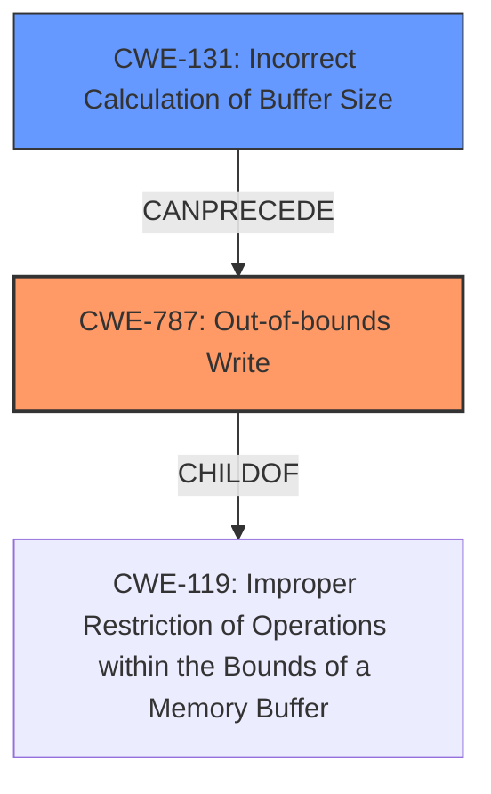

# Analysis Report for CVE-2024-38578

# Vulnerability Analysis Report: CVE-2024-38578

## Description

In the Linux kernel, the following vulnerability has been resolvedecryptfs Fix buffer size for tag 66 packetThe TAG 66 Packet Format description is missing the cipher code andchecksum fields that are packed into the message packet. As a result,the buffer allocated for the packet is 3 bytes too small andwrite_tag_66_packet() will write up to 3 bytes past the end of thebuffer.Fix this by increasing the size of the allocation so the whole packetwill always fit in the buffer.This fixes the below kasan **slab-out-of-bounds** bug BUG KASAN **slab-out-of-bounds** in ecryptfs_generate_key_packet_set+0x7d6/0xde0 Write of size 1 at addr ffff88800afbb2a5 by task touch/181 CPU 0 PID 181 Comm touch Not tainted 6.6.13-gnu #1 4c9534092be820851bb687b82d1f92a426598dc6 Hardware name QEMU Standard PC (i440FX + PIIX, 1996), BIOS 1.16.2/GNU Guix 04/01/2014 Call Trace dump_stack_lvl+0x4c/0x70 print_report+0xc5/0x610 ? ecryptfs_generate_key_packet_set+0x7d6/0xde0 ? kasan_complete_mode_report_info+0x44/0x210 ? ecryptfs_generate_key_packet_set+0x7d6/0xde0 kasan_report+0xc2/0x110 ? ecryptfs_generate_key_packet_set+0x7d6/0xde0 __asan_store1+0x62/0x80 ecryptfs_generate_key_packet_set+0x7d6/0xde0 ? __pfx_ecryptfs_generate_key_packet_set+0x10/0x10 ? __alloc_pages+0x2e2/0x540 ? __pfx_ovl_open+0x10/0x10 [overlay 30837f11141636a8e1793533a02e6e2e885dad1d] ? dentry_open+0x8f/0xd0 ecryptfs_write_metadata+0x30a/0x550 ? __pfx_ecryptfs_write_metadata+0x10/0x10 ? ecryptfs_get_lower_file+0x6b/0x190 ecryptfs_initialize_file+0x77/0x150 ecryptfs_create+0x1c2/0x2f0 path_openat+0x17cf/0x1ba0 ? __pfx_path_openat+0x10/0x10 do_filp_open+0x15e/0x290 ? __pfx_do_filp_open+0x10/0x10 ? __kasan_check_write+0x18/0x30 ? _raw_spin_lock+0x86/0xf0 ? __pfx__raw_spin_lock+0x10/0x10 ? __kasan_check_write+0x18/0x30 ? alloc_fd+0xf4/0x330 do_sys_openat2+0x122/0x160 ? __pfx_do_sys_openat2+0x10/0x10 __x64_sys_openat+0xef/0x170 ? __pfx___x64_sys_openat+0x10/0x10 do_syscall_64+0x60/0xd0 entry_SYSCALL_64_after_hwframe+0x6e/0xd8 RIP 00330x7f00a703fd67 Code 25 00 00 41 00 3d 00 00 41 00 74 37 64 8b 04 25 18 00 00 00 85 c0 75 5b 44 89 e2 48 89 ee bf 9c ff ff ff b8 01 01 00 00 0f 05 3d 00 f0 ff ff 0f 87 85 00 00 00 48 83 c4 68 5d 41 5c c3 0f 1f RSP 002b00007ffc088e30b0 EFLAGS 00000246 ORIG_RAX 0000000000000101 RAX ffffffffffffffda RBX 00007ffc088e3368 RCX 00007f00a703fd67 RDX 0000000000000941 RSI 00007ffc088e48d7 RDI 00000000ffffff9c RBP 00007ffc088e48d7 R08 0000000000000001 R09 0000000000000000 R10 00000000000001b6 R11 0000000000000246 R12 0000000000000941 R13 0000000000000000 R14 00007ffc088e48d7 R15 00007f00a7180040 Allocated by task 181 kasan_save_stack+0x2f/0x60 kasan_set_track+0x29/0x40 kasan_save_alloc_info+0x25/0x40 __kasan_kmalloc+0xc5/0xd0 __kmalloc+0x66/0x160 ecryptfs_generate_key_packet_set+0x6d2/0xde0 ecryptfs_write_metadata+0x30a/0x550 ecryptfs_initialize_file+0x77/0x150 ecryptfs_create+0x1c2/0x2f0 path_openat+0x17cf/0x1ba0 do_filp_open+0x15e/0x290 do_sys_openat2+0x122/0x160 __x64_sys_openat+0xef/0x170 do_syscall_64+0x60/0xd0 entry_SYSCALL_64_after_hwframe+0x6e/0xd8

## Vulnerability Description Key Phrases

- **Rootcause:** The TAG 66 Packet Format description is missing the cipher code and checksum fields that are packed into the message packet.
- **Weakness:** ['Buffer allocated for the packet is 3 bytes too small.', 'slab-out-of-bounds']
- **Impact:** ['write_tag_66_packet() will write up to 3 bytes past the end of the buffer', 'resulting in a slab-out-of-bounds write.']
- **Vector:** Writing metadata to an ecryptfs file system triggers the vulnerability
- **Attacker:** Local user
- **Product:** Linux Kernel
- **Version:** 6.6.13
- **Component:** ecryptfs

## Analysis (with Relationship Data)

# Summary
| CWE ID  | CWE Name  | Confidence | CWE Abstraction Level | CWE Vulnerability Mapping Label | CWE-Vulnerability Mapping Notes |
|---|---|---|---|---|---|
| CWE-787 | Out-of-bounds Write | 0.9 | Base | Primary | Allowed |
| CWE-131 | Incorrect Calculation of Buffer Size | 0.8 | Base | Secondary | Allowed |

## Evidence and Confidence

*   **Confidence Score:** 0.85
*   **Evidence Strength:** HIGH

## Relationship Analysis
The primary CWE is CWE-787, which is a child of CWE-119 (Improper Restriction of Operations within the Bounds of a Memory Buffer). The root cause stems from CWE-131, as the buffer size miscalculation leads directly to the out-of-bounds write. The relationship is linear, with CWE-131 preceding CWE-787. Selecting CWE-787 at the Base level provides the most precise description of the observed weakness.



## Vulnerability Chain
The vulnerability chain starts with an **incorrect calculation of the buffer size** (CWE-131). This leads to a buffer that is too small. Subsequently, when data is written to this undersized buffer, it results in an **out-of-bounds write** (CWE-787), which is the direct impact of the initial flaw.

## Summary of Analysis
The initial analysis of the vulnerability description, particularly the phrases "**buffer allocated for the packet is 3 bytes too small**" and "**slab-out-of-bounds**", strongly suggests an out-of-bounds write. The root cause is identified as a missing cipher code and checksum, leading to the allocation of an insufficient buffer size. This aligns directly with CWE-787 (Out-of-bounds Write) and CWE-131 (Incorrect Calculation of Buffer Size).

The provided evidence explicitly states: "As a result, the **buffer allocated for the packet is 3 bytes too small** and write_tag_66_packet() will write up to 3 bytes past the end of the buffer."

CWE-787 accurately captures the **slab-out-of-bounds** write condition, while CWE-131 explains why the buffer was too small in the first place. The graph relationships confirm that CWE-787 is a child of CWE-119, which is a more general class. The selection of CWE-787 at the Base level provides the necessary specificity.

CWE-20 (Improper Input Validation) was considered, but it is too high-level and doesn't accurately describe the specific flaw, as the issue isn't about validating untrusted input, but rather about allocating enough memory for trusted input being processed.

CWE-770 (Allocation of Resources Without Limits or Throttling) was also considered, but it describes a different scenario where there is a lack of restriction on the number of resources allocated, not an incorrect calculation of the size of a single buffer.

CWE-1284 (Improper Validation of Specified Quantity in Input) was considered but rejected because while a quantity (buffer size) is involved, the core issue isn't about validating user-supplied quantities but rather internal miscalculation based on missing fields.

Therefore, the most appropriate CWEs are CWE-787 and CWE-131, providing a comprehensive representation of the vulnerability.

Relevant CWE Information:

# Enhanced Context (25 CWEs)
The following CWEs were identified as potentially relevant to this vulnerability:

## CWE-668: Exposure of Resource to Wrong Sphere
**Abstraction Level**: Class
**Similarity Score**: 0.76
**Source**: dense

**Description**:
The product exposes a resource to the wrong control sphere, providing unintended actors with inappropriate access to the resource.

**Mapping Guidance**:
- Usage: Discouraged
- Rationale: CWE-668 is high-level and is often misused as a catch-all when lower-level CWE IDs might be applicable. It is sometimes used for low-information vulnerability reports [REF-1287]. It is a level-1 Class (i.e., a child of a Pillar). It is not useful for trend analysis.


## CWE-1391: Use of Weak Credentials
**Abstraction Level**: Class
**Similarity Score**: 0.75
**Source**: dense

**Description**:
The product uses weak credentials (such as a default key or hard-coded password) that can be calculated, derived, reused, or guessed by an attacker.

**Mapping Guidance**:
- Usage: Allowed-with-Review
- Rationale: This CWE entry is a Class and might have Base-level children that would be more appropriate


## CWE-345: Insufficient Verification of Data Authenticity
**Abstraction Level**: Class
**Similarity Score**: 0.75
**Source**: dense

**Description**:
The product does not sufficiently verify the origin or authenticity of data, in a way that causes it to accept invalid data.

**Mapping Guidance**:
- Usage: Discouraged
- Rationale: This CWE entry is a level-1 Class (i.e., a child of a Pillar). It might have lower-level children that would be more appropriate


## CWE-667: Improper Locking
**Abstraction Level**: Class
**Similarity Score**: 0.75
**Source**: dense

**Description**:
The product does not properly acquire or release a lock on a resource, leading to unexpected resource state changes and behaviors.

**Mapping Guidance**:
- Usage: Allowed-with-Review
- Rationale: This CWE entry is a Class and might have Base-level children that would be more appropriate


## CWE-696: Incorrect Behavior Order
**Abstraction Level**: Class
**Similarity Score**: 0.75
**Source**: dense

**Description**:
The product performs multiple related behaviors, but the behaviors are performed in the wrong order in ways which may produce resultant weaknesses.

**Mapping Guidance**:
- Usage: Allowed-with-Review
- Rationale: This CWE entry is a Class and might have Base-level children that would be more appropriate


## CWE-703: Improper Check or Handling of Exceptional Conditions
**Abstraction Level**: Pillar
**Similarity Score**: 0.75
**Source**: dense

**Description**:
The product does not properly anticipate or handle exceptional conditions that rarely occur during normal operation of the product.

**Mapping Guidance**:
- Usage: Discouraged
- Rationale: This CWE entry is extremely high-level, a Pillar.


## CWE-755: Improper Handling of Exceptional Conditions
**Abstraction Level**: Class
**Similarity Score**: 0.75
**Source**: dense

**Description**:
The product does not handle or incorrectly handles an exceptional condition.

**Mapping Guidance**:
- Usage: Discouraged
- Rationale: This CWE entry is a level-1 Class (i.e., a child of a Pillar). It might have lower-level children that would be more appropriate


## CWE-754: Improper Check for Unusual or Exceptional Conditions
**Abstraction Level**: Class
**Similarity Score**: 0.75
**Source**: dense

**Description**:
The product does not check or incorrectly checks for unusual or exceptional conditions that are not expected to occur frequently during day to day operation of the product.

**Mapping Guidance**:
- Usage: Allowed-with-Review
- Rationale: This CWE entry is a Class and might have Base-level children that would be more appropriate


## CWE-497: Exposure of Sensitive System Information to an Unauthorized Control Sphere
**Abstraction Level**: Base
**Similarity Score**: 0.75
**Source**: dense

**Description**:
The product does not properly prevent sensitive system-level information from being accessed by unauthorized actors who do not have the same level of access to the underlying system as the product does.

**Mapping Guidance**:
- Usage: Allowed
- Rationale: This CWE entry is at the Base level of abstraction, which is a preferred level of abstraction for mapping to the root causes of vulnerabilities.


## CWE-131: Incorrect Calculation of Buffer Size
**Abstraction Level**: Base
**Similarity Score**: 0.75
**Source**: dense

**Description**:
The product does not correctly calculate the size to be used when allocating a buffer, which could lead to a buffer overflow.

**Mapping Guidance**:
- Usage: Allowed
- Rationale: This CWE entry is at the Base level of abstraction, which is a preferred level of abstraction for mapping to the root causes of vulnerabilities.


## CWE-1


## CWE Relationship Analysis

Current CWEs represent these abstraction levels: .


### Vulnerability Chain Analysis

**Chain starting from CWE-1284:**
- 1284 (Improper Validation of Specified Quantity in Input) - ROOT


**Chain starting from CWE-1391:**
- 1391 (Use of Weak Credentials) - ROOT


### CWE Relationship Diagram

```mermaid
graph TD
    classDef primary fill:#f96,stroke:#333,stroke-width:2px
    classDef secondary fill:#69f,stroke:#333
    classDef tertiary fill:#9e9,stroke:#333
```


*Report generated on 2025-07-13 10:44:04*
