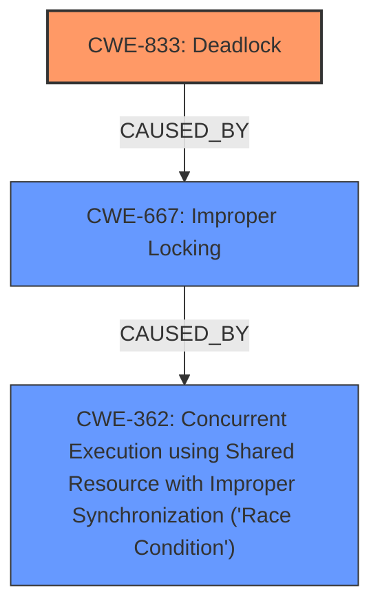

# Analysis Report for CVE-2024-38589

# Vulnerability Analysis Report: CVE-2024-38589

## Description

In the Linux kernel, the following vulnerability has been resolved netrom fix possible dead-lock in nr_rt_ioctl() syzbot loves netrom, and found a possible deadlock in nr_rt_ioctl [1] Make sure we always acquire nr_node_list_lock before nr_node_lock(nr_node) [1] WARNING **possible circular locking dependency** detected 6.9.0-rc7-syzkaller-02147-g654de42f3fc6 #0 Not tainted ------------------------------------------------------ syz-executor350/5129 is trying to acquire lock ffff8880186e2070 (&nr_node->node_lock){+...}-{22}, at spin_lock_bh include/linux/spinlock.h356 [inline] ffff8880186e2070 (&nr_node->node_lock){+...}-{22}, at nr_node_lock include/net/netrom.h152 [inline] ffff8880186e2070 (&nr_node->node_lock){+...}-{22}, at nr_dec_obs net/netrom/nr_route.c464 [inline] ffff8880186e2070 (&nr_node->node_lock){+...}-{22}, at nr_rt_ioctl+0x1bb/0x1090 net/netrom/nr_route.c697 but task is already holding lock ffffffff8f7053b8 (nr_node_list_lock){+...}-{22}, at spin_lock_bh include/linux/spinlock.h356 [inline] ffffffff8f7053b8 (nr_node_list_lock){+...}-{22}, at nr_dec_obs net/netrom/nr_route.c462 [inline] ffffffff8f7053b8 (nr_node_list_lock){+...}-{22}, at nr_rt_ioctl+0x10a/0x1090 net/netrom/nr_route.c697 which lock already depends on the new lock. the existing dependency chain (in reverse order) is -> #1 (nr_node_list_lock){+...}-{22} lock_acquire+0x1ed/0x550 kernel/locking/lockdep.c5754 __raw_spin_lock_bh include/linux/spin

## Vulnerability Description Key Phrases

- **Rootcause:** possible circular locking dependency
- **Impact:** deadlock
- **Product:** Linux kernel
- **Version:** 6.9.0-rc7-syzkaller-02147-g654de42f3fc6
- **Component:** netrom

## Analysis (with Relationship Data)

# Summary
| CWE ID  | CWE Name                                                                                             | Confidence | CWE Abstraction Level | CWE Vulnerability Mapping Label | CWE-Vulnerability Mapping Notes |
| :------- | :--------------------------------------------------------------------------------------------------- | :---------- | :---------------------- | :------------------------------ | :------------------------------ |
| CWE-833 | Deadlock                                                                                               | 0.9         | Base                    | Primary                         | Allowed                         |
| CWE-667 | Improper Locking                                                                                       | 0.7         | Class                   | Secondary                       | Allowed-with-Review             |
| CWE-362 | Concurrent Execution using Shared Resource with Improper Synchronization ('Race Condition') | 0.6         | Class                   | Secondary                       | Allowed-with-Review             |

## Evidence and Confidence

*   **Confidence Score:** 0.9
*   **Evidence Strength:** HIGH

## Relationship Analysis
The primary weakness is CWE-833 Deadlock. This occurs due to improper locking, which can be represented by CWE-667. A race condition (CWE-362) can lead to improper locking and thus to a deadlock. CWE-667 and CWE-362 are higher-level Class CWEs, while CWE-833 is a more specific Base CWE and thus a better fit as the primary.



## Vulnerability Chain
The vulnerability chain starts with **improper locking** in the `nr_rt_ioctl` function, specifically an inconsistent lock acquisition order. This leads to a **circular locking dependency**, which ultimately results in a **deadlock**.
  - Root Cause: Improper Locking (Inconsistent lock acquisition order)
  - Weakness: Circular Locking Dependency
  - Impact: Deadlock

## Summary of Analysis
The analysis is based on the provided vulnerability description and the associated CVE reference links. The vulnerability is a **deadlock** caused by a **possible circular locking dependency** in the `nr_rt_ioctl` function of the Linux kernel's NetROM module. The root cause is **incorrect lock ordering**, where `nr_node_list_lock` and `nr_node->node_lock` are acquired in inconsistent order. The fix involves ensuring that `nr_node_list_lock` is always acquired before `nr_node->node_lock`.

The retriever results suggest CWE-667 (Improper Locking), CWE-833 (Deadlock), and CWE-362 (Concurrent Execution using Shared Resource with Improper Synchronization) as potential candidates. Given the specific nature of the vulnerability, CWE-833 (Deadlock) is the most appropriate primary CWE because the vulnerability description explicitly mentions "deadlock." CWE-667 (Improper Locking) and CWE-362 (Concurrent Execution using Shared Resource with Improper Synchronization) are contributing factors.

Other CWEs Considered but Not Used:

*   CWE-476 (NULL Pointer Dereference): This is not relevant as the vulnerability is related to locking issues, not null pointers.
*   CWE-789 (Memory Allocation with Excessive Size Value): This is not relevant as the vulnerability is related to locking issues, not memory allocation.
*   CWE-415 (Double Free): This is not relevant as the vulnerability is related to locking issues, not memory deallocation.
*   CWE-835 (Loop with Unreachable Exit Condition ('Infinite Loop')): This is not relevant as the vulnerability is related to locking issues, not loops.
*   CWE-770 (Allocation of Resources Without Limits or Throttling): This is not relevant as the vulnerability is related to locking issues, not resource allocation.

# Enhanced Context (25 CWEs)
The following CWEs were identified as potentially relevant to this vulnerability:

## CWE-833: Deadlock
**Abstraction Level**: Base
**Similarity Score**: 0.79
**Source**: dense

**Description**:
The product contains multiple threads or executable segments that are waiting for each other to release a necessary lock, resulting in deadlock.

**Mapping Guidance**:
- Usage: Allowed
- Rationale: This CWE entry is at the Base level of abstraction, which is a preferred level of abstraction for mapping to the root causes of vulnerabilities.

## CWE-667: Improper Locking
**Abstraction Level**: Class
**Similarity Score**: 0.78
**Source**: dense

**Description**:
The product does not properly acquire or release a lock on a resource, leading to unexpected resource state changes and behaviors.

**Mapping Guidance**:
- Usage: Allowed-with-Review
- Rationale: This CWE entry is a Class and might have Base-level children that would be more appropriate

## CWE-362: Concurrent Execution using Shared Resource with Improper Synchronization ('Race Condition')
**Abstraction Level**: Class
**Similarity Score**: 0.74
**Source**: dense

**Description**:
The product contains a concurrent code sequence that requires temporary, exclusive access to a shared resource, but a timing window exists in which the shared resource can be modified by another code sequence operating concurrently.

**Mapping Guidance**:
- Usage: Allowed-with-Review
- Rationale: This CWE entry is a Class and might have Base-level children that would be more appropriate

## CWE-755: Improper Handling of Exceptional Conditions
**Abstraction Level**: Class
**Similarity Score**: 0.73
**Source**: dense

**Description**:
The product does not handle or incorrectly handles an exceptional condition.

**Mapping Guidance**:
- Usage: Discouraged
- Rationale: This CWE entry is a level-1 Class (i.e., a child of a Pillar). It might have lower-level children that would be more appropriate

## CWE-835: Loop with Unreachable Exit Condition ('Infinite Loop')
**Abstraction Level**: Base
**Similarity Score**: 0.73
**Source**: dense

**Description**:
The product contains an iteration or loop with an exit condition that cannot be reached, i.e., an infinite loop.

**Mapping Guidance**:
- Usage: Allowed
- Rationale: This CWE entry is at the Base level of abstraction, which is a preferred level of abstraction for mapping to the root causes of vulnerabilities.

## CWE-476: NULL Pointer Dereference
**Abstraction Level**: Base
**Similarity Score**: 0.72
**Source**: dense

**Description**:
The product dereferences a pointer that it expects to be valid but is NULL.

**Mapping Guidance**:
- Usage: Allowed
- Rationale: This CWE entry is at the Base level of abstraction, which is a preferred level of abstraction for mapping to the root causes of vulnerabilities.

## CWE-703: Improper Check or Handling of Exceptional Conditions
**Abstraction Level**: Pillar
**Similarity Score**: 0.72
**Source**: dense

**Description**:
The product does not properly anticipate or handle exceptional conditions that rarely occur during normal operation of the product.

**Mapping Guidance**:
- Usage: Discouraged
- Rationale: This CWE entry is extremely high-level, a Pillar.

## CWE-61: UNIX Symbolic Link (Symlink) Following
**Abstraction Level**: Compound
**Similarity Score**: 0.72
**Source**: dense

**Description**:
The product, when opening a file or directory, does not sufficiently account for when the file is a symbolic link that resolves to a target outside of the intended control sphere. This could allow an attacker to cause the product to operate on unauthorized files.

**Mapping Guidance**:
- Usage: Allowed
- Rationale: This is a well-known Composite of multiple weaknesses that must all occur simultaneously, although it is attack-oriented in nature.

## CWE-789: Memory Allocation with Excessive Size Value
**Abstraction Level**: Variant
**Similarity Score**: 0.72
**Source**: dense

**Description**:
The product allocates memory based on an untrusted, large size value, but it does not ensure that the size is within expected limits, allowing arbitrary amounts of memory to be allocated.

**Mapping Guidance**:
- Usage: Allowed
- Rationale: This CWE entry is at the Variant level of abstraction, which is a preferred level of abstraction for mapping to the root causes of vulnerabilities.

## CWE-367: Time-of-check Time-of-use (TOCTOU) Race Condition
**Abstraction Level**: Base
**Similarity Score**: 0.72
**Source**: dense

**Description**:
The product checks the state of a resource before using that resource, but the resource's state can change between the check and the use in a way that invalidates the results of the check. This can cause the product to perform invalid actions when the resource is in an unexpected state


## CWE Relationship Analysis

Current CWEs represent these abstraction levels: .


### Vulnerability Chain Analysis

**Chain starting from CWE-476:**
- 476 (NULL Pointer Dereference) - ROOT


**Chain starting from CWE-415:**
- 415 (Double Free) - ROOT


### CWE Relationship Diagram

```mermaid
graph TD
    classDef primary fill:#f96,stroke:#333,stroke-width:2px
    classDef secondary fill:#69f,stroke:#333
    classDef tertiary fill:#9e9,stroke:#333
```


*Report generated on 2025-07-13 10:45:25*
