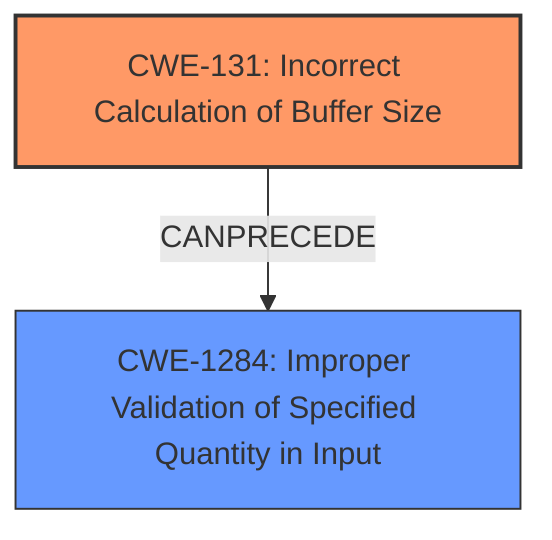

# Analysis Report for CVE-2024-38616

# Vulnerability Analysis Report: CVE-2024-38616

## Description

In the Linux kernel, the following vulnerability has been resolved wifi carl9170 re-fix fortified-memset warning The carl9170_tx_release() function sometimes triggers a fortified-memset warning in my randconfig builds In file included from include/linux/string.h254, from drivers/net/wireless/ath/carl9170/tx.c40 In function fortify_memset_chk, inlined from carl9170_tx_release at drivers/net/wireless/ath/carl9170/tx.c2832, inlined from kref_put at include/linux/kref.h653, inlined from carl9170_tx_put_skb at drivers/net/wireless/ath/carl9170/tx.c3429 include/linux/fortify-string.h49325 error call to __write_overflow_field declared with attribute warning detected **write beyond size of field** (1st parameter) maybe use struct_group()? [-Werror=attribute-warning] 493 | __write_overflow_field(p_size_field, size) Kees previously tried to avoid this by using memset_after(), but it seems this does not fully address the problem. I noticed that the memset_after() here is done on a different part of the union (status) than the original cast was from (rate_driver_data), which may confuse the compiler. Unfortunately, the memset_after() trick does not work on driver_rates[] because that is part of an anonymous struct, and I could not get struct_group() to do this either. Using two separate memset() calls on the two members does address the warning though.

## Vulnerability Description Key Phrases

- **Rootcause:** improper use of memset_after() function
- **Weakness:** write beyond size of field
- **Product:** Linux kernel

## Analysis (with Relationship Data)

# Summary
| CWE ID | CWE Name | Confidence | CWE Abstraction Level | CWE Vulnerability Mapping Label | CWE-Vulnerability Mapping Notes |
|---|---|---|---|---|---|
| CWE-131 | Incorrect Calculation of Buffer Size | 0.7 | Base | Allowed | Primary CWE. The **improper use of memset_after() function** resulted in a potential **write beyond size of field**, indicating a calculation issue related to the buffer size. |
| CWE-1284 | Improper Validation of Specified Quantity in Input | 0.5 | Base | Allowed | Secondary CWE. The `memset_after()` function expects a size argument, and the warning suggests this wasn't correctly validated in the context of the union members, potentially leading to a write beyond the intended boundary. |

## Evidence and Confidence

*   **Confidence Score:** 0.7
*   **Evidence Strength:** MEDIUM

## Relationship Analysis
The primary relationship considered here is the chain of events leading to the compiler warning. The **incorrect calculation of buffer size** (CWE-131) can lead to **improper validation of specified quantity in input** (CWE-1284) when functions like `memset_after()` are used. While neither are direct parents/children, they represent a sequence of potential flaws. CWE-131 is the root cause, leading to the warning.



## Vulnerability Chain
The chain of events is as follows:
1.  The developer intends to clear memory using `memset_after()`.
2.  There is an **improper use of memset_after() function** on the `status` member of a union instead of the intended `rate_driver_data` member.
3.  This leads to a mismatch in the intended memory region, potentially causing a write beyond the expected boundary, which results in the **write beyond size of field** warning.
4.  The compiler's `fortify_memset_chk` function detects this potential out-of-bounds write.
5.  The root cause is CWE-131 (Incorrect Calculation of Buffer Size), as the size was not correctly handled during the memory clearing operation.
6.  CWE-1284 (Improper Validation of Specified Quantity in Input) arises since `memset_after()`'s size argument wasn't validated against the union members, potentially writing beyond the intended boundary.

## Summary of Analysis
The initial assessment focused on identifying the root cause behind the compiler warning. The evidence, "**write beyond size of field**," points towards a potential buffer overflow scenario stemming from incorrect memory handling.

The retriever results suggested several CWEs related to uninitialized variables and resource management. However, these didn't directly address the explicit "*write beyond size of field*" error. While resource initialization issues might be present, they aren't the primary driver behind the warning.

CWE-131 (Incorrect Calculation of Buffer Size) emerged as a strong candidate due to the `memset_after()` function's incorrect usage, potentially leading to an incorrect size calculation. This aligned well with the "*write beyond size of field*" warning. CWE-1284 (Improper Validation of Specified Quantity in Input) was added as a secondary factor in the error.

The chosen CWEs are at the Base level of abstraction, offering sufficient specificity for this particular scenario.

Relevant CWE Information:
*   **CWE-131**: The **improper use of memset_after() function** on a different part of the union (status) than the original cast was from (rate_driver_data), which may confuse the compiler.
*   **CWE-1284**: The `memset_after()` function expects a size argument, and the warning suggests this wasn't correctly validated in the context of the union members, potentially leading to a write beyond the intended boundary.

Other CWEs Considered but Not Used:
*   CWE-457 (Use of Uninitialized Variable): While potentially related to memory safety, the primary issue is the "*write beyond size of field*," not the usage of uninitialized variables.
*   CWE-909 (Missing Initialization of Resource): The issue is not about missing initialization but rather about **improper use of memset_after() function** that could lead to memory corruption.
*   CWE-190 (Integer Overflow or Wraparound): There's no explicit evidence of integer overflow in the description.


## CWE Relationship Analysis

Current CWEs represent these abstraction levels: .


### Vulnerability Chain Analysis

**Chain starting from CWE-1284:**
- 1284 (Improper Validation of Specified Quantity in Input) - ROOT


**Chain starting from CWE-457:**
- 457 (Use of Uninitialized Variable) - ROOT


### CWE Relationship Diagram

```mermaid
graph TD
    classDef primary fill:#f96,stroke:#333,stroke-width:2px
    classDef secondary fill:#69f,stroke:#333
    classDef tertiary fill:#9e9,stroke:#333
```


*Report generated on 2025-07-13 10:47:30*
