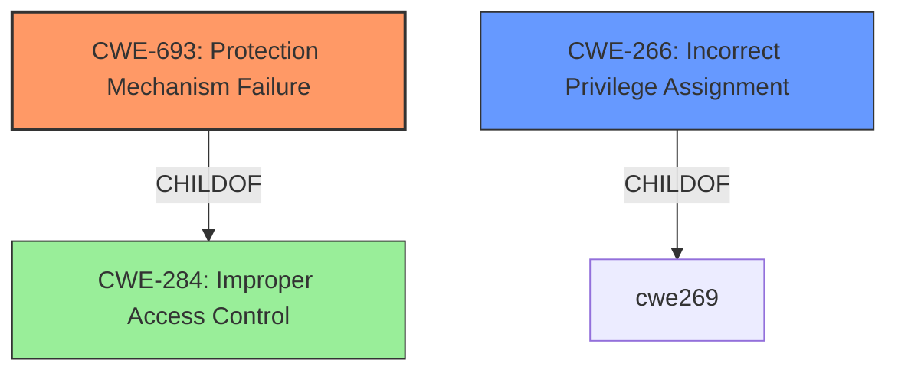

# Analysis Report for CVE-2024-38660

# Vulnerability Analysis Report: CVE-2024-38660

## Description

**Protection mechanism failure** in the SPP for some Intel(R) Xeon(R) processor family (E-Core) may allow an authenticated user to potentially enable escalation of privilege via local access.

## Vulnerability Description Key Phrases

- **Rootcause:** Protection mechanism failure
- **Impact:** escalation of privilege
- **Vector:** local access
- **Attacker:** authenticated user
- **Product:** SPP for some Intel(R) Xeon(R) processor family
- **Component:** E-Core

## Analysis (with Relationship Data)

# Summary
| CWE ID | CWE Name | Confidence | CWE Abstraction Level | CWE Vulnerability Mapping Label | CWE-Vulnerability Mapping Notes |
|---|---|---|---|---|---|
| CWE-693 | Protection Mechanism Failure | 0.9 | Pillar | Allowed | Primary CWE. The vulnerability description explicitly mentions "**Protection mechanism failure**." |
| CWE-266 | Incorrect Privilege Assignment | 0.7 | Base | Allowed | Secondary Candidate. The vulnerability leads to "escalation of privilege," suggesting a potential issue with privilege assignment. |

## Evidence and Confidence

*   **Confidence Score:** 0.8
*   **Evidence Strength:** HIGH

## Relationship Analysis
The primary CWE selected is CWE-693, Protection Mechanism Failure, which is a high-level Pillar. The vulnerability description explicitly states a "**Protection mechanism failure**." Since the description is not providing additional information, a more granular mapping is not possible based on the provided information. CWE-693 is related to other CWEs through hierarchical and chain relationships, but these relationships do not directly influence the selection in this case due to the limited details available in the vulnerability description. CWE-266, Incorrect Privilege Assignment, is considered a possible secondary candidate due to the "escalation of privilege" impact, suggesting an issue with how privileges are assigned.



## Vulnerability Chain
The vulnerability chain starts with a **protection mechanism failure** (CWE-693) in the SPP, leading to the potential for an authenticated user to escalate privileges. This suggests a potential flaw in how privileges are assigned or managed (CWE-266).

Protection Mechanism Failure (CWE-693) -> Privilege Escalation (Potential CWE-266)

## Summary of Analysis
The initial assessment identified CWE-693 as the primary candidate due to the explicit mention of "**protection mechanism failure**" in the vulnerability description. The "escalation of privilege" impact suggests that CWE-266, Incorrect Privilege Assignment, may also be relevant, but is secondary since it is an impact not the root cause. The final decision to prioritize CWE-693 is based on the direct evidence in the vulnerability description, which clearly points to a failure in the protection mechanism. CWE-693 is at the Pillar level, which is higher than preferred. However, due to the limited information available, a more specific mapping is not possible.

Relevant CWE Information:

# Enhanced Context (25 CWEs)
The following CWEs were identified as potentially relevant to this vulnerability:

## CWE-266: Incorrect Privilege Assignment
**Abstraction Level**: Base
**Similarity Score**: 0.79
**Source**: dense

**Description**:
A product incorrectly assigns a privilege to a particular actor, creating an unintended sphere of control for that actor.

**Mapping Guidance**:
- Usage: Allowed
- Rationale: This CWE entry is at the Base level of abstraction, which is a preferred level of abstraction for mapping to the root causes of vulnerabilities.

CWE-693: Protection Mechanism Failure

CWE-691: Insufficient Control Flow Management

CWE-277: Insecure Inherited Permissions

CWE-248: Uncaught Exception

CWE-119: Improper Restriction of Operations within the Bounds of a Memory Buffer

CWE-1037: Processor Optimization Removal or Modification of Security-critical Code

CWE-284: Improper Access Control

CWE-453: Insecure Default Variable Initialization

CWE-1256: Improper Restriction of Software Interfaces to Hardware Features

CWE-1260: Improper Handling of Overlap Between Protected Memory Ranges


## CWE Relationship Analysis

Current CWEs represent these abstraction levels: .


### Vulnerability Chain Analysis

**Chain starting from CWE-453:**
- 453 (Insecure Default Variable Initialization) - ROOT


**Chain starting from CWE-119:**
- 119 (Improper Restriction of Operations within the Bounds of a Memory Buffer) - ROOT


### CWE Relationship Diagram

```mermaid
graph TD
    classDef primary fill:#f96,stroke:#333,stroke-width:2px
    classDef secondary fill:#69f,stroke:#333
    classDef tertiary fill:#9e9,stroke:#333
```


*Report generated on 2025-07-13 10:49:20*
