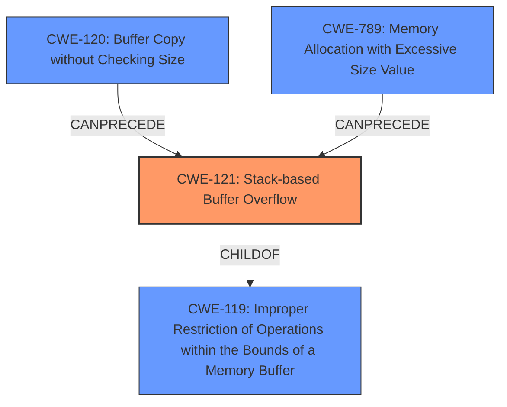

# Enhanced Analysis for CVE-2024-38667

# Summary
| CWE ID | CWE Name | Confidence | CWE Abstraction Level | CWE Vulnerability Mapping Label | CWE-Vulnerability Mapping Notes |
|---|---|---|---|---|---|
| CWE-121 | Stack-based Buffer Overflow | 0.9 | Base | Primary | Allowed |
| CWE-120 | Buffer Copy without Checking Size | 0.7 | Base | Secondary Candidate | Allowed |
| CWE-789 | Memory Allocation with Excessive Size Value | 0.6 | Variant | Secondary Candidate | Allowed |

## Evidence and Confidence

*   **Confidence Score:** 0.8
*   **Evidence Strength:** MEDIUM

## Relationship Analysis
The primary CWE is CWE-121 (Stack-based Buffer Overflow), which is a specific type of buffer overflow that occurs on the stack. CWE-121 is a child of CWE-119 (Improper Restriction of Operations within the Bounds of a Memory Buffer), which is a more general class of buffer overflows. CWE-120 (Buffer Copy without Checking Size) can precede CWE-121, as copying data without checking the size can lead to a buffer overflow. CWE-789 (Memory Allocation with Excessive Size Value) can also lead to stack corruption if the allocated memory exceeds the stack's capacity.



## Vulnerability Chain
The vulnerability chain starts with the **incorrect stack pointer initialization**, leading to **stack corruption**. The **stack corruption** overwrites the `pt_regs` structure, leading to undefined behavior. This can be summarized as: Incorrect Stack Initialization -> Stack Corruption (CWE-121) -> `pt_regs` Corruption -> Undefined Behavior.

## Summary of Analysis
The initial analysis focused on the **stack corruption** issue described in the vulnerability description. The evidence supports the classification of CWE-121 (Stack-based Buffer Overflow) as the primary CWE, as the vulnerability involves writing beyond the intended boundaries of the stack due to incorrect initialization. The relationship analysis shows that CWE-121 is a specific type of buffer overflow, making it a more appropriate choice than the more general CWE-119. The retriever results and graph relationships further support this decision, with CWE-120 and CWE-789 as potential contributing factors. The selected CWEs are at the optimal level of specificity, providing a clear and accurate representation of the vulnerability.

The vulnerability description explicitly mentions "**stack corruption**" and the "overlap with their pt_regs, so both may get corrupted". The CVE Reference Links Content Summary confirms that "The primary vulnerability is stack corruption. Because the stack pointer was not correctly initialized, operations such as `smp_callin` could write directly to the area reserved for `pt_regs`."

Relevant CWE Information:

*   **CWE-121: Stack-based Buffer Overflow:** This CWE is the best fit because the vulnerability involves writing beyond the intended boundaries of the stack due to an incorrect stack pointer initialization. The impact is corruption of the `pt_regs` structure, leading to undefined behavior. This aligns perfectly with the description of a stack-based buffer overflow.
*   **CWE-120: Buffer Copy without Checking Size:** This could be a contributing factor if the `smp_callin` function copies data onto the stack without proper size checks, exacerbating the stack corruption issue. However, the root cause is the incorrect stack initialization, making CWE-121 the primary issue.
*   **CWE-789: Memory Allocation with Excessive Size Value:** The stack corruption could be triggered by allocating a large data structure on the stack, exceeding its capacity.

CWEs considered but not used:

*   CWE-119: Improper Restriction of Operations within the Bounds of a Memory Buffer: While this is a parent of CWE-121, it's less specific and doesn't fully capture the stack-specific nature of the vulnerability.
*   CWE-125: Out-of-bounds Read: This is not the primary issue, as the vulnerability focuses on writing to an incorrect memory location.
*   CWE-476: NULL Pointer Dereference: There is no mention of null pointer dereference in the vulnerability description.
*   CWE-770: Allocation of Resources Without Limits or Throttling: This is not the primary issue, as the vulnerability focuses on incorrect stack pointer initialization.


## CWE Relationship Analysis

Current CWEs represent these abstraction levels: .


### Vulnerability Chain Analysis

**Chain starting from CWE-121:**
- 121 (Stack-based Buffer Overflow) - ROOT


**Chain starting from CWE-476:**
- 476 (NULL Pointer Dereference) - ROOT


### CWE Relationship Diagram

```mermaid
graph TD
    classDef primary fill:#f96,stroke:#333,stroke-width:2px
    classDef secondary fill:#69f,stroke:#333
    classDef tertiary fill:#9e9,stroke:#333
```