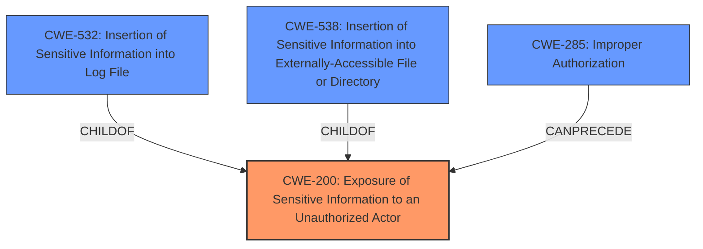

# Analysis for CVE-2024-38761

# Summary
| CWE ID | CWE Name | Confidence | CWE Abstraction Level | CWE Vulnerability Mapping Label | CWE-Vulnerability Mapping Notes |
|---|---|---|---|---|---|
| CWE-200 | Exposure of Sensitive Information to an Unauthorized Actor | 0.8 | Class | Primary | Discouraged - But most applicable based on the evidence provided. |
| CWE-285 | Improper Authorization | 0.5 | Class | Secondary | Discouraged - May be a contributing factor |

## Evidence and Confidence

*   **Confidence Score:** 0.8
*   **Evidence Strength:** MEDIUM

## Relationship Analysis
CWE-200 is a Class-level CWE that serves as a parent to more specific Base-level CWEs like CWE-532 (Insertion of Sensitive Information into Log File) and CWE-538 (Insertion of Sensitive Information into Externally-Accessible File or Directory). While these more specific CWEs were considered, the provided information does not give enough details to determine the exact mechanism of the **exposure of sensitive information**. CWE-285 (Improper Authorization) could be a contributing factor, as **missing or insufficient authorization** is a common root cause for information exposure vulnerabilities. However, without further details, it is difficult to confirm this relationship.

## Vulnerability Chain
The vulnerability chain starts with a **sensitive data exposure** due to an unspecified reason. This leads to the **impact** of a malicious actor being able to view **sensitive information**. The chain is:
1.  **Root Cause:** (Unspecified - likely a coding or configuration error leading to **improper authorization** or **access control**).
2.  **Weakness:** CWE-200 (Exposure of Sensitive Information to an Unauthorized Actor).
3.  **Impact:** Malicious actor views **sensitive information**, potentially leading to further exploitation.

## Summary of Analysis
The primary weakness is CWE-200 (Exposure of Sensitive Information to an Unauthorized Actor) because the vulnerability description and CVE summary explicitly mention "sensitive data exposure" and "unauthorized access to information".

The evidence for this is:
*   "Vulnerability Description Key Phrases: **impact:** Exposure of Sensitive Information to an Unauthorized Actor"
*   "CVE Reference Links Content Summary: **Weaknesses/vulnerabilities present:** Sensitive data exposure, allowing unauthorized access to information."

CWE-200 is a Class-level CWE, and the MITRE guidance discourages its use when more specific CWEs are available. However, the provided information lacks the details necessary to pinpoint the exact mechanism causing the exposure (e.g., whether the information is being logged, stored in an accessible file, or transmitted in cleartext). Without this detail, mapping to a more specific Base-level CWE would be speculative.

CWE-285 (Improper Authorization) is considered as a secondary candidate because the CVE summary mentions that the vulnerability is accessible to unauthenticated users, suggesting that **improper authorization** could be a contributing factor.

Other CWEs considered but not used:

*   CWE-532 (Insertion of Sensitive Information into Log File) and CWE-538 (Insertion of Sensitive Information into Externally-Accessible File or Directory): These were considered because they are more specific types of information exposure. However, there is no evidence to suggest these are the correct mechanisms.
*   CWE-359 (Exposure of Private Personal Information to an Unauthorized Actor): Considered, but the description doesn't specify if the exposed information is "private personal information"
*   CWE-497 (Exposure of Sensitive System Information to an Unauthorized Control Sphere): Considered, but the description doesn't specify if the exposed information is "sensitive system information".

The final selection of CWE-200 is based on the direct evidence of **sensitive information exposure** in the vulnerability description, making it the most appropriate, albeit generic, classification given the available information.