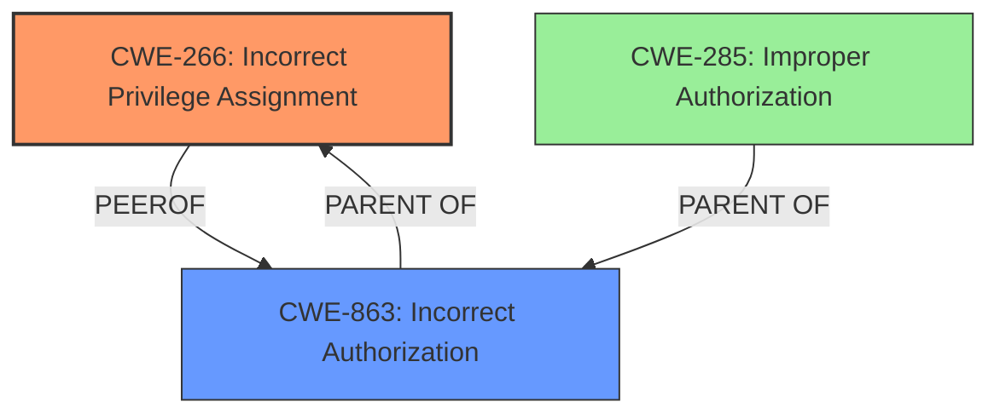

# Enhanced Analysis for CVE-2024-38806

# Summary
| CWE ID | CWE Name | Confidence | CWE Abstraction Level | CWE Vulnerability Mapping Label | CWE-Vulnerability Mapping Notes |
|---|---|---|---|---|---|
| CWE-266 | Incorrect Privilege Assignment | 0.8 | Base | Allowed | Primary CWE |
| CWE-863 | Incorrect Authorization | 0.6 | Class | Allowed-with-Review | Secondary Candidate |

## Evidence and Confidence

*   **Confidence Score:** 0.7
*   **Evidence Strength:** HIGH

## Relationship Analysis
The primary relationship that influenced the decision was the parent-child relationship. CWE-266 is a base CWE which is more specific than class CWEs like CWE-863, but both apply to this vulnerability. The decision to classify it as CWE-266 (Incorrect Privilege Assignment) is based on the fact that the **failure to properly synchronize users permissions** leads to users retaining access rights they should not have, which is an instance of incorrect privilege assignment.



## Vulnerability Chain
The vulnerability chain starts with the **failure to properly synchronize users permissions**, which leads to users retaining access rights they should not have.

## Summary of Analysis
The analysis is based on the provided evidence, which clearly indicates a **failure to properly synchronize users permissions**. The root cause is the incorrect assignment of privileges due to the synchronization failure between the external OIDC/SAML provider and the UAA. The impact is that users retain access rights they should not have, allowing them to perform operations beyond their intended permissions.

The retriever results suggested several CWEs, including CWE-269 (Improper Privilege Management), CWE-732 (Incorrect Permission Assignment for Critical Resource), and CWE-863 (Incorrect Authorization). However, CWE-266 (Incorrect Privilege Assignment) was chosen as the primary CWE because it directly reflects the root cause of the vulnerability.

The mapping guidance helped clarify the distinction between privileges and permissions, leading to the selection of CWE-266 over other related CWEs.

Relevant CWE Information:

# Enhanced Context (25 CWEs)
The following CWEs were identified as potentially relevant to this vulnerability:

## CWE-266: Incorrect Privilege Assignment
**Abstraction Level**: Base
**Similarity Score**: 0.79
**Source**: dense

**Description**:
A product incorrectly assigns a privilege to a particular actor, creating an unintended sphere of control for that actor.

**Mapping Guidance**:
- Usage: Allowed
- Rationale: This CWE entry is at the Base level of abstraction, which is a preferred level of abstraction for mapping to the root causes of vulnerabilities.

### Technical Explanation for CWE-266:
The vulnerability's details match the CWE's characteristics as the UAA fails to remove users from internal groups when they are removed from corresponding groups in an external provider. This results in users retaining privileges they should not have. The security implication is unauthorized access to resources. This CWE is a base level CWE, directly addressing the root cause. The MITRE mapping guidance influenced the decision by emphasizing the importance of selecting the most specific base-level CWE that accurately represents the weakness, and CWE-266 fits the vulnerability well.

### Technical Explanation for CWE-863:
CWE-863 (Incorrect Authorization) is a Class-level CWE that describes a situation where the product performs an authorization check, but it does not correctly perform the check. In this case, UAA **fails to properly synchronize users permissions**, leading to users retaining access rights. While this could be viewed as an authorization issue, the root cause is more specifically an incorrect privilege assignment. It is a less descriptive fit than CWE-266.

CWE-285 (Improper Authorization) and CWE-269 (Improper Privilege Management) were considered but deemed less appropriate. CWE-285 is too general and discouraged, while CWE-269 is also discouraged and often misused.


## CWE Relationship Analysis

Current CWEs represent these abstraction levels: .


### Vulnerability Chain Analysis

**Chain starting from CWE-863:**
- 863 (Incorrect Authorization) - ROOT


**Chain starting from CWE-732:**
- 732 (Incorrect Permission Assignment for Critical Resource) - ROOT


### CWE Relationship Diagram

```mermaid
graph TD
    classDef primary fill:#f96,stroke:#333,stroke-width:2px
    classDef secondary fill:#69f,stroke:#333
    classDef tertiary fill:#9e9,stroke:#333
```