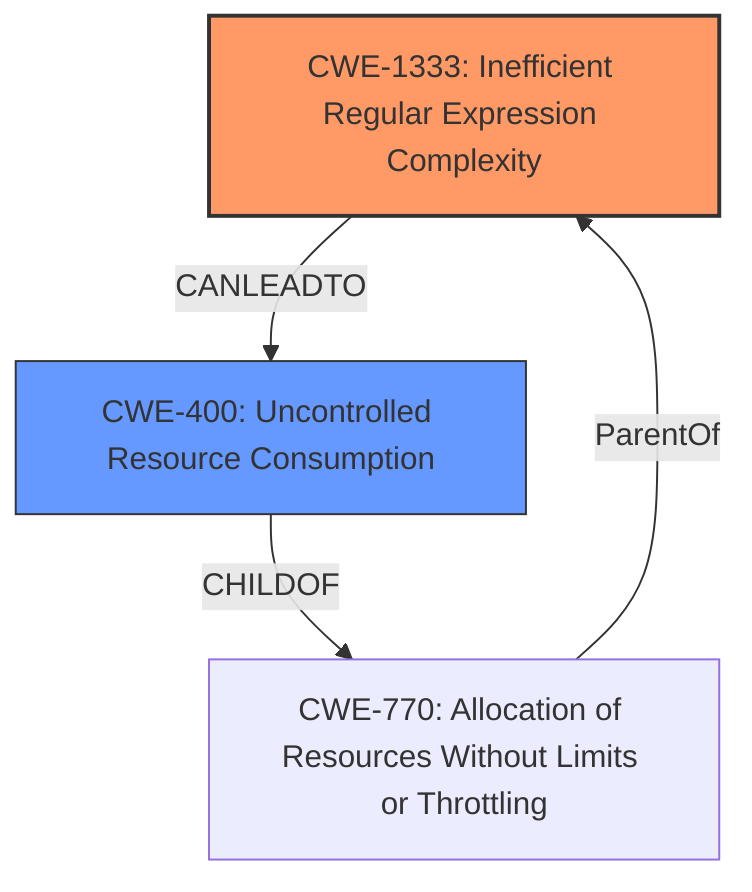

# Raw Analyzer Response for CVE-2024-38809

# Summary

| CWE ID | CWE Name | Confidence | CWE Abstraction Level | CWE Vulnerability Mapping Label | CWE-Vulnerability Mapping Notes |
|---|---|---|---|---|---|
| CWE-1333 | Inefficient Regular Expression Complexity | 0.8 | Base | Allowed | Primary CWE. The parsing process uses regular expressions that are inefficient, leading to excessive CPU consumption and DoS. |
| CWE-400 | Uncontrolled Resource Consumption | 0.6 | Class | Discouraged | Secondary CWE. The **inefficient** regular expression leads to uncontrolled consumption of CPU resources, but the root cause is the regular expression itself. |

## Evidence and Confidence

*   **Confidence Score:** 0.7
*   **Evidence Strength:** MEDIUM

## Relationship Analysis
The primary relationship influencing the CWE selection is the hierarchical relationship between CWE-1333 (Inefficient Regular Expression Complexity) and CWE-400 (Uncontrolled Resource Consumption). CWE-1333 can lead to CWE-400 by causing excessive CPU usage. The abstraction level of CWE-1333 is Base, which is preferred, while CWE-400 is Class, which is higher level.

## Vulnerability Chain
The vulnerability chain starts with the **inefficient** regular expression (CWE-1333) used in parsing ETags. This inefficiency leads to excessive CPU consumption (CWE-400), ultimately resulting in a Denial of Service (DoS) attack.
  - CWE-1333: Inefficient Regular Expression Complexity (**Root Cause**)
  - CWE-400: Uncontrolled Resource Consumption
  - DoS Attack (**Impact**)

## Summary of Analysis
The initial assessment identified the DoS attack as the primary impact, but further analysis revealed the root cause to be the **inefficient** regular expression used in ETag parsing. The description states that applications parsing ETags are vulnerable to DoS attack. The CVE Reference Links Content Summary indicates that the parsing process is susceptible to DoS and mentions "insecure parsing of ETag values". The retriever results list CWE-1333 (Inefficient Regular Expression Complexity) as a candidate. While CWE-400 (Uncontrolled Resource Consumption) is also relevant due to the consumption of resources, the underlying cause is the complexity of the regular expression. Therefore, CWE-1333 is the primary CWE, and CWE-400 is a secondary CWE representing the resulting resource consumption. The selection of CWE-1333 is at the optimal level of specificity because it describes the exact weakness, which is the regular expression.

Relevant CWE Information:

# Enhanced Context (25 CWEs)
The following CWEs were identified as potentially relevant to this vulnerability:

## CWE-918: Server-Side Request Forgery (SSRF)
**Abstraction Level**: Base
**Similarity Score**: 0.71

## CWE-789: Memory Allocation with Excessive Size Value
**Abstraction Level**: Variant
**Similarity Score**: 0.71

## CWE-74: Improper Neutralization of Special Elements in Output Used by a Downstream Component ('Injection')
**Abstraction Level**: Class
**Similarity Score**: 0.71

## CWE-617: Reachable Assertion
**Abstraction Level**: Base
**Similarity Score**: 0.71

## CWE-303: Incorrect Implementation of Authentication Algorithm
**Abstraction Level**: Base
**Similarity Score**: 0.70

## CWE-755: Improper Handling of Exceptional Conditions
**Abstraction Level**: Class
**Similarity Score**: 0.70

## CWE-668: Exposure of Resource to Wrong Sphere
**Abstraction Level**: Class
**Similarity Score**: 0.70

## CWE-346: Origin Validation Error
**Abstraction Level**: Class
**Similarity Score**: 0.70

## CWE-1286: Improper Validation of Syntactic Correctness of Input
**Abstraction Level**: Base
**Similarity Score**: 0.70

## CWE-400: Uncontrolled Resource Consumption
**Abstraction Level**: Class
**Similarity Score**: 0.70

## CWE-347: Improper Verification of Cryptographic Signature
**Abstraction Level**: Base
**Similarity Score**: 784.59

## CWE-1333: Inefficient Regular Expression Complexity
**Abstraction Level**: Base
**Similarity Score**: 733.25

## CWE-789: Memory Allocation with Excessive Size Value
**Abstraction Level**: Variant
**Similarity Score**: 722.09

## CWE-113: Improper Neutralization of CRLF Sequences in HTTP Headers ('HTTP Request/Response Splitting')
**Abstraction Level**: Variant
**Similarity Score**: 720.81

## CWE-22: Improper Limitation of a Pathname to a Restricted Directory ('Path Traversal')
**Abstraction Level**: Base
**Similarity Score**: 719.50

## CWE-1325: Improperly Controlled Sequential Memory Allocation
**Abstraction Level**: base
**Similarity Score**: 4.39

## CWE-22: Improper Limitation of a Pathname to a Restricted Directory ('Path Traversal')
**Abstraction Level**: base
**Similarity Score**: 3.65

## CWE-79: Improper Neutralization of Input During Web Page Generation ('Cross-site Scripting')
**Abstraction Level**: base
**Similarity Score**: 2.87

## CWE-73: External Control of File Name or Path
**Abstraction Level**: base
**Similarity Score**: 2.73

## CWE-201: Insertion of Sensitive Information Into Sent Data
**Abstraction Level**: base
**Similarity Score**: 2.73

## CWE-942: Permissive Cross-domain Policy with Untrusted Domains
**Abstraction Level**: variant
**Similarity Score**: 2.68

## CWE-347: Improper Verification of Cryptographic Signature
**Abstraction Level**: base
**Similarity Score**: 2.33

## CWE-770: Allocation of Resources Without Limits or Throttling
**Abstraction Level**: base
**Similarity Score**: 2.28

## CWE-789: Memory Allocation with Excessive Size Value
**Abstraction Level**: Variant
**Similarity Score**: 2.27

## CWE-1284: Improper Validation of Specified Quantity in Input
**Abstraction Level**: base
**Similarity Score**: 2.21

Other CWEs Considered and Rejected:

*   CWE-347 (Improper Verification of Cryptographic Signature): While listed in Retriever Results, this CWE is not relevant as the vulnerability does not involve cryptographic signatures.
*   CWE-789 (Memory Allocation with Excessive Size Value): This is not the primary cause, although large ETag headers could contribute. The underlying issue is the inefficient regex.
*   CWE-400 (Uncontrolled Resource Consumption): This is a consequence of the inefficient regular expression, but not the root cause.