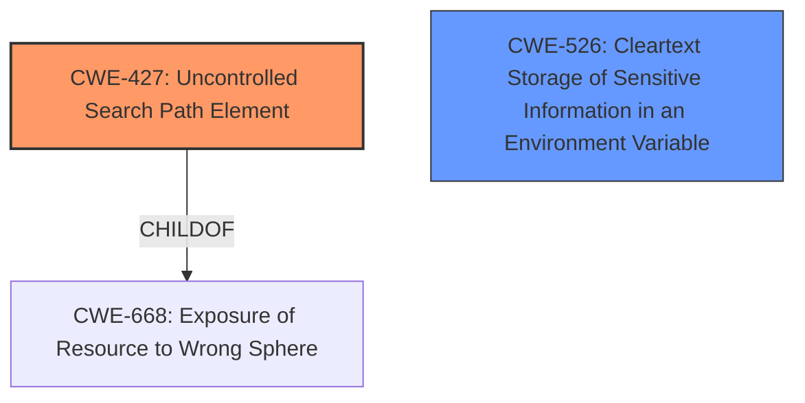

# Raw Analyzer Response for CVE-2024-38811

# Summary

| CWE ID  | CWE Name                                                      | Confidence | CWE Abstraction Level | CWE Vulnerability Mapping Label | CWE-Vulnerability Mapping Notes |
|---------|---------------------------------------------------------------|------------|-----------------------|---------------------------------|---------------------------------|
| CWE-427 | Uncontrolled Search Path Element                                   | 0.8        | Base                  | Primary CWE                     | Allowed                         |
| CWE-526 | Cleartext Storage of Sensitive Information in an Environment Variable | 0.6        | Variant               | Secondary Candidate             | Allowed                         |

## Evidence and Confidence

*   **Confidence Score:** 0.7
*   **Evidence Strength:** MEDIUM

## Relationship Analysis

The primary relationship influencing the decision is that CWE-427 [Uncontrolled Search Path Element] can lead to code execution, as described in the vulnerability. The description clearly indicates that an **insecure environment variable** is the root cause, which aligns with the concept of an uncontrolled search path. While CWE-526 [Cleartext Storage of Sensitive Information in an Environment Variable] is related to environment variables, it focuses on sensitive information storage rather than the path control aspect. CWE-427 is a child of CWE-668 [Exposure of Resource to Wrong Sphere], but CWE-427 is more specific and better fits the vulnerability description.

## Vulnerability Chain

The vulnerability chain starts with the **insecure environment variable** (CWE-427 [Uncontrolled Search Path Element]), which then leads to the impact of code execution.

CWE-427 (Root Cause) -> Code Execution (Impact)

## Summary of Analysis

Initially, several CWEs were considered based on the provided information, including CWE-732 [Incorrect Permission Assignment for Critical Resource], CWE-918 [Server-Side Request Forgery (SSRF)], and CWE-250 [Execution with Unnecessary Privileges]. However, after a detailed review of the vulnerability description and the provided CWE specifications, it became clear that CWE-427 [Uncontrolled Search Path Element] is the most appropriate primary CWE. The **root cause** is the usage of an **insecure environment variable**, which directly aligns with the definition of CWE-427 [Uncontrolled Search Path Element].

The vulnerability description states, "VMware Fusion (13.x before 13.6) contains a code-execution vulnerability due to the usage of an **insecure environment variable**. A malicious actor with standard user privileges may exploit this vulnerability to execute code in the context of the Fusion application."

CWE-526 [Cleartext Storage of Sensitive Information in an Environment Variable] was also considered because the vulnerability involves an environment variable. However, the core issue is not the storage of sensitive information, but rather the uncontrolled nature of the search path dictated by the environment variable. Therefore, CWE-427 [Uncontrolled Search Path Element] is the better fit as the primary weakness.

The selected CWEs are at the optimal level of specificity. CWE-427 [Uncontrolled Search Path Element] is a Base level CWE, which is preferred.
# Enhanced Context (25 CWEs)
The following CWEs were identified as potentially relevant to this vulnerability:

## CWE-427: Uncontrolled Search Path Element
**Abstraction Level**: Base
**Similarity Score**: 0.78
**Source**: dense

**Description**:
The product allows user input to control or influence paths or file names that are used in filesystem operations.

**Mapping Guidance**:
- Usage: Allowed
- Rationale: This CWE entry is at the Base level of abstraction, which is a preferred level of abstraction for mapping to the root causes of vulnerabilities.