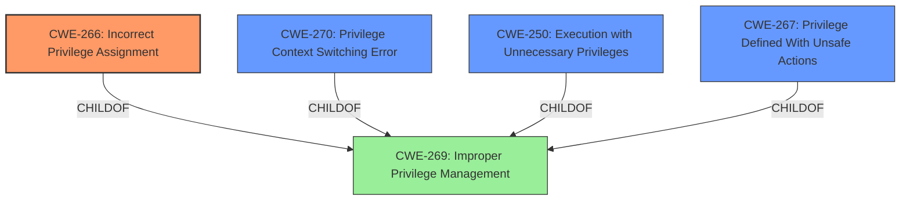

# Enhanced Analysis for CVE-2024-38818

# Summary
| CWE ID | CWE Name | Confidence | CWE Abstraction Level | CWE Vulnerability Mapping Label | CWE-Vulnerability Mapping Notes |
|---|---|---|---|---|---|
| **CWE-266** | **Incorrect Privilege Assignment** | 0.9 | Base | Primary | Allowed |
| CWE-270 | Privilege Context Switching Error | 0.6 | Base | Secondary | Allowed |
| CWE-250 | Execution with Unnecessary Privileges | 0.6 | Base | Secondary | Allowed |
| CWE-267 | Privilege Defined With Unsafe Actions | 0.5 | Base | Secondary | Allowed |

## Evidence and Confidence

*   **Confidence Score:** 0.9
*   **Evidence Strength:** HIGH

## Relationship Analysis
The primary relationship influencing the selection was the parent-child relationship, particularly how CWE-266 (Incorrect Privilege Assignment) fits as a root cause for the observed **privilege escalation vulnerability**. Several peer relationships offered alternative classifications, such as CWE-270 (Privilege Context Switching Error) and CWE-250 (Execution with Unnecessary Privileges), which were considered as potential contributing factors or alternative perspectives on the root cause. Abstraction levels were crucial; the analysis favored Base-level CWEs for their specificity in describing the vulnerability's technical details and mechanisms.



## Vulnerability Chain
The vulnerability chain starts with **incorrect privilege assignment** (CWE-266), which then leads to the possibility of **privilege escalation**.

1.  **Root Cause:** **Incorrect Privilege Assignment (CWE-266)**: The system incorrectly assigns privileges to an actor, leading to an unintended sphere of control.
2.  **Weakness:** Privilege Context Switching Error (CWE-270): If a privilege context switch is required, it might be handled incorrectly, compounding the initial incorrect assignment.
3.  **Weakness:** Execution with Unnecessary Privileges (CWE-250): The code or operation may be executed with higher privileges than necessary, exacerbating the risk introduced by the incorrect privilege assignment.
4.  **Impact:** Privilege Escalation: An authenticated actor gains elevated privileges, allowing them to perform actions beyond their intended authorization.

## Summary of Analysis
Initially, the analysis focused on the **privilege escalation vulnerability** to identify the root cause. The primary CWE identified is CWE-266 (Incorrect Privilege Assignment), as it aligns closely with the vulnerability description indicating that an authenticated actor can obtain permissions from a separate group role than previously assigned.

The vulnerability description clearly points to a scenario where an authenticated user gains elevated privileges, corresponding to a different group role than assigned. This is strong evidence for CWE-266.

The retriever results and graph relationships influenced the final selection by emphasizing the importance of focusing on the root cause of the **privilege escalation**, rather than just the impact. The chosen CWEs are at the optimal level of specificity because they accurately describe the technical details and mechanisms involved in the vulnerability, while also providing actionable information for mitigation.

Relevant CWE Information:
*   CWE-266: Incorrect Privilege Assignment: This CWE is selected as the primary cause because the vulnerability description indicates that an authenticated actor can obtain permissions from a separate group role than previously assigned. The key aspect is the **incorrect assignment** of privileges.
*   CWE-270: Privilege Context Switching Error: This CWE is considered a secondary factor if the application involves privilege context switching, and an error in this process contributes to the escalation.
*   CWE-250: Execution with Unnecessary Privileges: This CWE is considered a secondary factor if the application component executes with higher privileges than necessary, which amplifies the impact of the incorrect privilege assignment.

CWEs Considered But Not Used:
*   CWE-269: Improper Privilege Management: While related, this is a higher-level class and less specific than CWE-266. The description also discourages its usage.
*   CWE-285: Improper Authorization: This is related to authorization checks, but the vulnerability is more directly tied to the assignment of privileges, making CWE-266 a better fit.
*   CWE-306: Missing Authentication for Critical Function: The vulnerability involves authenticated users, so missing authentication is not the issue.
*   CWE-863: Incorrect Authorization: Similar to CWE-285, this is related to authorization checks, but the root cause is the **incorrect assignment** of privileges, making CWE-266 a better fit.


## CWE Relationship Analysis

Current CWEs represent these abstraction levels: .


### Vulnerability Chain Analysis

**Chain starting from CWE-863:**
- 863 (Incorrect Authorization) - ROOT


**Chain starting from CWE-306:**
- 306 (Missing Authentication for Critical Function) - ROOT


### CWE Relationship Diagram

```mermaid
graph TD
    classDef primary fill:#f96,stroke:#333,stroke-width:2px
    classDef secondary fill:#69f,stroke:#333
    classDef tertiary fill:#9e9,stroke:#333
```