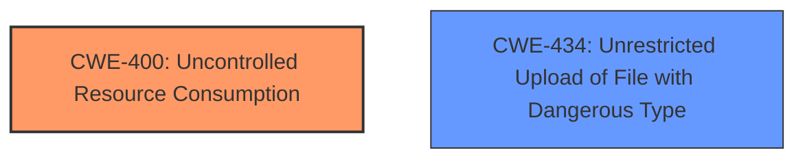

# Raw Analyzer Response for CVE-2024-38826

# Summary
| CWE ID | CWE Name | Confidence | CWE Abstraction Level | CWE Vulnerability Mapping Label | CWE-Vulnerability Mapping Notes |
|---|---|---|---|---|---|
| CWE-400 | Uncontrolled Resource Consumption | 0.9 | Base | Primary CWE | Allowed |
| CWE-434 | Unrestricted Upload of File with Dangerous Type | 0.7 | Base | Secondary Candidate | Allowed |

## Evidence and Confidence

*   **Confidence Score:** 0.9
*   **Evidence Strength:** HIGH

## Relationship Analysis
The primary CWE is CWE-400, which represents the uncontrolled consumption of resources, aligning with the vulnerability's core issue of crafted files leading to denial of service. CWE-434 is considered as a secondary candidate, as the vulnerability involves the uploading of potentially dangerous files that can trigger resource exhaustion.

## Vulnerability Chain
The vulnerability chain starts with the authenticated user uploading a specially crafted file, which is then processed by the Cloud Controller. The **improper** processing leads to **uncontrolled resource consumption**, ultimately causing a denial-of-service condition.

## Summary of Analysis
The primary focus is on the **uncontrolled resource consumption** caused by processing specifically crafted files. The evidence from the CVE Reference Links Content Summary states: "Authenticated users can upload specifically crafted files that cause excessive server resource consumption." This directly aligns with CWE-400. While CWE-434 (Unrestricted Upload of File with Dangerous Type) is relevant because the vulnerability involves uploading files, the core issue is how the uploaded files are processed and the resulting resource consumption. CWE-400 is therefore the primary CWE. CWE-434 is included as a secondary candidate to capture the file upload aspect.

Relevant CWE Information:

# Enhanced Context (25 CWEs)
The following CWEs were identified as potentially relevant to this vulnerability:

## CWE-434: Unrestricted Upload of File with Dangerous Type
**Abstraction Level**: Base
**Similarity Score**: 0.74
**Source**: dense

**Description**:
The product allows the upload or transfer of dangerous file types that are automatically processed within its environment.

**Mapping Guidance**:
- Usage: Allowed
- Rationale: This CWE entry is at the Base level of abstraction, which is a preferred level of abstraction for mapping to the root causes of vulnerabilities.

## CWE-400: Uncontrolled Resource Consumption
**Abstraction Level**: Base
**Description**: The software does not properly control the consumption of resources, which can lead to denial of service, degraded performance, or other adverse effects.
**Observed Example**: A web server might allow a client to repeatedly request the same resource without any limits, which could exhaust the server's memory or CPU resources.

**CWE-400 Explanation**: The vulnerability description indicates that **authenticated users can upload specifically crafted files** that lead to excessive server resource consumption, potentially causing a denial-of-service (DoS) attack. This aligns directly with CWE-400, as the **uncontrolled processing** of these files results in resource exhaustion. The security implication is a DoS attack, and the potential impact is service unavailability.

**CWE-434 Explanation**: While the vulnerability involves file uploads, the core issue is the processing of those files leading to resource exhaustion. CWE-434 highlights the danger of uploading files of dangerous types, which is a contributing factor but not the root cause in this scenario.

**CWEs Considered But Not Used:**
- CWE-918 (Server-Side Request Forgery (SSRF)): Not applicable as the vulnerability does not involve making requests to arbitrary servers.
- CWE-22 (Improper Limitation of a Pathname to a Restricted Directory ('Path Traversal')): Not applicable as the vulnerability does not involve path traversal.
- CWE-1333 (Inefficient Regular Expression Complexity): Not applicable as the description does not mention regular expressions as the attack vector.
- CWE-94 (Improper Control of Generation of Code ('Code Injection')): Not applicable as the vulnerability does not involve code injection.
- CWE-1284 (Improper Validation of Specified Quantity in Input): While input validation might be related, the main issue is resource consumption, making CWE-400 a better fit.