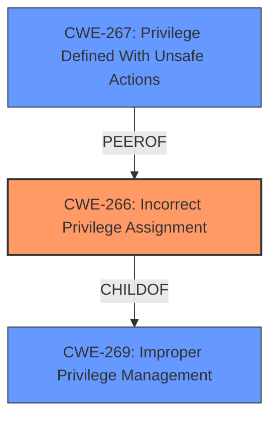

# Raw Analyzer Response for CVE-2024-38830

# Summary
| CWE ID | CWE Name | Confidence | CWE Abstraction Level | CWE Vulnerability Mapping Label | CWE-Vulnerability Mapping Notes |
|---|---|---|---|---|---|
| CWE-266 | Incorrect Privilege Assignment | 0.8 | Base | Primary CWE | Allowed |
| CWE-267 | Privilege Defined With Unsafe Actions | 0.5 | Base | Secondary Candidate | Allowed |
| CWE-269 | Improper Privilege Management | 0.3 | Class | Secondary Candidate | Discouraged |

## Evidence and Confidence

*   **Confidence Score:** 0.8
*   **Evidence Strength:** HIGH

## Relationship Analysis
The primary relationship that influenced the CWE selection was the hierarchical relationship between CWE-269 (Improper Privilege Management) and CWE-266 (Incorrect Privilege Assignment). CWE-266 is a more specific child of CWE-269. The retriever results and the vulnerability description both point towards issues with privilege management, and the description explicitly mentions a **privilege escalation vulnerability**, suggesting an **incorrect assignment** of privileges.

## Vulnerability Chain
The vulnerability chain starts with the **incorrect assignment** of privileges, leading to the ability for a malicious actor to escalate their privileges to the root user.

1.  **Root Cause:** **Incorrect Privilege Assignment** (CWE-266)
2.  **Impact:** Privilege Escalation

## Summary of Analysis
The initial analysis considered several CWEs related to privilege and permission management. The final decision to prioritize CWE-266 was based on the explicit mention of **privilege escalation** and the ability of an attacker to escalate to root. This suggests that the initial privilege assignment was incorrect, allowing for the escalation. The retriever results also indicated that CWE-266 was a strong candidate.

The evidence supporting this decision comes directly from the vulnerability description: "VMware Aria Operations contains a local **privilege escalation vulnerability**. A malicious actor with local administrative privileges may trigger this vulnerability to escalate privileges to root user on the appliance."

CWE-266 is at the optimal level of specificity because it directly addresses the **incorrect assignment** of privileges, which is the root cause of the vulnerability. While CWE-269 (Improper Privilege Management) is a broader category, CWE-266 provides a more precise description of the underlying issue. CWE-267 was considered because a privilege might be defined with unsafe actions, which might lead to privilege escalation.

Relevant CWE Information:

# Enhanced Context (25 CWEs)
The following CWEs were identified as potentially relevant to this vulnerability:

## CWE-266: Incorrect Privilege Assignment
**Abstraction Level**: Base
**Similarity Score**: 0.79
**Source**: dense

**Description**:
A product incorrectly assigns a privilege to a particular actor, creating an unintended sphere of control for that actor.

**Mapping Guidance**:
- Usage: Allowed
- Rationale: This CWE entry is at the Base level of abstraction, which is a preferred level of abstraction for mapping to the root causes of vulnerabilities.

## CWE-267: Privilege Defined With Unsafe Actions
**Abstraction Level**: Base
**Similarity Score**: 0.78
**Source**: dense

**Description**:
A particular privilege, role, capability, or right can be used to perform unsafe actions that were not intended, even when it is assigned to the correct entity.

**Mapping Guidance**:
- Usage: Allowed
- Rationale: This CWE entry is at the Base level of abstraction, which is a preferred level of abstraction for mapping to the root causes of vulnerabilities.

## CWE-269: Improper Privilege Management
**Abstraction Level**: Class
**Similarity Score**: 0.74
**Source**: dense

**Description**:
The product does not properly assign, modify, track, or check privileges for an actor, creating an unintended sphere of control for that actor.

**Mapping Guidance**:
- Usage: Discouraged
- Rationale: CWE-269 is commonly misused. It can be conflated with "privilege escalation," which is a technical impact that is listed in many low-information vulnerability reports [REF-1287]. It is not useful for trend analysis.

## CWE-250: Execution with Unnecessary Privileges

CWE-250 was considered but not selected as the primary CWE because the vulnerability description explicitly mentions **privilege escalation**, suggesting the issue is with the initial assignment of privileges rather than the execution of code with unnecessary privileges. The provided MITRE Privilege vs Permissions Guidance states: *“Escalate to root/admin” suggests Privilege escalation impact Not CWE-269! Use root cause (e.g., 266, 250)*. The **privilege escalation vulnerability** is due to **incorrect privilege assignment** rather than unnecessary privileges.

## CWE-285: Improper Authorization

CWE-285 was not selected because the issue is not with authorization checks but with the initial privilege assignment. The vulnerability is not about incorrectly allowing an action based on flawed permission checking but about assigning the wrong privileges in the first place.

## CWE-306: Missing Authentication for Critical Function

CWE-306 was not selected because the vulnerability is not related to missing authentication but rather to the **incorrect assignment** of privileges. Authentication might be present and working correctly, but the assigned privileges are still incorrect.

## CWE-732: Incorrect Permission Assignment for Critical Resource

CWE-732 was not selected because the vulnerability description focuses on **privilege escalation**, which is more related to the assignment of privileges to actors rather than permissions for specific resources. Also, the Mapping Guidance states: *While the name itself indicates an assignment of permissions for resources, this is often misused for vulnerabilities in which "permissions" are not checked, which is an "authorization" weakness (CWE-285 or descendants) within CWE's model*.

## CWE-863: Incorrect Authorization

CWE-863 was not selected because, similar to CWE-285, the issue is not with incorrectly performing authorization checks but with the initial assignment of privileges.