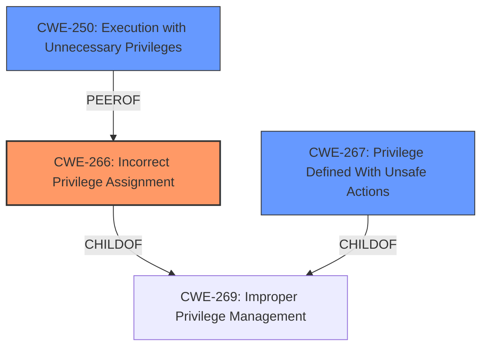

# Enhanced Analysis for CVE-2024-38831

# Summary
| CWE ID | CWE Name | Confidence | CWE Abstraction Level | CWE Vulnerability Mapping Label | CWE-Vulnerability Mapping Notes |
|---|---|---|---|---|---|
| CWE-266 | Incorrect Privilege Assignment | 0.9 | Base | Primary CWE | Allowed |
| CWE-267 | Privilege Defined With Unsafe Actions | 0.7 | Base | Secondary Candidate | Allowed |
| CWE-250 | Execution with Unnecessary Privileges | 0.6 | Base | Secondary Candidate | Allowed |

## Evidence and Confidence

*   **Confidence Score:** 0.8
*   **Evidence Strength:** HIGH

## Relationship Analysis
The primary relationship that influenced the CWE selection was the hierarchical structure related to privilege management. Specifically, the vulnerability involves an **incorrect assignment of privileges**, leading to a privilege escalation. The parent CWE, CWE-269 (Improper Privilege Management), is a Class-level CWE and is discouraged. Therefore, the analysis focused on its more specific children, especially CWE-266 (Incorrect Privilege Assignment) and CWE-267 (Privilege Defined With Unsafe Actions). CWE-250 (Execution with Unnecessary Privileges) was considered as the process ran with higher privileges than needed.



## Vulnerability Chain
The vulnerability chain starts with the **improper handling of user-controlled input in the properties file**. This leads to the ability to inject malicious commands, ultimately resulting in **privilege escalation** to the root user.

1.  **Root Cause:** **Incorrect Privilege Assignment** (CWE-266) due to insufficient validation or sanitization.
2.  **Weakness:** Allows insertion of malicious commands.
3.  **Impact:** Privilege escalation to root.

## Summary of Analysis
The initial analysis focused on identifying the root cause of the privilege escalation. The key evidence is: "A malicious actor with local administrative privileges can insert malicious commands into the properties file to escalate privileges to a root user". This indicates that the system **incorrectly assigns privileges** or allows actions based on the content of the properties file.

CWE-266 (Incorrect Privilege Assignment) is the most appropriate primary CWE because the vulnerability's description explicitly states a **privilege escalation** due to the ability to insert malicious commands, indicating that the **privileges** were **incorrectly assigned** based on the manipulated properties file.

CWE-267 (Privilege Defined With Unsafe Actions) is a possible secondary CWE because the privileges defined in the properties file can be used to perform unsafe actions.

CWE-250 (Execution with Unnecessary Privileges) is a possible secondary CWE as the running process is running with more privileges than it should, allowing the malicious commands to run.

The final decision is based on the evidence that the root cause is due to **incorrectly assigning privileges**, which allows the attacker to escalate to root. This makes CWE-266 the optimal level of specificity.

Relevant CWE Information:

# Enhanced Context (25 CWEs)
The following CWEs were identified as potentially relevant to this vulnerability:

## CWE-266: Incorrect Privilege Assignment
**Abstraction Level**: Base
**Similarity Score**: 0.79
**Source**: dense

**Description**:
A product incorrectly assigns a privilege to a particular actor, creating an unintended sphere of control for that actor.

**Mapping Guidance**:
- Usage: Allowed
- Rationale: This CWE entry is at the Base level of abstraction, which is a preferred level of abstraction for mapping to the root causes of vulnerabilities.
## CWE-267: Privilege Defined With Unsafe Actions
**Abstraction Level**: Base
**Similarity Score**: 0.78
**Source**: dense

**Description**:
A particular privilege, role, capability, or right can be used to perform unsafe actions that were not intended, even when it is assigned to the correct entity.

**Mapping Guidance**:
- Usage: Allowed
- Rationale: This CWE entry is at the Base level of abstraction, which is a preferred level of abstraction for mapping to the root causes of vulnerabilities.
## CWE-250: Execution with Unnecessary Privileges
**Abstraction Level**: Base
**Similarity Score**: 0.78
**Source**: dense

**Description**:
Code runs with higher privileges than needed to complete its function.

**Mapping Guidance**:
- Usage: Allowed
- Rationale: This CWE entry is at the Base level of abstraction, which is a preferred level of abstraction for mapping to the root causes of vulnerabilities.


## CWE Relationship Analysis

Current CWEs represent these abstraction levels: .


### Vulnerability Chain Analysis

**Chain starting from CWE-266:**
- 266 (Incorrect Privilege Assignment) - ROOT


**Chain starting from CWE-269:**
- 269 (Improper Privilege Management) - ROOT


### CWE Relationship Diagram

```mermaid
graph TD
    classDef primary fill:#f96,stroke:#333,stroke-width:2px
    classDef secondary fill:#69f,stroke:#333
    classDef tertiary fill:#9e9,stroke:#333
```