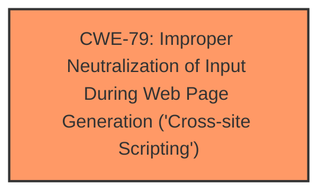

# Raw Analyzer Response for CVE-2024-3888

# Summary
| CWE ID | CWE Name | Confidence | CWE Abstraction Level | CWE Vulnerability Mapping Label | CWE-Vulnerability Mapping Notes |
|---|---|---|---|---|---|
| CWE-79 | Improper Neutralization of Input During Web Page Generation ('Cross-site Scripting') | 1.0 | Base | Allowed | Primary CWE: Root cause is **insufficient input sanitization and output escaping**, leading to XSS. |

## Evidence and Confidence

*   **Confidence Score:** 1.0
*   **Evidence Strength:** HIGH

## Relationship Analysis
The primary relationship to consider is that CWE-79 is a base-level CWE that describes the core issue of improper neutralization leading to XSS. While there are parent and child relationships for CWE-79, the description provided fits the base case directly.

## Vulnerability Chain
The vulnerability chain is straightforward:

1.  **Root Cause:** **Insufficient input sanitization and output escaping** in the tagDiv Composer plugin.
2.  **Weakness:** Improper neutralization of input.
3.  **Impact:** Stored Cross-Site Scripting (XSS) allowing injection of arbitrary web scripts and potential compromise of user accounts.

## Summary of Analysis
The vulnerability description clearly states that the root cause is **insufficient input sanitization and output escaping** on user-supplied attributes, leading directly to a Stored Cross-Site Scripting vulnerability. The description aligns perfectly with CWE-79, "Improper Neutralization of Input During Web Page Generation ('Cross-site Scripting')".

The evidence supporting this decision is:

*   "**insufficient input sanitization and output escaping on user supplied attributes**" - This directly points to the core weakness.
*   "This makes it possible for authenticated attackers, with contributor-level access and above, to inject arbitrary web scripts in pages that will execute whenever a user accesses an injected page." - This describes the XSS vulnerability.

The Retriever Results also list CWE-79 as a highly relevant CWE.

CWE-116, CWE-138, and CWE-352 were considered but not selected. CWE-116 (Improper Encoding or Escaping of Output) is related, but the primary issue is the lack of sanitization, not just encoding. CWE-138 (Improper Neutralization of Special Elements) is a more general class, while CWE-79 is more specific to XSS. CWE-352 (Cross-Site Request Forgery) is not applicable because the vulnerability described is XSS, not CSRF. The provided evidence does not suggest any CSRF-related issues.