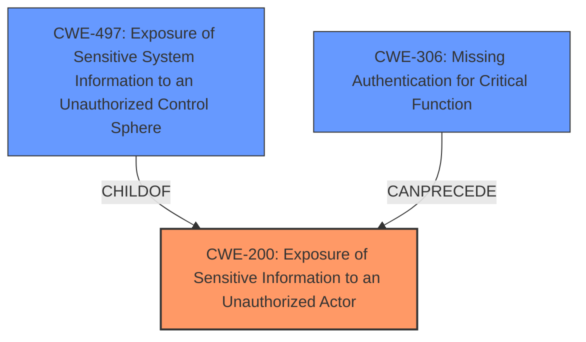

# Enhanced Analysis for CVE-2024-38970

# Summary
| CWE ID | CWE Name | Confidence | CWE Abstraction Level | CWE Vulnerability Mapping Label | CWE-Vulnerability Mapping Notes |
|---|---|---|---|---|---|
| CWE-200 | Exposure of Sensitive Information to an Unauthorized Actor | 0.9 | Class | Primary | Discouraged because it is a Class-level CWE, but it best represents the **impact** of the vulnerability, which is the **exposure of sensitive information**. |
| CWE-497 | Exposure of Sensitive System Information to an Unauthorized Control Sphere | 0.7 | Base | Secondary | Allowed; It describes the **exposure of sensitive system information**, which in this case is the administrator's password. |
| CWE-306 | Missing Authentication for Critical Function | 0.6 | Base | Secondary | Allowed; the system **does not properly** handle the administrator's login process. |

## Evidence and Confidence

*   **Confidence Score:** 0.8
*   **Evidence Strength:** HIGH

## Relationship Analysis
The primary weakness is CWE-200, representing the **exposure of sensitive information**. CWE-497 is a base-level CWE that describes the **exposure of sensitive system information**, while CWE-306 describes the **missing authentication** aspect, potentially leading to the **information disclosure**.



## Vulnerability Chain
The vulnerability chain starts with potentially **missing authentication** (CWE-306), which leads to **exposure of sensitive system information** (CWE-497), ultimately resulting in **exposure of sensitive information to an unauthorized actor** (CWE-200).

## Summary of Analysis
The analysis indicates that the primary vulnerability is CWE-200, as it describes the **impact** of the vulnerability, which is the **exposure of sensitive information**. However, CWE-200 is discouraged. The root cause appears to be a combination of **missing authentication** and **improper handling of sensitive system information**. Therefore, CWE-497 and CWE-306 are also included as secondary CWEs.

The evidence is strong, as the vulnerability description explicitly mentions the **information disclosure** and the inclusion of the administrator's password in the data packet. The retriever results also support the selection of CWE-200 and CWE-497.

The selection of CWEs is at the optimal level of specificity, as CWE-497 and CWE-306 provide more detailed information about the nature of the weakness compared to higher-level CWEs like CWE-284 (Improper Access Control).

Relevant CWE Information:

*   **CWE-200: Exposure of Sensitive Information to an Unauthorized Actor**: The product exposes sensitive information to an actor that is not explicitly authorized to have access to that information. The administrator's password being included in the data packet returned by the system during login directly matches this CWE.
*   **CWE-497: Exposure of Sensitive System Information to an Unauthorized Control Sphere**: The product does not properly prevent sensitive system-level information from being accessed by unauthorized actors. The inclusion of the administrator's password in the data packet fits this description.
*   **CWE-306: Missing Authentication for Critical Function**: The product does not perform any authentication for functionality that requires a provable user identity. While not explicitly stated, the vulnerability implies a **lack of proper authentication** in the access management administrator function.

Other CWEs Considered:

*   CWE-425 (Direct Request ('Forced Browsing')): While there might be some overlap, the primary issue is not about directly requesting restricted resources but rather the **exposure of sensitive information** during the login process.
*   CWE-639 (Authorization Bypass Through User-Controlled Key): This CWE is not applicable as the vulnerability is not about bypassing authorization through user-controlled keys.
*   CWE-94 (Improper Control of Generation of Code ('Code Injection')): This is not applicable as there is no evidence of code injection.
*   CWE-1336 (Improper Neutralization of Special Elements Used in a Template Engine): This is not applicable as there is no evidence of template engine usage or improper neutralization.
*   CWE-284 (Improper Access Control): This is a high-level CWE, and more specific CWEs like CWE-497 and CWE-306 are more appropriate.
*   CWE-362 (Concurrent Execution using Shared Resource with Improper Synchronization ('Race Condition')): This is not applicable as there is no evidence of concurrent execution or race conditions.
*   CWE-1272 (Sensitive Information Uncleared Before Debug/Power State Transition): This is not applicable as the vulnerability is not related to debug/power state transitions.


## CWE Relationship Analysis

Current CWEs represent these abstraction levels: .


### Vulnerability Chain Analysis

**Chain starting from CWE-1272:**
- 1272 (Sensitive Information Uncleared Before Debug/Power State Transition) - ROOT


**Chain starting from CWE-94:**
- 94 (Improper Control of Generation of Code ('Code Injection')) - ROOT


### CWE Relationship Diagram

```mermaid
graph TD
    classDef primary fill:#f96,stroke:#333,stroke-width:2px
    classDef secondary fill:#69f,stroke:#333
    classDef tertiary fill:#9e9,stroke:#333
```