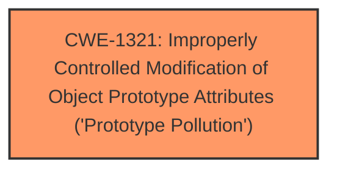

# Analysis Report for CVE-2024-38993

# Vulnerability Analysis Report: CVE-2024-38993

## Description

rjrodger jsonic-next v2.12.1 was discovered to contain a **prototype pollution** via the function empty. This vulnerability allows attackers to execute arbitrary code or cause a Denial of Service (DoS) via injecting arbitrary properties.

## Vulnerability Description Key Phrases

- **Rootcause:** prototype pollution
- **Impact:** ['execute arbitrary code', 'denial of service']
- **Vector:** injecting arbitrary properties
- **Attacker:** attackers
- **Product:** rjrodger jsonic-next
- **Version:** v2.12.1
- **Component:** empty function

## Analysis (with Relationship Data)

# Summary
| CWE ID | CWE Name | Confidence | CWE Abstraction Level | CWE Vulnerability Mapping Label | CWE-Vulnerability Mapping Notes |
|---|---|---|---|---|---|
| CWE-1321 | Improperly Controlled Modification of Object Prototype Attributes ('Prototype Pollution') | 1.0 | Variant | Allowed | Primary CWE |

## Evidence and Confidence

*   **Confidence Score:** 1.0
*   **Evidence Strength:** HIGH

## Relationship Analysis
The primary CWE is CWE-1321, which is a Variant level CWE. There are no direct parent-child relationships or chain relationships apparent from the provided information that directly impact the selection. The abstraction level of Variant is preferred for mapping root causes.



## Vulnerability Chain
The vulnerability chain starts with the **improperly controlled modification of object prototype attributes** (**prototype pollution**) due to the failure to prevent modification of the `Object.prototype` within utility functions. This leads to the ability to inject arbitrary properties, which can then lead to a denial of service (DoS) or arbitrary code execution.

## Summary of Analysis
The vulnerability description clearly indicates a **prototype pollution** issue, making CWE-1321 the most appropriate choice. The "Vulnerability Description Key Phrases" section explicitly mentions "**prototype pollution**" as the root cause. The "CVE Reference Links Content Summary" confirms this, stating that the vulnerability stems from the improper handling of the `__proto__` property, leading to modifications of the `Object.prototype`.

The Retriever Results also list CWE-1321 as the top candidate, with a high similarity score. The CWE description accurately reflects the vulnerability: "The product receives input from an upstream component that specifies attributes that are to be initialized or updated in an object, but it does not properly control modifications of attributes of the object prototype."

The evidence strongly supports the selection of CWE-1321.

CWE-787 was listed as the Primary CWE Match for similar CVE Descriptions and also listed in the top CWEs. However, CWE-787 is an Out-of-bounds Write. While the **prototype pollution** *could* lead to an out-of-bounds write, the root cause is the **improperly controlled modification of object prototype attributes**. Therefore, CWE-1321 is a better match.


## CWE Relationship Analysis

Current CWEs represent these abstraction levels: .


### Vulnerability Chain Analysis

**Chain starting from CWE-787:**
- 787 (Out-of-bounds Write) - ROOT


**Chain starting from CWE-1321:**
- 1321 (Improperly Controlled Modification of Object Prototype Attributes ('Prototype Pollution')) - ROOT


### CWE Relationship Diagram

```mermaid
graph TD
    classDef primary fill:#f96,stroke:#333,stroke-width:2px
    classDef secondary fill:#69f,stroke:#333
    classDef tertiary fill:#9e9,stroke:#333
```


*Report generated on 2025-07-13 11:03:20*
