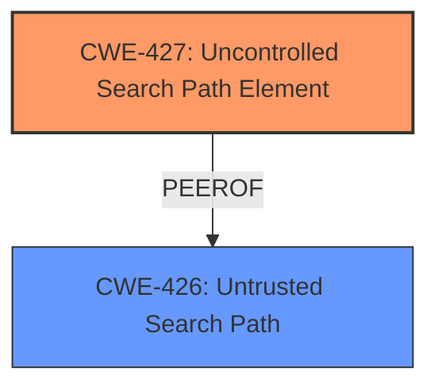

# Raw Analyzer Response for CVE-2024-39069

# Summary

| CWE ID | CWE Name | Confidence | CWE Abstraction Level | CWE Vulnerability Mapping Label | CWE-Vulnerability Mapping Notes |
|---|---|---|---|---|---|
| CWE-427 | Uncontrolled Search Path Element | 1.0 | Base | Primary | Allowed |

## Evidence and Confidence

*   **Confidence Score:** 1.0
*   **Evidence Strength:** HIGH

## Relationship Analysis

The primary relationship influencing the decision is the direct match between the vulnerability description and the definition of CWE-427, which is a **DLL hijacking** attack due to an **uncontrolled search path element**. There are also peer relationships with CWE-426 (Untrusted Search Path), which is a closely related weakness but less specific. The abstraction level of CWE-427 is Base, which is preferred for root cause analysis.

## Vulnerability Chain

The vulnerability chain starts with the **uncontrolled search path element** (CWE-427), which allows an attacker to introduce a malicious DLL into the search path. The application then loads this malicious DLL, resulting in arbitrary code execution.

CWE-427 (Uncontrolled Search Path Element) -> Arbitrary Code Execution (Impact)

## Summary of Analysis

The analysis is strongly based on the provided evidence. The vulnerability description clearly states a **DLL hijacking** attack, and the CVE Reference Links Content Summary confirms that the application has an **insecure DLL search path**. This allows attackers to place a malicious DLL (d3d12.dll) in a location where the application will load it, leading to arbitrary code execution.

The Retriever Results strongly suggest CWE-427 (Uncontrolled Search Path Element) as the most relevant CWE, with the highest score.

The hierarchical relationships support the selection of CWE-427, as it is a Base level CWE and directly addresses the root cause of the vulnerability. Other CWEs, such as CWE-426 (Untrusted Search Path), were considered but deemed less specific. CWE-427 accurately describes the vulnerability where the application uses a fixed search path, but an attacker can control elements within that path.

The selected CWE is at the optimal level of specificity, as it directly corresponds to the **root cause** of the vulnerability, which is the **uncontrolled search path element** that enables **DLL hijacking**.

Relevant CWE Information:

# Enhanced Context (25 CWEs)
The following CWEs were identified as potentially relevant to this vulnerability:

## CWE-427: Uncontrolled Search Path Element
**Abstraction Level**: Base
**Similarity Score**: 0.76
**Source**: dense

**Description**:
The product uses a fixed or controlled search path to find resources, but one or more locations in that path can be under the control of unintended actors.

**Mapping Guidance**:
- Usage: Allowed
- Rationale: This CWE entry is at the Base level of abstraction, which is a preferred level of abstraction for mapping to the root causes of vulnerabilities.

## CWE-426: Untrusted Search Path
**Abstraction Level**: Base
**Similarity Score**: 1019.59
**Source**: sparse

**Description**:
The product searches for critical resources using an externally-supplied search path that can point to resources that are not under the product's direct control.

**Mapping Guidance**:
- Usage: Allowed
- Rationale: This CWE entry is at the Base level of abstraction, which is a preferred level of abstraction for mapping to the root causes of vulnerabilities.

## CWE-732: Incorrect Permission Assignment for Critical Resource
**Abstraction Level**: Class
**Similarity Score**: 1008.27
**Source**: sparse

**Description**:
The product specifies permissions for a security-critical resource in a way that allows that resource to be read or modified by unintended actors.

**Mapping Guidance**:
- Usage: Allowed-with-Review
- Rationale: While the name itself indicates an assignment of permissions for resources, this is often misused for vulnerabilities in which "permissions" are not checked, which is an "authorization" weakness (CWE-285 or descendants) within CWE's model [REF-1287].

## CWE-434: Unrestricted Upload of File with Dangerous Type
**Abstraction Level**: Base
**Similarity Score**: 966.01
**Source**: sparse

**Description**:
The product allows the upload or transfer of dangerous file types that are automatically processed within its environment.

**Mapping Guidance**:
- Usage: Allowed
- Rationale: This CWE entry is at the Base level of abstraction, which is a preferred level of abstraction for mapping to the root causes of vulnerabilities.

## CWE-59: Improper Link Resolution Before File Access ('Link Following')
**Abstraction Level**: Base
**Similarity Score**: 958.72
**Source**: sparse

**Description**:
The product attempts to access a file based on the filename, but it does not properly prevent that filename from identifying a link or shortcut that resolves to an unintended resource.

**Mapping Guidance**:
- Usage: Allowed
- Rationale: This CWE entry is at the Base level of abstraction, which is a preferred level of abstraction for mapping to the root causes of vulnerabilities.