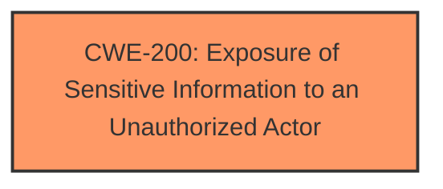

# Enhanced Analysis for CVE-2024-39182

# Summary
| CWE ID | CWE Name | Confidence | CWE Abstraction Level | CWE Vulnerability Mapping Label | CWE-Vulnerability Mapping Notes |
|---|---|---|---|---|---|
| CWE-200 | Exposure of Sensitive Information to an Unauthorized Actor | 0.8 | Class | Primary | Discouraged because it is a class, but it is the best match given the limited information. |

## Evidence and Confidence

*   **Confidence Score:** 0.8
*   **Evidence Strength:** LOW

## Relationship Analysis
The primary CWE is CWE-200, which is a class-level CWE. No child CWEs are clearly applicable based on the provided information. The retriever results suggest several related CWEs, but none are specific enough to warrant a different primary mapping. The main relationship influencing the decision is the lack of detailed information preventing a more specific mapping.



## Vulnerability Chain
The vulnerability chain is simple: a lack of proper access control or input validation leads to the **exposure of sensitive information**.

## Summary of Analysis
The initial assessment identified **information disclosure** as the primary weakness. The retriever results and the vulnerability description both point to CWE-200 as the most relevant CWE.

The provided evidence is minimal, consisting only of a brief description stating that the vulnerability allows attackers to access sensitive details of the root user's session via an arbitrary command. Without more detail about the root cause (e.g., specific input validation failures, authentication bypass, etc.), a more precise CWE mapping is not possible.

CWE-200 is a class-level CWE and is generally discouraged as a primary mapping. However, in this case, it serves as the best available option given the limited information. More specific CWEs like CWE-497 (Exposure of Sensitive System Information to an Unauthorized Control Sphere) or CWE-532 (Insertion of Sensitive Information into Log File) could be applicable if more details about the vulnerability were known, but there is insufficient evidence to support those mappings.


## CWE Relationship Analysis

Current CWEs represent these abstraction levels: .


### Vulnerability Chain Analysis

**Chain starting from CWE-200:**
- 200 (Exposure of Sensitive Information to an Unauthorized Actor) - ROOT


**Chain starting from CWE-497:**
- 497 (Exposure of Sensitive System Information to an Unauthorized Control Sphere) - ROOT


### CWE Relationship Diagram

```mermaid
graph TD
    classDef primary fill:#f96,stroke:#333,stroke-width:2px
    classDef secondary fill:#69f,stroke:#333
    classDef tertiary fill:#9e9,stroke:#333
```