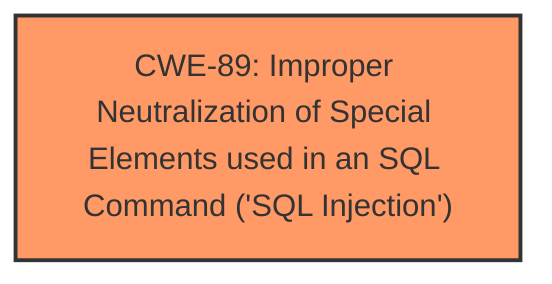

# Raw Analyzer Response for CVE-2024-3922

# Summary
| CWE ID | CWE Name | Confidence | CWE Abstraction Level | CWE Vulnerability Mapping Label | CWE-Vulnerability Mapping Notes |
|---|---|---|---|---|---|
| CWE-89 | Improper Neutralization of Special Elements used in an SQL Command ('SQL Injection') | 1.0 | Base | Allowed | Primary CWE |

## Evidence and Confidence

*   **Confidence Score:** 1.0
*   **Evidence Strength:** HIGH

## Relationship Analysis
The primary relationship identified is that CWE-89 [CWE-89: Improper Neutralization of Special Elements used in an SQL Command ('SQL Injection')] is a base level CWE. There are child CWEs of CWE-89, but the description does not include enough information to determine if a more specific CWE is warranted.

## Vulnerability Chain
The vulnerability chain starts with **insufficient escaping on the user supplied parameter and lack of sufficient preparation on the existing SQL query**, leading to **SQL injection**, which allows unauthenticated attackers to extract sensitive information from the database.

## Summary of Analysis
The vulnerability description clearly states that the root cause is **insufficient escaping on the user supplied parameter and lack of sufficient preparation on the existing SQL query**, leading to **SQL Injection**. The impact is that unauthenticated attackers can extract sensitive information from the database.

The CWE-89 [CWE-89: Improper Neutralization of Special Elements used in an SQL Command ('SQL Injection')] description matches this vulnerability well: "The product constructs all or part of an SQL command using externally-influenced input from an upstream component, but it does not neutralize or incorrectly neutralizes special elements that could modify the intended SQL command when it is sent to a downstream component."

Other CWEs Considered:

*   CWE-79 [CWE-79: Improper Neutralization of Input During Web Page Generation ('Cross-site Scripting')]: This CWE is not appropriate because the vulnerability is related to SQL injection, not cross-site scripting.
*   CWE-434 [CWE-434: Unrestricted Upload of File with Dangerous Type]: This CWE is not related to the vulnerability because it's about file uploads, not SQL injection.
*   CWE-90 [CWE-90: Improper Neutralization of Special Elements used in an LDAP Query ('LDAP Injection')]: This CWE is not appropriate because the vulnerability is related to SQL injection, not LDAP injection.

The selection of CWE-89 [CWE-89: Improper Neutralization of Special Elements used in an SQL Command ('SQL Injection')] is at the optimal level of specificity because it directly addresses the **SQL injection** vulnerability caused by **insufficient escaping and lack of sufficient preparation on the existing SQL query**.