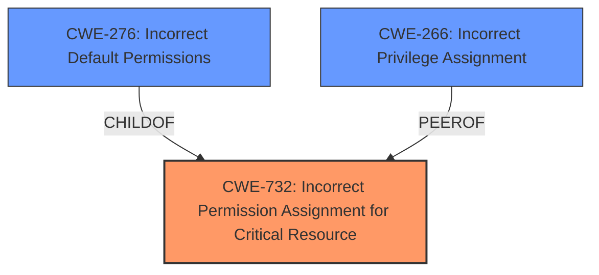

# Enhanced Analysis for CVE-2024-39302

# Summary
| CWE ID  | CWE Name                                                        | Confidence | CWE Abstraction Level | CWE Vulnerability Mapping Label | CWE-Vulnerability Mapping Notes |
| :-------- | :-------------------------------------------------------------- | :--------- | :-------------------- | :------------------------------ | :------------------------------ |
| CWE-732   | Incorrect Permission Assignment for Critical Resource           | 0.9        | Class                 | Allowed-with-Review             | Primary CWE                     |
| CWE-276   | Incorrect Default Permissions                                   | 0.7        | Base                  | Allowed                         | Secondary Candidate             |
| CWE-266   | Incorrect Privilege Assignment                                  | 0.6        | Base                  | Allowed                         | Secondary Candidate             |

## Evidence and Confidence

*   **Confidence Score:** 0.8
*   **Evidence Strength:** HIGH

## Relationship Analysis
The primary CWE selected, CWE-732 (Incorrect Permission Assignment for Critical Resource), is a Class-level CWE. While more specific Base or Variant CWEs are preferred, the available evidence doesn't pinpoint a more granular weakness. CWE-732 relates to the vulnerability because the **root cause** is the setting of incorrect file permissions, a critical resource, that allows unintended actors to exploit the system. CWE-276 (Incorrect Default Permissions) is a Base-level CWE and a more specific type of CWE-732, which could have been a good fit if the evidence pointed to default permissions being the root cause. CWE-266 (Incorrect Privilege Assignment) was considered, but the guidance suggests it's more about misconfigured roles, which isn't explicitly stated here.



## Vulnerability Chain
The vulnerability chain starts with the **incorrectly elevated file permissions** (CWE-732). This allows an attacker to perform actions they shouldn't be able to, leading to privilege escalation. The impact is the potential exposure of sensitive information.

Incorrect File Permissions (CWE-732) -> Privilege Escalation -> Exposure of Sensitive Information

## Summary of Analysis
The analysis is primarily based on the provided evidence, specifically the "Vulnerability Description Key Phrases" and "CVE Reference Links Content Summary". The **root cause** is explicitly stated as "**overly elevated file permissions**". The "CVE Reference Links Content Summary" further reinforces this by stating that the "incorrect file permissions were set". The retriever results also point towards permission-related CWEs, with CWE-732 being the top result.

CWE-732 is selected as the primary CWE because it best represents the **root cause** of the vulnerability, which is the **incorrect assignment of permissions to a critical resource**. While the vulnerability leads to privilege escalation, that is the impact and not the root cause. The guidance on Privileges vs Permissions helped clarify the distinction between privilege-related and permission-related CWEs.

The selected CWE is at the optimal level of specificity given the available evidence. While a more specific Base CWE might be desirable, the current evidence doesn't allow for a more precise classification.

Relevant CWE Information:

# Enhanced Context (25 CWEs)
The following CWEs were identified as potentially relevant to this vulnerability:

## CWE-266: Incorrect Privilege Assignment
**Abstraction Level**: Base
**Similarity Score**: 0.80
**Source**: dense

**Description**:
A product incorrectly assigns a privilege to a particular actor, creating an unintended sphere of control for that actor.

**Mapping Guidance**:
- Usage: Allowed
- Rationale: This CWE entry is at the Base level of abstraction, which is a preferred level of abstraction for mapping to the root causes of vulnerabilities.

*Why not selected:* While privilege escalation is the impact, the root cause is incorrect permissions, not incorrect privilege assignment.

## CWE-267: Privilege Defined With Unsafe Actions
**Abstraction Level**: Base
**Similarity Score**: 0.79
**Source**: dense

**Description**:
A particular privilege, role, capability, or right can be used to perform unsafe actions that were not intended, even when it is assigned to the correct entity.

**Mapping Guidance**:
- Usage: Allowed
- Rationale: This CWE entry is at the Base level of abstraction, which is a preferred level of abstraction for mapping to the root causes of vulnerabilities.

*Why not selected:* This CWE doesn't fit because it discusses a privilege being defined with unsafe actions. The **root cause** here is **incorrect file permissions** and not the definition of privileges.

## CWE-280: Improper Handling of Insufficient Permissions or Privileges 
**Abstraction Level**: Base
**Similarity Score**: 0.77
**Source**: dense

**Description**:
The product does not handle or incorrectly handles when it has insufficient privileges to access resources or functionality as specified by their permissions. This may cause it to follow unexpected code paths that may leave the product in an invalid state.

**Mapping Guidance**:
- Usage: Allowed
- Rationale: This CWE entry is at the Base level of abstraction, which is a preferred level of abstraction for mapping to the root causes of vulnerabilities.

*Why not selected:* The **root cause** is not the handling of insufficient permissions. Rather, the problem is the assignment of overly permissive permissions.

## CWE-668: Exposure of Resource to Wrong Sphere
**Abstraction Level**: Class
**Similarity Score**: 0.77
**Source**: dense

**Description**:
The product exposes a resource to the wrong control sphere, providing unintended actors with inappropriate access to the resource.

**Mapping Guidance**:
- Usage: Discouraged
- Rationale: CWE-668 is high-level and is often misused as a catch-all when lower-level CWE IDs might be applicable. It is sometimes used for low-information vulnerability reports [REF-1287]. It is a level-1 Class (i.e., a child of a Pillar). It is not useful for trend analysis.

*Why not selected:* Although technically this could apply, CWE-732 is a more specific fit for **incorrect permission assignment**.

## CWE-274: Improper Handling of Insufficient Privileges
**Abstraction Level**: Base
**Similarity Score**: 0.77
**Source**: dense

**Description**:
The product does not handle or incorrectly handles when it has insufficient privileges to perform an operation, leading to resultant weaknesses.

**Mapping Guidance**:
- Usage: Discouraged
- Rationale: This CWE entry could be deprecated in a future version of CWE.

*Why not selected:* Similar to CWE-280, this is about *insufficient* privileges, not *incorrect* permissions which is the described weakness.

## CWE-276: Incorrect Default Permissions
**Abstraction Level**: Base
**Similarity Score**: 0.76
**Source**: dense

**Description**:
During installation, installed file permissions are set to allow anyone to modify those files.

**Mapping Guidance**:
- Usage: Allowed
- Rationale: This CWE entry is at the Base level of abstraction, which is a preferred level of abstraction for mapping to the root causes of vulnerabilities.

*Why not selected:* This is a possible Base CWE to consider, but the evidence doesn't explicitly state these are *default* permissions.

## CWE-212: Improper Removal of Sensitive Information Before Storage or Transfer
**Abstraction Level**: Base
**Similarity Score**: 0.76
**Source**: dense

**Description**:
The product stores, transfers, or shares a resource that contains sensitive information, but it does not properly remove that information before the product makes the resource available to unauthorized actors.

**Mapping Guidance**:
- Usage: Allowed
- Rationale: This CWE entry is at the Base level of abstraction, which is a preferred level of abstraction for mapping to the root causes of vulnerabilities.

*Why not selected:* This CWE does not apply because the vulnerability is about **incorrect file permissions**, not the handling of sensitive information.

## CWE-472: External Control of Assumed-Immutable Web Parameter
**Abstraction Level**: Base
**Similarity Score**: 0.75
**Source**: dense

**Description**:
The web application does not sufficiently verify inputs that are assumed to be immutable but are actually externally controllable, such as hidden form fields.

**Mapping Guidance**:
- Usage: Allowed
- Rationale: This CWE entry is at the Base level of abstraction, which is a preferred level of abstraction for mapping to the root causes of vulnerabilities.

*Why not selected:* This CWE is specific to web parameters and isn't relevant to the described vulnerability.

## CWE-639: Authorization Bypass Through User-Controlled Key
**Abstraction Level**: Base
**Similarity Score**: 0.75
**Source**: dense

**Description**:
The system's authorization functionality does not prevent one user from gaining access to


## CWE Relationship Analysis

Current CWEs represent these abstraction levels: .


### Vulnerability Chain Analysis

**Chain starting from CWE-274:**
- 274 (Improper Handling of Insufficient Privileges) - ROOT


**Chain starting from CWE-280:**
- 280 (Improper Handling of Insufficient Permissions or Privileges ) - ROOT


### CWE Relationship Diagram

```mermaid
graph TD
    classDef primary fill:#f96,stroke:#333,stroke-width:2px
    classDef secondary fill:#69f,stroke:#333
    classDef tertiary fill:#9e9,stroke:#333
```