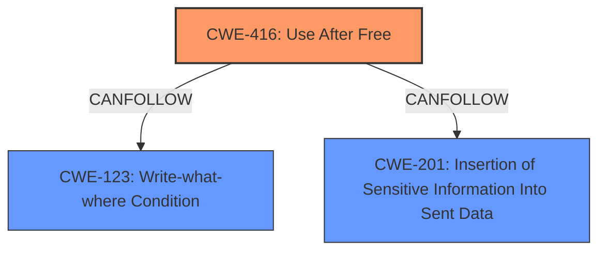

# Enhanced Analysis for CVE-2024-39305

# Summary
| CWE ID | CWE Name | Confidence | CWE Abstraction Level | CWE Vulnerability Mapping Label | CWE-Vulnerability Mapping Notes |
|---|---|---|---|---|---|
| CWE-416 | Use After Free | 1 | Variant | Allowed | Primary CWE. The vulnerability is explicitly described as a use-after-free. |
| CWE-123 | Write-what-where Condition | 0.6 | Base | Allowed | Secondary CWE. This could occur as a result of writing to memory that has already been freed. |
| CWE-201 | Insertion of Sensitive Information Into Sent Data | 0.5 | Base | Allowed | Secondary candidate. Envoy's memory is sent to the upstream service. |

## Evidence and Confidence

*   **Confidence Score:** 0.8
*   **Evidence Strength:** HIGH

## Relationship Analysis
The primary weakness is CWE-416 Use After Free, which is a variant. CWE-123 Write-what-where Condition and CWE-201 Insertion of Sensitive Information Into Sent Data are base CWEs that can occur as a result of CWE-416.



## Vulnerability Chain
The vulnerability chain starts with a **use-after-free** (CWE-416). After the memory is freed, the program attempts to write to it, leading to a write-what-where condition (CWE-123). Because the data is sent to the upstream service it can lead to sensitive information being sent (CWE-201).

## Summary of Analysis
The primary **rootcause** of this vulnerability is a **use-after-free** condition. The CVE description and the CVE reference links content summary both explicitly state this. The vulnerability occurs when Envoy attempts to copy the content of de-allocated memory into a request cookie header. The most accurate CWE for this is CWE-416 Use After Free, which is a Variant level CWE. The evidence from the CVE description is: "Envoy references already freed memory" and from the CVE Reference Links Content Summary is: "The vulnerability is a use-after-free. Memory allocated to hold cookie attribute values is freed after the configuration parsing phase. During request processing, Envoy attempts to copy the content of this de-allocated memory into the request cookie header."

CWE-123 (Write-what-where Condition) is considered as a secondary CWE because it could happen as a result of the use-after-free. After the memory is freed, the program attempts to write to it, leading to a write-what-where condition.

CWE-201 (Insertion of Sensitive Information Into Sent Data) is considered as a secondary CWE because Envoy's memory is sent to the upstream service. The evidence from the CVE description is: "This can lead to arbitrary content of Envoys memory to be sent to the upstream service".

Other CWEs Considered and Rejected:

*   CWE-784 Reliance on Cookies without Validation and Integrity Checking in a Security Decision: While the vulnerability involves cookies, the root cause is not related to cookie validation or integrity checking.
*   CWE-212 Improper Removal of Sensitive Information Before Storage or Transfer: The vulnerability is not about the improper removal of sensitive information before storage or transfer, but rather about accessing memory that has already been freed.
*   CWE-346 Origin Validation Error: The vulnerability does not involve origin validation.
*   CWE-941 Incorrectly Specified Destination in a Communication Channel: The vulnerability does not involve incorrect communication channel destination.
*   CWE-74 Improper Neutralization of Special Elements in Output Used by a Downstream Component ('Injection'): The vulnerability is not related to injection.
*   CWE-918 Server-Side Request Forgery (SSRF): The vulnerability does not involve server-side request forgery.
*   CWE-843 Access of Resource Using Incompatible Type ('Type Confusion'): The vulnerability is not related to type confusion.
*   CWE-755 Improper Handling of Exceptional Conditions: The vulnerability is not primarily about improper handling of exceptional conditions.
*   CWE-617 Reachable Assertion: The vulnerability does not involve reachable assertions.
*   CWE-789 Memory Allocation with Excessive Size Value: The vulnerability is not about memory allocation with excessive size.
*   CWE-190 Integer Overflow or Wraparound: The vulnerability is not related to integer overflow or wraparound.
*   CWE-362 Concurrent Execution using Shared Resource with Improper Synchronization ('Race Condition'): The vulnerability does not involve race conditions.
*   CWE-327 Use of a Broken or Risky Cryptographic Algorithm: The vulnerability does not involve cryptography.
*   CWE-674 Uncontrolled Recursion: The vulnerability is not related to uncontrolled recursion.
*   CWE-287 Improper Authentication: The vulnerability is not related to authentication.
*   CWE-128 Wrap-around Error: The vulnerability is not related to wrap-around errors.
*   CWE-201 Insertion of Sensitive Information Into Sent Data: While sensitive information might be leaked, the primary issue is the use-after-free.
*   CWE-364 Signal Handler Race Condition: The vulnerability is not related to signal handler race conditions.
*   CWE-226 Sensitive Information in Resource Not Removed Before Reuse: The vulnerability is not related to sensitive information not being removed before reuse.
*   CWE-1339 Insufficient Precision or Accuracy of a Real Number: The vulnerability is not related to real number precision.


## CWE Relationship Analysis

Current CWEs represent these abstraction levels: .


### Vulnerability Chain Analysis

**Chain starting from CWE-416:**
- 416 (Use After Free) - ROOT


**Chain starting from CWE-226:**
- 226 (Sensitive Information in Resource Not Removed Before Reuse) - ROOT


### CWE Relationship Diagram

```mermaid
graph TD
    classDef primary fill:#f96,stroke:#333,stroke-width:2px
    classDef secondary fill:#69f,stroke:#333
    classDef tertiary fill:#9e9,stroke:#333
```