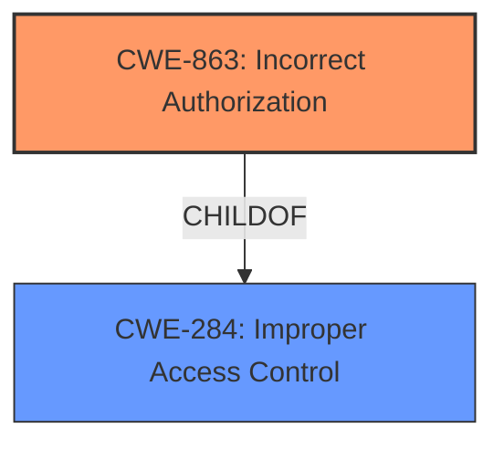

# Enhanced Analysis for CVE-2024-39327

# Summary
| CWE ID | CWE Name | Confidence | CWE Abstraction Level | CWE Vulnerability Mapping Label | CWE-Vulnerability Mapping Notes |
|---|---|---|---|---|---|
| CWE-863 | Incorrect Authorization | 0.8 | Class | Allowed-with-Review | Primary CWE - The product performs an authorization check when an actor attempts to access a resource or perform an action, but it does not correctly perform the check. |
| CWE-284 | Improper Access Control | 0.6 | Pillar | Discouraged | Secondary candidate - top-level category used when access control failure exists but root cause is unclear. |

## Evidence and Confidence

*   **Confidence Score:** 0.7
*   **Evidence Strength:** MEDIUM

## Relationship Analysis
The primary CWE is CWE-863, "Incorrect Authorization," which is a Class-level CWE. CWE-284, "Improper Access Control," is a Pillar-level CWE and a parent of CWE-863. Since the description explicitly states "incorrect access control," but the Retriever Results and guidance leans more towards authorization the Class-level CWE-863 is a better fit than the more general Pillar-level CWE-284.



## Vulnerability Chain
The vulnerability chain starts with **incorrect access control**, leading to the ability to "obtain CA signing in an illegitimate way".

Incorrect Access Control (CWE-863) -> Privilege Escalation

## Summary of Analysis
The vulnerability description indicates an **incorrect access control** issue that allows illegitimate CA signing. The Retriever Results list CWE-863 (Incorrect Authorization) as a high-scoring candidate, and the CWE guidance highlights the difference between Authentication, Authorization, and Access Control.

The vulnerability description key phrase indicates the **rootcause** is **incorrect access control**. The vulnerability is best represented by CWE-863 because the description indicates that authorization mechanisms are present but flawed, leading to unauthorized access.

CWE-284 is a more general category, which is less specific, and therefore a less preferred mapping.

Relevant CWE Information:

# Enhanced Context (25 CWEs)
The following CWEs were identified as potentially relevant to this vulnerability:

## CWE-668: Exposure of Resource to Wrong Sphere
**Abstraction Level**: Class
**Similarity Score**: 0.75

## CWE-280: Improper Handling of Insufficient Permissions or Privileges 
**Abstraction Level**: Base
**Similarity Score**: 0.74

## CWE-274: Improper Handling of Insufficient Privileges
**Abstraction Level**: Base
**Similarity Score**: 0.74

## CWE-41: Improper Resolution of Path Equivalence
**Abstraction Level**: Base
**Similarity Score**: 0.74

## CWE-345: Insufficient Verification of Data Authenticity
**Abstraction Level**: Class
**Similarity Score**: 0.74

## CWE-303: Incorrect Implementation of Authentication Algorithm
**Abstraction Level**: Base
**Similarity Score**: 0.74

## CWE-497: Exposure of Sensitive System Information to an Unauthorized Control Sphere
**Abstraction Level**: Base
**Similarity Score**: 0.74

## CWE-807: Reliance on Untrusted Inputs in a Security Decision
**Abstraction Level**: Base
**Similarity Score**: 0.74

## CWE-639: Authorization Bypass Through User-Controlled Key
**Abstraction Level**: Base
**Similarity Score**: 0.74

## CWE-703: Improper Check or Handling of Exceptional Conditions
**Abstraction Level**: Pillar
**Similarity Score**: 0.74

## CWE-863: Incorrect Authorization
**Abstraction Level**: Class
**Similarity Score**: 1247.83

## CWE-639: Authorization Bypass Through User-Controlled Key
**Abstraction Level**: Base
**Similarity Score**: 1233.50

## CWE-285: Improper Authorization
**Abstraction Level**: Class
**Similarity Score**: 1211.14

## CWE-306: Missing Authentication for Critical Function
**Abstraction Level**: Base
**Similarity Score**: 1166.40

## CWE-287: Improper Authentication
**Abstraction Level**: Class
**Similarity Score**: 1148.23

## CWE-613: Insufficient Session Expiration
**Abstraction Level**: base
**Similarity Score**: 4.33

## CWE-295: Improper Certificate Validation
**Abstraction Level**: base
**Similarity Score**: 2.77

## CWE-942: Permissive Cross-domain Policy with Untrusted Domains
**Abstraction Level**: variant
**Similarity Score**: 2.68

## CWE-287: Improper Authentication
**Abstraction Level**: class
**Similarity Score**: 2.55

## CWE-280: Improper Handling of Insufficient Permissions or Privileges 
**Abstraction Level**: Base
**Similarity Score**: 2.48

## CWE-274: Improper Handling of Insufficient Privileges
**Abstraction Level**: Base
**Similarity Score**: 2.48

## CWE-306: Missing Authentication for Critical Function
**Abstraction Level**: base
**Similarity Score**: 2.47

## CWE-798: Use of Hard-coded Credentials
**Abstraction Level**: base
**Similarity Score**: 2.47

## CWE-1220: Insufficient Granularity of Access Control
**Abstraction Level**: base
**Similarity Score**: 2.47

## CWE-22: Improper Limitation of a Pathname to a Restricted Directory ('Path Traversal')
**Abstraction Level**: base
**Similarity Score**: 2.42

Other CWEs Considered and Rejected:

*   CWE-287 (Improper Authentication): While authentication is related to access control, the description focuses on **incorrect access control** rather than a lack of authentication.
*   CWE-306 (Missing Authentication for Critical Function): Similar to CWE-287, this CWE focuses on missing authentication, which is not the primary issue described.
*   CWE-798 (Use of Hard-coded Credentials): There is no mention of hard-coded credentials in the vulnerability description.
*   CWE-285 (Improper Authorization): Similar to CWE-863, but less specific. Since there are authorization checks but they are incorrect, CWE-863 is a better fit.


## CWE Relationship Analysis

Current CWEs represent these abstraction levels: .


### Vulnerability Chain Analysis

**Chain starting from CWE-274:**
- 274 (Improper Handling of Insufficient Privileges) - ROOT


**Chain starting from CWE-345:**
- 345 (Insufficient Verification of Data Authenticity) - ROOT


### CWE Relationship Diagram

```mermaid
graph TD
    classDef primary fill:#f96,stroke:#333,stroke-width:2px
    classDef secondary fill:#69f,stroke:#333
    classDef tertiary fill:#9e9,stroke:#333
```