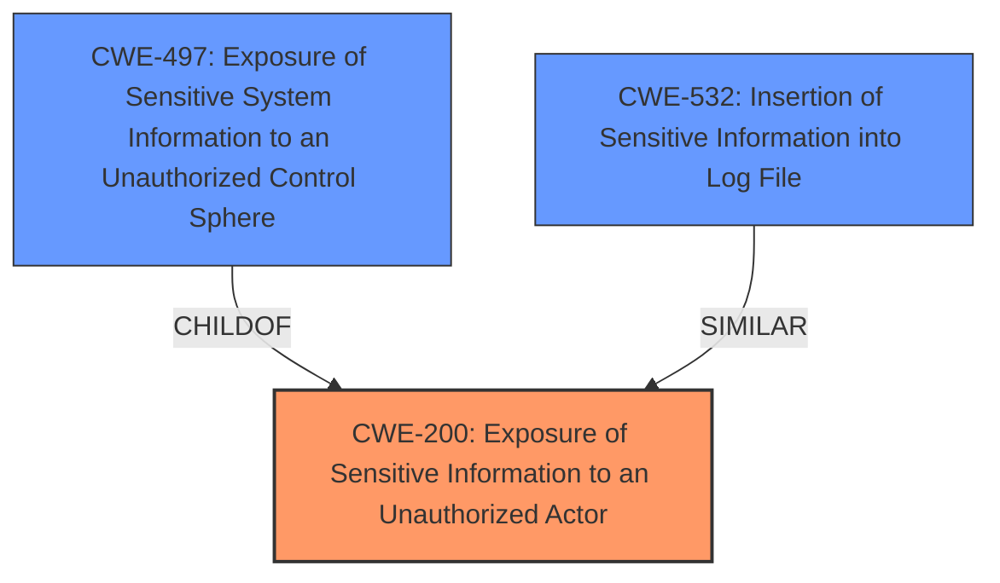

# Analysis Report for CVE-2024-39339

# Vulnerability Analysis Report: CVE-2024-39339

## Description

A vulnerability has been discovered in all versions of Smartplay headunits, which are widely used in Suzuki and Toyota cars. This **misconfiguration** can lead to information disclosure, leaking sensitive details such as diagnostic log traces, system logs, headunit passwords, and personally identifiable information (PII). The exposure of such information may have serious implications for user privacy and system integrity.

## Vulnerability Description Key Phrases

- **Rootcause:** misconfiguration
- **Impact:** ['and personally identifiable information (PII)', 'headunit passwords', 'information disclosure', 'integrity', 'leaking sensitive details such as diagnostic log traces', 'system logs']
- **Product:** Smartplay headunits
- **Version:** all versions

## Analysis (with Relationship Data)

# Summary
| CWE ID | CWE Name | Confidence | CWE Abstraction Level | CWE Vulnerability Mapping Label | CWE-Vulnerability Mapping Notes |
|---|---|---|---|---|---|
| **CWE-200** | Exposure of Sensitive Information to an Unauthorized Actor | 0.8 | Class | Allowed-with-Review | Primary CWE |
| CWE-497 | Exposure of Sensitive System Information to an Unauthorized Control Sphere | 0.6 | Base | Allowed | Secondary Candidate |
| CWE-532 | Insertion of Sensitive Information into Log File | 0.5 | Base | Allowed | Secondary Candidate |

## Evidence and Confidence

*   **Confidence Score:** 0.8
*   **Evidence Strength:** MEDIUM

## Relationship Analysis
The primary relationship considered was the hierarchical structure, specifically the parent-child relationship. While CWE-497 is a more specific "Base" weakness, CWE-200, a "Class" weakness, directly addresses the **information disclosure** aspect emphasized in the vulnerability description. This vulnerability leads to the exposure of sensitive data, thus matching the definition of CWE-200. The other CWEs have a weaker direct linkage to the vulnerability.



## Vulnerability Chain
The vulnerability chain begins with a **misconfiguration**, leading to the **disclosure of sensitive information** such as diagnostic logs, system logs, headunit passwords, and PII.
  - **Root Cause:** **Misconfiguration**
  - **Weakness:** Information Disclosure
  - **Impact:** Privacy breach, unauthorized access, potential further security breaches

## Summary of Analysis
The initial assessment focused on identifying the **root cause** and the resulting impact. The vulnerability description clearly states that a **misconfiguration** leads to **information disclosure**.

CWE-200 (Exposure of Sensitive Information to an Unauthorized Actor) directly aligns with the vulnerability's description and impact. While CWE-497 (Exposure of Sensitive System Information to an Unauthorized Control Sphere) is also relevant, CWE-200 serves as a broader, more encompassing classification for the **information disclosure** aspect. I am overriding the general mapping guidance to map to CWE-200.

CWE-532 (Insertion of Sensitive Information into Log File) was considered, but the vulnerability extends beyond just log files. The exposed information also includes headunit passwords and other PII, making CWE-200 a more appropriate choice.

The selection of CWE-200 is based on the evidence provided in the vulnerability description and the CVE reference links, which emphasize the **misconfiguration** leading to **information disclosure** of various sensitive data types.

Relevant CWE Information:

# Enhanced Context (25 CWEs)

## CWE-200: Exposure of Sensitive Information to an Unauthorized Actor
**Abstraction Level**: Class
**Similarity Score**: 0.72
**Source**: dense

**Description**:
The product exposes sensitive information to an actor that is not explicitly authorized to have access to that information.

**Mapping Guidance**:
- Usage: Discouraged
- Rationale: CWE-200 is commonly misused to represent the loss of confidentiality in a vulnerability, but confidentiality loss is a technical impact - not a root cause error. As of CWE 4.9, over 400 CWE entries can lead to a loss of confidentiality. Other options are often available. [REF-1287].

*Technical Explanation:*
The Smartplay headunits have a **misconfiguration** that results in the exposure of PII, diagnostic log traces, system logs, and headunit passwords. This directly matches the description of CWE-200, as the system exposes sensitive information to unauthorized actors due to the incorrect configuration.

*Security Implications:*
The exposure of sensitive information can lead to privacy breaches, unauthorized access to headunit functions and vehicle systems, and potential for further security breaches.

*Relationship Analysis:*
CWE-200 is a class-level CWE. Child CWEs like CWE-497 (Exposure of Sensitive System Information to an Unauthorized Control Sphere) are more specific. However, the broader scope of exposed information (PII, system logs, etc.) makes CWE-200 a more fitting primary classification.

*Primary or Secondary Weakness:*
Primary weakness due to the direct impact of **information disclosure**.

## CWE-497: Exposure of Sensitive System Information to an Unauthorized Control Sphere
**Abstraction Level**: Base
**Similarity Score**: 0.71
**Source**: dense

**Description**:
The product does not properly prevent sensitive system-level information from being accessed by unauthorized actors who do not have the same level of access to the underlying system as the product does.

**Mapping Guidance**:
- Usage: Allowed
- Rationale: This CWE entry is at the Base level of abstraction, which is a preferred level of abstraction for mapping to the root causes of vulnerabilities.

*Technical Explanation:*
The vulnerability allows unauthorized access to sensitive system information, aligning with CWE-497.

*Security Implications:*
Unauthorized access to system-level information can compromise the integrity and security of the headunit and potentially connected vehicle systems.

*Relationship Analysis:*
CWE-497 is a child of CWE-200. It is more specific than CWE-200.

*Primary or Secondary Weakness:*
Secondary weakness. It is a specific type of **information disclosure**.

## CWE-532: Insertion of Sensitive Information into Log File
**Abstraction Level**: Base
**Similarity Score**: 0.71
**Source**: dense

**Description**:
The product writes sensitive information to a log file.

**Mapping Guidance**:
- Usage: Allowed
- Rationale: This CWE entry is at the Base level of abstraction, which is a preferred level of abstraction for mapping to the root causes of vulnerabilities.

*Technical Explanation:*
A part of the disclosed information comes from diagnostic log traces and system logs, aligning with CWE-532.

*Security Implications:*
If sensitive information is written to log files, it becomes accessible to unauthorized users, which can lead to privacy breaches and potential exploitation.

*Relationship Analysis:*
CWE-532 is a base-level CWE related to logging practices.

*Primary or Secondary Weakness:*
Secondary weakness as it describes only one facet of the **information disclosure**.

## Other CWEs Considered But Not Used:

*   **CWE-798: Use of Hard-coded Credentials, CWE-259: Use of Hard-coded Password, CWE-321: Use of Hard-coded Cryptographic Key**: While the description mentions "headunit passwords," there is no explicit evidence that these passwords are hard-coded. Therefore, these CWEs are not appropriate.
*   **CWE-209: Generation of Error Message Containing Sensitive Information**: There is no evidence of error messages being the source of **information disclosure**.
*   **CWE-201: Insertion of Sensitive Information Into Sent Data**: This is not about sending data but rather exposing it due to misconfiguration.
*   **CWE-613: Insufficient Session Expiration**: No evidence supports session management issues.
*   **CWE-319: Cleartext Transmission of Sensitive Information**: There is no evidence of cleartext transmission.
*   **CWE-345: Insufficient Verification of Data Authenticity**: This is not about verifying data authenticity.
*   **CWE-538: Insertion of Sensitive Information into Externally-Accessible File or Directory**: While related, CWE-200 is more encompassing.
*   **CWE-294: Authentication Bypass by Capture-replay**: No evidence supports this.
*   **CWE-213: Exposure of Sensitive Information Due to Incompatible Policies**: There is no discussion of incompatible policies.
*   **CWE-941: Incorrectly Specified Destination in a Communication Channel**: This CWE is not applicable.
*   **CWE-1272: Sensitive Information Uncleared Before Debug/Power State Transition**: Not directly applicable to the described vulnerability.
*   **CWE-756: Missing Custom Error Page**: Not directly applicable to the described vulnerability.
*   **CWE-226: Sensitive Information in Resource Not Removed Before Reuse**: Not directly applicable to the described vulnerability.
*   **CWE-212: Improper Removal of Sensitive Information Before Storage or Transfer**: Not directly applicable to the described vulnerability.
*   **CWE-1295: Debug Messages Revealing Unnecessary Information**: While related, CWE-200 is more encompassing.


## CWE Relationship Analysis

Current CWEs represent these abstraction levels: .


### Vulnerability Chain Analysis

**Chain starting from CWE-345:**
- 345 (Insufficient Verification of Data Authenticity) - ROOT


**Chain starting from CWE-226:**
- 226 (Sensitive Information in Resource Not Removed Before Reuse) - ROOT


### CWE Relationship Diagram

```mermaid
graph TD
    classDef primary fill:#f96,stroke:#333,stroke-width:2px
    classDef secondary fill:#69f,stroke:#333
    classDef tertiary fill:#9e9,stroke:#333
```


*Report generated on 2025-07-13 11:15:07*
