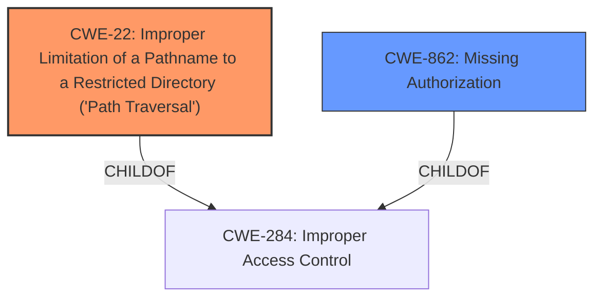

# Analysis Report for CVE-2024-3934

# Vulnerability Analysis Report: CVE-2024-3934

## Description

The Mercado Pago payments for WooCommerce plugin for WordPress is vulnerable to **Path Traversal** in versions 7.3.0 to 7.5.1 via the mercadopagoDownloadLog function. This makes it possible for authenticated attackers, with subscriber-level access and above, to download and read the contents of arbitrary files on the server, which can contain sensitive information. The arbitrary file download was patched in 7.5.1, while the **missing authorization** was corrected in version 7.6.2.

## Vulnerability Description Key Phrases

- **Rootcause:** missing authorization
- **Weakness:** Path Traversal
- **Impact:** download and read arbitrary files
- **Attacker:** authenticated attackers
- **Product:** Mercado Pago payments for WooCommerce plugin for WordPress
- **Version:** 7.3.0 to 7.5.1
- **Component:** mercadopagoDownloadLog function

## Analysis (with Relationship Data)

# Summary
| CWE ID    | CWE Name                                                                      | Confidence | CWE Abstraction Level | CWE Vulnerability Mapping Label | CWE-Vulnerability Mapping Notes |
| :-------- | :---------------------------------------------------------------------------- | :--------- | :-------------------- | :------------------------------ | :------------------------------ |
| CWE-22    | Improper Limitation of a Pathname to a Restricted Directory ('Path Traversal') | 0.9        | Base                  | Primary CWE                     | Allowed                       |
| CWE-862   | Missing Authorization                                                         | 0.8        | Class                 | Secondary Candidate               | Allowed-with-Review             |

## Evidence and Confidence

*   **Confidence Score:** 0.85
*   **Evidence Strength:** HIGH

## Relationship Analysis
The primary relationship is that CWE-22 is a specific type of vulnerability that can occur when authorization is **missing** (CWE-862). CWE-22 is a base CWE, while CWE-862 is a class CWE. The vulnerability description indicates both a **path traversal** issue and **missing authorization**, making both CWEs relevant but with CWE-22 as the more specific **root cause**.



## Vulnerability Chain
The vulnerability chain starts with **missing authorization** on the `mercadopagoDownloadLog` function. Because of this **missing authorization**, an attacker can exploit a **path traversal** vulnerability by manipulating the filename parameter, leading to arbitrary file download and potential disclosure of sensitive information. The **path traversal** is the **root cause**, while the **missing authorization** is a prerequisite.

## Summary of Analysis
The initial assessment correctly identified CWE-22 as the primary vulnerability due to the **path traversal** issue. The additional context from the vulnerability description and CVE details confirms that **missing authorization** (CWE-862) is also present.

The selection of CWE-22 and CWE-862 is based on the provided evidence, which clearly states that a **path traversal** vulnerability exists due to **missing authorization**. The graph relationships confirm that both CWEs are related to broader access control issues, but the specific nature of the vulnerability allows for a more precise classification. CWE-22 is the most specific and appropriate CWE for the **root cause**, while CWE-862 represents a contributing factor.

Relevant CWE Information:
*   **CWE-22:** "The product uses external input to construct a pathname that should be within a restricted directory, but it does not properly neutralize sequences such as '..' that can resolve to a location that is outside of that directory." This matches the description of the **path traversal** vulnerability.
*   **CWE-862:** "The product does not perform an authorization check when an actor attempts to access a resource or perform an action." This aligns with the **missing authorization** aspect of the vulnerability.

Other CWEs Considered but Not Used:
*   CWE-284: Improper Access Control - While this is a general access control issue, CWE-22 and CWE-862 provide more specific details.
*   CWE-306: Missing Authentication for Critical Function - The vulnerability requires authentication, so this CWE is not applicable.
*   CWE-639: Authorization Bypass Through User-Controlled Key - This CWE is related to authorization bypass, but the **root cause** is the **path traversal** due to **missing authorization**, making CWE-22 and CWE-862 more appropriate.


## CWE Relationship Analysis

Current CWEs represent these abstraction levels: .


### Vulnerability Chain Analysis

**Chain starting from CWE-862:**
- 862 (Missing Authorization) - ROOT


**Chain starting from CWE-639:**
- 639 (Authorization Bypass Through User-Controlled Key) - ROOT


### CWE Relationship Diagram

```mermaid
graph TD
    classDef primary fill:#f96,stroke:#333,stroke-width:2px
    classDef secondary fill:#69f,stroke:#333
    classDef tertiary fill:#9e9,stroke:#333
```


*Report generated on 2025-07-13 11:15:22*
